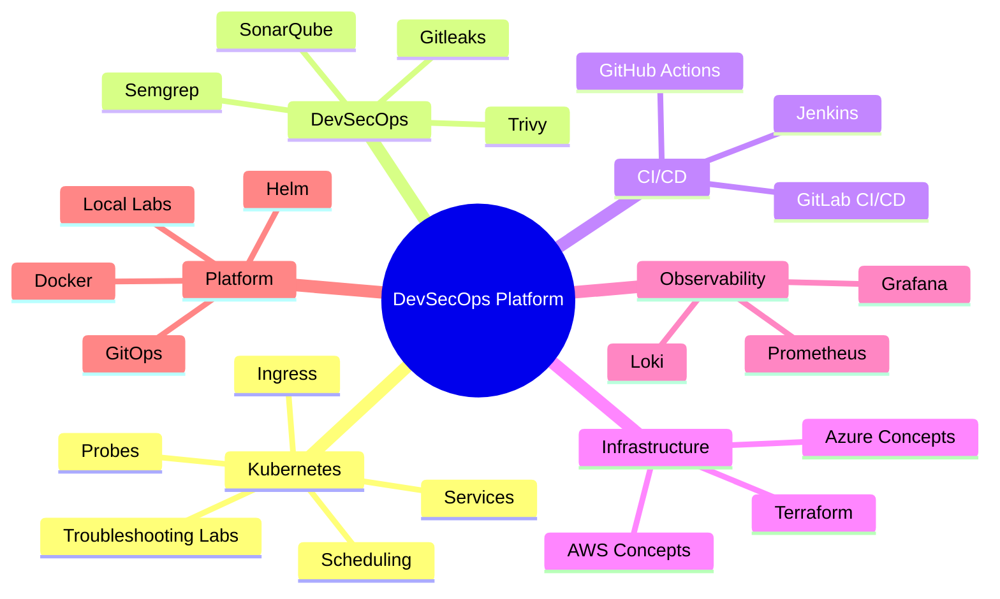
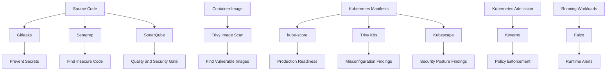
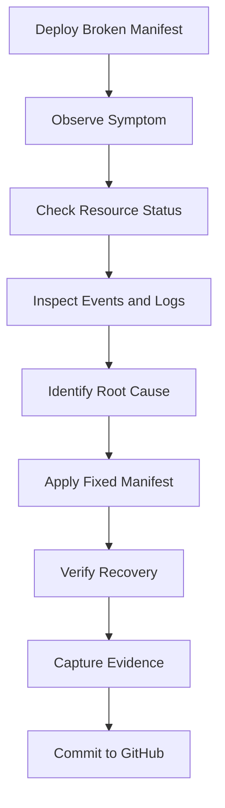
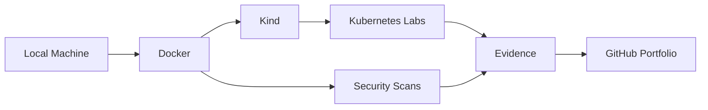
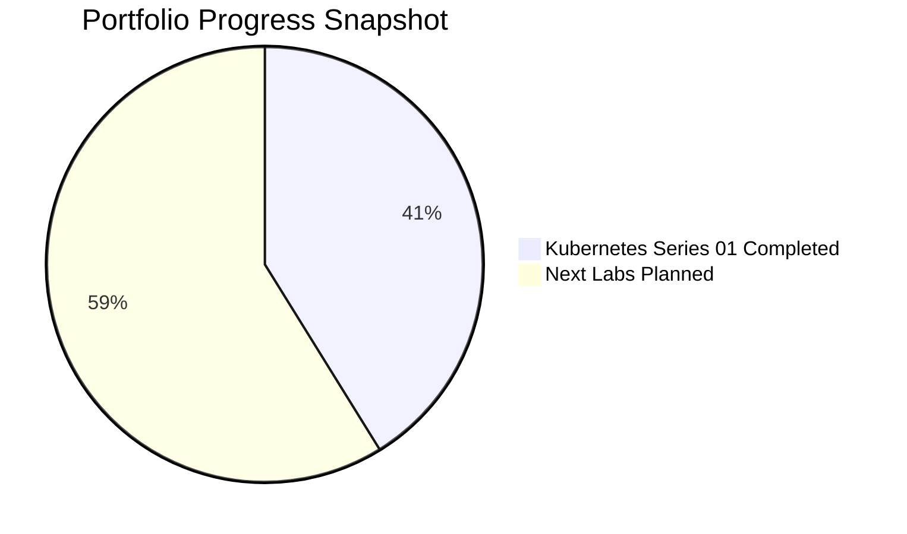

# DevSecOps Platform


---

## Overview

This repository is a production-style DevOps and DevSecOps platform portfolio built with a local-first approach.

The goal is to demonstrate hands-on skills in:

```text
Linux
Git
Docker
Kubernetes
Terraform
CI/CD
DevSecOps
Monitoring
Incident troubleshooting
Platform Engineering
SRE practices
```

This repository is designed to prove practical engineering ability through real labs, broken/fixed configurations, incident notes, evidence files, and interview-ready documentation.

> [!NOTE]
> This is not a collection of random notes. It is structured as a real DevOps portfolio with production-style workflows.

---

## Portfolio Focus



---

## DevSecOps Security Portfolio

Status:

```text
Completed security labs: 9
Environment: Local Kind cluster + local Docker tooling
Cloud cost: ₹0
Focus: Practical DevSecOps evidence for GitHub portfolio and interviews
```

| Area | Tool | Purpose | Status |
|---|---|---|---|
| Secret Scanning | [Gitleaks](labs/security/gitleaks/README.md) | Detect hardcoded secrets before commit/push | Completed |
| Container Security | [Trivy Image Scanning](labs/security/trivy-image-scanning/README.md) | Scan container images for vulnerabilities | Completed |
| SAST | [Semgrep](labs/security/semgrep/README.md) | Detect insecure code patterns | Completed |
| Code Quality / Security | [SonarQube](labs/security/sonarqube/README.md) | Analyze code quality and security issues | Completed |
| Kubernetes Readiness | [kube-score](labs/security/kubernetes-scanning/kube-score/README.md) | Check Kubernetes production-readiness | Completed |
| Kubernetes Misconfigurations | [Trivy K8s](labs/security/kubernetes-scanning/trivy-k8s/README.md) | Scan Kubernetes manifests for misconfigurations | Completed |
| Kubernetes Security Posture | [Kubescape](labs/security/kubernetes-scanning/kubescape/README.md) | Scan against security framework controls | Completed |
| Kubernetes Policy Enforcement | [Kyverno](labs/security/kubernetes-scanning/kyverno/README.md) | Block unsafe Kubernetes resources at admission time | Completed |
| Runtime Threat Detection | [Falco](labs/security/kubernetes-scanning/falco/README.md) | Detect suspicious runtime activity | Completed |

Full security index:

```text
labs/security/README.md
```

Kubernetes security series:

```text
labs/security/kubernetes-scanning/README.md
```

---

## DevSecOps Security Workflow



---

## Security Portfolio Story

```text
Gitleaks    -> Prevent secrets from entering Git
Trivy       -> Find vulnerable container images
Semgrep     -> Detect insecure code patterns
SonarQube   -> Improve code quality and security visibility
kube-score  -> Check Kubernetes production-readiness
Trivy K8s   -> Detect Kubernetes misconfigurations
Kubescape   -> Validate security posture controls
Kyverno     -> Enforce Kubernetes policies
Falco       -> Detect runtime threats
```

This demonstrates a complete DevSecOps flow:

```text
Prevent -> Scan -> Analyze -> Enforce -> Detect
```

---

## CI/CD Security Gates

This repository includes GitHub Actions workflows that run automated DevSecOps checks.

| Workflow | Purpose | Status |
|---|---|---|
| Gitleaks Secret Scan | Detect secrets before they enter Git history | Passing |
| Trivy Image Scan | Scan container images for vulnerabilities | Passing |
| Trivy Critical Gate | Fail CI on critical container vulnerabilities | Passing |
| Semgrep SAST Scan | Detect insecure code patterns | Passing |
| Semgrep SAST Gate | Fail CI on serious insecure code patterns | Passing |
| Trivy Kubernetes Config Scan | Scan fixed Kubernetes manifests for HIGH/CRITICAL misconfigurations | Passing |
| kube-score Kubernetes Scan | Check fixed Kubernetes manifests for production-readiness | Passing |

```text
Local labs prove learning.
CI/CD gates prove automation.
```

---

## Current Major Milestone

### Kubernetes Troubleshooting Labs: Series 01

Status:

```text
Completed labs: 7 / 7
Environment: Local Kind cluster
Cloud cost: ₹0
```

| Lab | Incident | Focus Area | Status |
|---|---|---|---|
| 001 | [CrashLoopBackOff](labs/kubernetes/001-crashloopbackoff/README.md) | Logs, restart count, app crash | Completed |
| 002 | [ImagePullBackOff](labs/kubernetes/002-imagepullbackoff/README.md) | Image tags, registry failures | Completed |
| 003 | [OOMKilled](labs/kubernetes/003-oomkilled/README.md) | Memory limits, exit code 137 | Completed |
| 004 | [Pod Pending](labs/kubernetes/004-pod-pending/README.md) | Scheduling, resources, node capacity | Completed |
| 005 | [Service Endpoints Empty](labs/kubernetes/005-service-endpoints-empty/README.md) | Labels, selectors, endpoints | Completed |
| 006 | [Readiness Probe Failure](labs/kubernetes/006-readiness-probe-failure/README.md) | Health checks, traffic routing | Completed |
| 007 | [Ingress 404/503](labs/kubernetes/007-ingress-404-503/README.md) | Ingress, Service, endpoints | Completed |

Read the full summary:

```text
labs/kubernetes/SERIES-01-SUMMARY.md
```

---

## Kubernetes Troubleshooting Workflow



Each Kubernetes lab includes:

```text
Broken manifest
Fixed manifest
Troubleshooting steps
Root cause explanation
Evidence files
Interview answer
```

---

## Incident Notes

This repository also contains production-style incident notes.

Main index:

```text
docs/incidents/README.md
```

Current incident notes include:

```text
Kubernetes pod issues
Service and Ingress issues
CI/CD pipeline failures
DevSecOps scan failures
Observability incidents
Resource pressure incidents
Rollback scenarios
```

Incident notes are written using this structure:

```text
1. Symptom
2. What it means
3. Common causes
4. Investigation commands
5. Root cause
6. Fix
7. Verification
8. Prevention
9. Interview explanation
```

---

## Main Sections

| Section | Purpose |
|---|---|
| [`labs/kubernetes`](labs/kubernetes/README.md) | Hands-on Kubernetes troubleshooting labs |
| [`labs/security`](labs/security/README.md) | DevSecOps security labs: Gitleaks, Trivy, Semgrep, SonarQube, Kubernetes security, Kyverno, Falco |
| [`docs/incidents`](docs/incidents/README.md) | Production-style incident notes |
| `docker/` | Docker and container labs |
| `terraform/` | Infrastructure as Code practice |
| `ci/github-actions/` | GitHub Actions workflows |
| `ci/gitlab-ci/` | GitLab CI/CD examples |
| `ci/jenkins/` | Jenkins pipeline examples |
| `security/` | DevSecOps scanning and security practices |
| `monitoring/` | Observability stack examples |
| `scripts/` | Bash and automation scripts |
| `python/` | Python automation examples |

---

## Tools Covered

| Category | Tools |
|---|---|
| Operating System | Linux |
| Version Control | Git, GitHub |
| Containers | Docker, Docker Compose |
| Kubernetes | Kubernetes, Kind, kubectl, Helm |
| Infrastructure as Code | Terraform |
| CI/CD | GitHub Actions, GitLab CI/CD, Jenkins |
| Security | Trivy, Gitleaks, Semgrep, SonarQube |
| Policy & Governance | Kyverno, OPA |
| Monitoring | Prometheus, Grafana, Loki |
| Cloud Concepts | AWS, Azure |
| GitOps | Argo CD |
| AI for DevOps | Ollama, local LLM workflows |

---

## Local-First Philosophy

This portfolio is built to avoid unnecessary cloud cost.

```text
Use local tools first
Simulate production workflows locally
Use Kind for Kubernetes
Use Docker for lab environments
Use Terraform safely without applying paid cloud resources unless required
Use real cloud accounts only when explicitly needed
```



---

## Skills Demonstrated

```text
Kubernetes troubleshooting
DevOps documentation
Incident response
Root cause analysis
CI/CD understanding
DevSecOps mindset
Local lab design
Evidence-based debugging
GitHub portfolio building
Interview preparation
```

---

## Recruiter-Friendly Summary

This repository demonstrates hands-on DevOps and DevSecOps skills through practical labs and documented troubleshooting workflows.

It includes real Kubernetes incident simulations, broken and fixed manifests, evidence files, incident notes, and interview-ready explanations.

The work proves ability to:

```text
Troubleshoot Kubernetes workloads
Investigate incidents using kubectl
Read logs and events
Debug Services and Ingress
Fix resource and scheduling issues
Document root cause and prevention
Use GitHub as proof of work
```

---

## Interview Topics Practiced

```text
CrashLoopBackOff troubleshooting
ImagePullBackOff troubleshooting
OOMKilled and exit code 137
Pod Pending and scheduler events
Service selectors and endpoints
Readiness probe failures
Ingress 404 and 503 debugging
CI/CD failure investigation
DevSecOps scanning failures
Observability alerts
Root cause analysis
Safe remediation
```

---

## Portfolio Progress



Completed:

```text
Kubernetes Troubleshooting Labs: Series 01
Incident Notes Index
Kubernetes Labs Landing Page
Series Summary Page
```

Next planned:

```text
Kubernetes Troubleshooting Labs: Series 02
DevSecOps scanning labs
GitHub Actions CI validation
Terraform infrastructure modules
Monitoring stack with Prometheus and Grafana
```

---

## Recommended Reading Path

Start here:

```text
1. labs/kubernetes/README.md
2. labs/kubernetes/SERIES-01-SUMMARY.md
3. docs/incidents/README.md
4. Individual Kubernetes lab README files
5. Evidence files inside each lab
```

---

## Repository Status

```text
Status: Active
Primary focus: DevOps + DevSecOps + Kubernetes + SRE
Learning mode: Local-first
Cloud cost target: ₹0 until real deployment is required
```