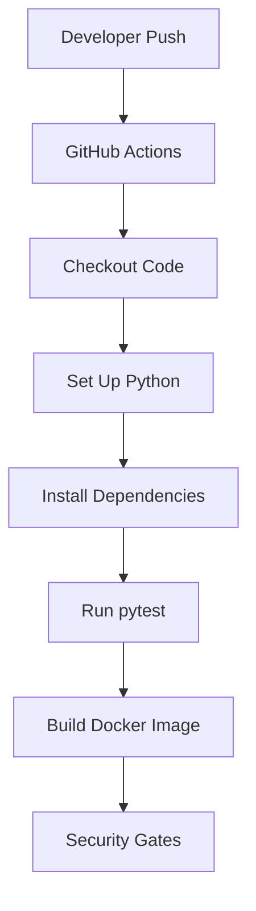
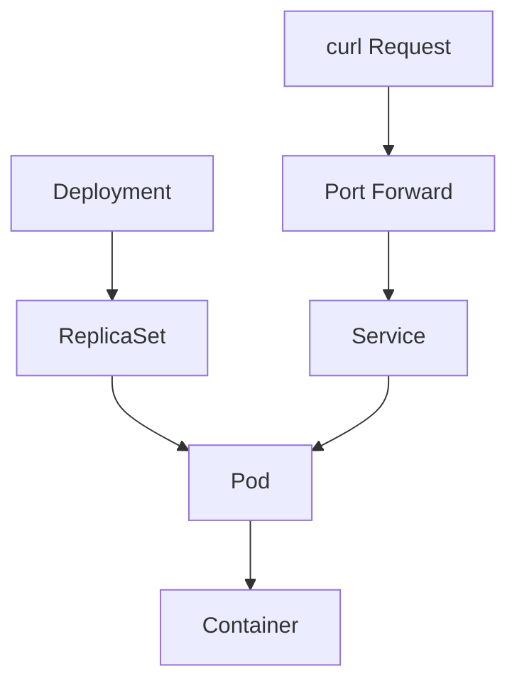

# Flask Health API - Interview Notes

## Project Summary

I built a small Flask Health API as a DevOps and DevSecOps CI/CD pipeline project.

The application exposes two endpoints:

```text
/        - returns service information
/health  - returns application health status
```

The project demonstrates application development, unit testing, Docker containerization, Kubernetes deployment, service exposure, and GitHub Actions CI.

---

## What I Built

```text
Python Flask API
pytest unit tests
Dockerfile
Kubernetes Namespace
Kubernetes Deployment
Kubernetes Service
GitHub Actions CI workflow
Gitleaks pre-commit and pre-push protection
```

---

## CI/CD Flow



---

## Kubernetes Flow



---

## Interview Answer

I created a Flask-based health API and built a complete delivery flow around it.

First, I wrote the application with two endpoints: `/` for service status and `/health` for health checks. Then I added pytest unit tests to validate both endpoints.

After that, I containerized the application using Docker and tested the container locally. I deployed it to a local Kind Kubernetes cluster using a Namespace, Deployment, and ClusterIP Service.

The Deployment includes production-style Kubernetes labels, CPU and memory requests/limits, readiness probe, liveness probe, and container security context.

I also added a GitHub Actions workflow that runs automatically on push and pull request changes. The workflow checks out the code, sets up Python, installs dependencies, runs pytest, and builds the Docker image.

This proves that I understand application packaging, CI/CD automation, Kubernetes deployment, health checks, service routing, and basic DevSecOps controls.

---

## Troubleshooting I Faced

### 1. Deployment name missing

Issue:

```text
resource name may not be empty
```

Root cause:

```text
metadata.name was missing or incorrectly indented in deployment.yml
```

Fix:

```text
Corrected metadata.name under Deployment metadata
```

---

### 2. Misspelled securityContext

Issue:

```text
unknown field "seccurityContext"
```

Root cause:

```text
Typo in Kubernetes manifest field name
```

Fix:

```text
Changed seccurityContext to securityContext
```

---

### 3. ImagePullBackOff in Kind

Issue:

```text
Pod status: ImagePullBackOff
```

Root cause:

```text
The Docker image was built on the host machine but not loaded into the Kind cluster node.
```

Fix:

```bash
kind load docker-image flask-health-api:local --name devsecops-lab
kubectl delete pod -n flask-health-api -l app.kubernetes.io/name=flask-health-api
```

---

### 4. Service selector issue avoided

I verified that the Service selector matches the Pod labels.

Check command:

```bash
kubectl get endpoints -n flask-health-api
```

Working endpoint:

```text
10.244.x.x:5000
```

This confirmed that the Service was routing traffic to the Pod correctly.

---

## Security Improvements I Made

### Semgrep Finding: Flask Development Server

Semgrep flagged that running Flask with `host="0.0.0.0"` could expose the development server publicly.

I fixed this by keeping the Flask development server local-only:

```python
app.run(host="127.0.0.1", port=5000)
```

For the Docker container, I used Gunicorn instead:

```dockerfile
CMD ["gunicorn", "--bind", "0.0.0.0:5000", "app:app"]
```

This separates local development from production container runtime.

---

### SonarQube Finding: Container Running as Root

SonarQube flagged that the Docker image was running as root.

I fixed this by creating a dedicated non-root user and group:

```dockerfile
RUN groupadd --system --gid 10001 appgroup \
    && useradd --system --uid 10001 --gid appgroup --shell /usr/sbin/nologin appuser
```

Then I changed ownership of the app directory and switched the container runtime user:

```dockerfile
RUN chown -R appuser:appgroup /app

USER appuser
```

I validated the fix with:

```bash
docker run --rm flask-health-api:local id
```

Output:

```text
uid=10001(appuser) gid=10001(appgroup) groups=10001(appgroup)
```

This reduces impact if the application is compromised because the attacker does not get root privileges inside the container.

---

## Commands I Used

Run tests:

```bash
pytest -v
```

Build Docker image:

```bash
docker build -t flask-health-api:local .
```

Run container:

```bash
docker run --rm -p 5000:5000 flask-health-api:local
```

Load image into Kind:

```bash
kind load docker-image flask-health-api:local --name devsecops-lab
```

Deploy to Kubernetes:

```bash
kubectl apply -f apps/flask-health-api/kubernetes/namespace.yml
kubectl apply -f apps/flask-health-api/kubernetes/deployment.yml
kubectl apply -f apps/flask-health-api/kubernetes/service.yml
```

Verify:

```bash
kubectl get all -n flask-health-api
kubectl get endpoints -n flask-health-api
```

Access app:

```bash
kubectl port-forward -n flask-health-api service/flask-health-api 5000:5000
curl http://localhost:5000/
curl http://localhost:5000/health
```

---

## Interview Keywords

```text
CI/CD
GitHub Actions
pytest
Docker image build
Kubernetes Deployment
ClusterIP Service
Readiness probe
Liveness probe
Resource requests and limits
Security context
ImagePullBackOff troubleshooting
Service selector
Endpoint validation
DevSecOps gates
```

---

## Common Follow-up Questions

### Why did you add a health endpoint?

A health endpoint helps Kubernetes and CI/CD systems verify whether the application is running correctly.

Kubernetes uses health endpoints in readiness and liveness probes.

---

### What is the difference between readiness and liveness probes?

Readiness probe checks whether the application is ready to receive traffic.

Liveness probe checks whether the application is still healthy. If liveness fails repeatedly, Kubernetes restarts the container.

---

### Why did ImagePullBackOff happen?

Because the image was built locally on the Docker host, but the Kind cluster node could not access it until I loaded it using `kind load docker-image`.

---

### Why use ClusterIP Service?

ClusterIP gives the application a stable internal Kubernetes network endpoint. Pods can change, but the Service name and IP remain stable.

---

### What did GitHub Actions do in this project?

GitHub Actions automatically ran the CI pipeline. It installed dependencies, ran unit tests, and built the Docker image whenever relevant files changed.

---

## Current Status

```text
Application: Working
Tests: Passing
Docker build: Working
Kubernetes deployment: Working
Service access: Working
GitHub Actions: Passing
Gitleaks: Passing
```