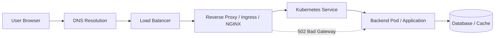
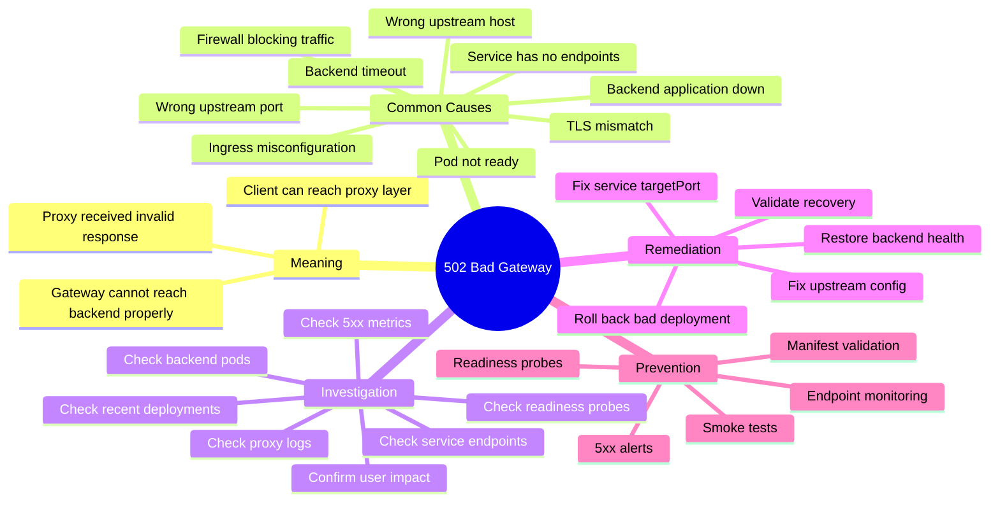

# Incident #001: 502 Bad Gateway

## Scenario

Users report that the application is unavailable.

The browser shows:

```text
502 Bad Gateway
```

---

## Meaning

`502 Bad Gateway` means the gateway, reverse proxy, load balancer, or ingress controller could not get a valid response from the upstream backend service.

Important point:

The client can reach the proxy or gateway layer, but the proxy cannot successfully communicate with the backend application.

---

## Request Flow



---

## Mindmap



---

## Common Causes

- Backend application is down
- Wrong upstream host or port
- NGINX or Ingress misconfiguration
- Kubernetes Service has no healthy endpoints
- Pod is crashing or not ready
- Load balancer target is unhealthy
- Firewall, Security Group, NACL, or NetworkPolicy is blocking traffic
- TLS mismatch between proxy and backend
- Backend timeout
- Connection refused from backend
- Wrong Kubernetes Service `targetPort`

---

## Investigation

### Goal

Find why the proxy, gateway, load balancer, or ingress cannot get a valid response from the backend service.

### Investigation Flow

1. Confirm scope and user impact.
2. Check monitoring for 5xx errors.
3. Check load balancer or ingress health.
4. Review NGINX, reverse proxy, or ingress logs.
5. Check backend pod status.
6. Check Kubernetes Service endpoints.
7. Check readiness probes.
8. Check recent deployments or configuration changes.
9. Apply the safest fix and monitor recovery.

### Key Commands

Check NGINX:

```bash
sudo nginx -t
sudo systemctl status nginx
sudo journalctl -u nginx --since "30 minutes ago"
sudo tail -n 100 /var/log/nginx/error.log
```

Check Docker:

```bash
docker ps
docker logs <container_name>
```

Check Kubernetes:

```bash
kubectl get pods -A
kubectl get svc -A
kubectl get endpoints -A
kubectl describe pod <pod-name> -n <namespace>
kubectl logs <pod-name> -n <namespace>
kubectl describe ingress <ingress-name> -n <namespace>
kubectl rollout history deployment/<deployment-name> -n <namespace>
```

### Evidence to Collect

- Error start time
- Affected endpoint
- 5xx error rate
- Proxy or ingress error logs
- Backend pod status
- Service endpoint status
- Readiness probe result
- Recent deployment or config change
- Service `port` and `targetPort`
- Ingress backend configuration

---

## Example Root Cause

The application container listens on port `8080`.

But the Kubernetes Service is configured with:

```yaml
targetPort: 8000
```

Because of this mismatch, the ingress can reach the Service, but traffic does not reach the application correctly.

The proxy layer returns:

```text
502 Bad Gateway
```

---

## Remediation

Fix the Service port mapping:

```yaml
ports:
  - port: 80
    targetPort: 8080
```

Apply the corrected manifest:

```bash
kubectl apply -f service.yaml
```

Verify endpoints:

```bash
kubectl get endpoints -n <namespace>
kubectl describe svc <service-name> -n <namespace>
```

Verify application response:

```bash
curl -I http://application-url
```

If the issue started after a deployment, roll back safely:

```bash
kubectl rollout undo deployment/<deployment-name> -n <namespace>
```

---

## Prevention

- Add readiness probes
- Validate Kubernetes manifests in CI
- Add smoke tests after deployment
- Monitor ingress 5xx errors
- Alert on unhealthy backend targets
- Alert when Service endpoints become empty
- Review Service `port` and `targetPort` during deployment reviews
- Document rollback steps
- Avoid blind restarts
- Use structured incident investigation

---

## Interview Answer

`502 Bad Gateway` usually means the gateway, reverse proxy, load balancer, or ingress controller could not get a valid response from the upstream backend service.

I would first confirm the scope and impact, then check monitoring for 5xx errors. Next, I would inspect load balancer or ingress health, review NGINX or reverse proxy logs, and check backend application health.

In Kubernetes, I would verify pods, services, endpoints, ingress configuration, readiness probes, and recent rollout history.

I would avoid blind restarts and troubleshoot layer by layer using evidence.

---

## Follow-up Interview Questions

- What is the difference between 502, 503, and 504?
- How do you check Kubernetes Service endpoints?
- What NGINX log errors indicate upstream failure?
- How can readiness probes prevent 502 errors?
- How would you prevent this issue in CI/CD?

---

## LinkedIn Draft

Today I documented a production-style incident: 502 Bad Gateway.

A 502 usually means the load balancer, reverse proxy, gateway, or ingress controller cannot get a valid response from the upstream backend service.

In a Kubernetes-based setup, I would check:

1. Ingress or NGINX logs
2. Backend pod status
3. Kubernetes Service endpoints
4. Readiness probes
5. Recent deployments
6. Service port and targetPort mapping

One common root cause:

The application listens on port 8080, but the Kubernetes Service is configured with targetPort 8000.

Key lesson:

Do not restart blindly.

Troubleshoot using evidence:

Observe → Hypothesize → Verify → Act

This is part of my DevSecOps platform portfolio where I document production-style incidents, troubleshooting flows, remediation steps, and interview-ready notes.

GitHub repo:
https://github.com/lingarajayli/devsecops-platform

#DevOps #DevSecOps #Kubernetes #SRE #PlatformEngineering #Linux #CloudEngineering