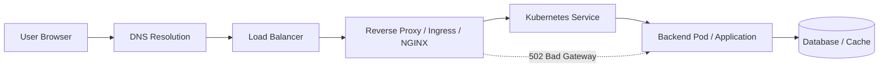

# Incident #001: 502 Bad Gateway

## Scenario

Users report that the application is unavailable and the browser shows:

```text
502 Bad Gateway
```

## Meaning

A `502 Bad Gateway` means the reverse proxy, load balancer, gateway, or ingress controller could not get a valid response from the upstream backend service.

```text
Client
  ↓
Load Balancer / Reverse Proxy / Ingress
  ↓
Backend Application
```

The client can reach the proxy layer, but the proxy cannot successfully reach or receive a valid response from the backend.

## Common Causes

- Backend application is down
- Wrong upstream host or port
- NGINX or Ingress misconfiguration
- Kubernetes Service has no healthy endpoints
- Pod is crashing or not ready
- Load balancer target is unhealthy
- Firewall, Security Group, NACL, or NetworkPolicy is blocking traffic
- TLS mismatch between proxy and backend
- Backend timeout or connection refused

## Troubleshooting Steps

1. Confirm scope and impact.
2. Check monitoring for 5xx errors.
3. Check load balancer or ingress health.
4. Check NGINX or reverse proxy logs.
5. Check backend application health.
6. Check connectivity from proxy to backend.
7. Check recent deployments or configuration changes.
8. Apply the safest fix.
9. Monitor recovery.

## Useful Commands

### NGINX

```bash
sudo nginx -t
sudo systemctl status nginx
sudo journalctl -u nginx --since "30 minutes ago"
sudo tail -n 100 /var/log/nginx/error.log
```

### Docker

```bash
docker ps
docker logs <container_name>
```

### Kubernetes

```bash
kubectl get pods -A
kubectl get svc -A
kubectl get endpoints -A
kubectl describe pod <pod-name> -n <namespace>
kubectl logs <pod-name> -n <namespace>
```

## Example Root Cause

The application container listens on port `8080`, but the Kubernetes Service is configured with `targetPort: 8000`.

Because of this mismatch, the ingress can reach the Service, but traffic does not reach the application correctly.

## Remediation

Fix the Service port mapping:

```yaml
ports:
  - port: 80
    targetPort: 8080
```

Verify:

```bash
kubectl get endpoints -n <namespace>
curl -I http://application-url
```

## Prevention

- Add readiness probes
- Validate Kubernetes manifests in CI
- Add smoke tests after deployment
- Monitor ingress 5xx errors
- Alert on unhealthy targets
- Review service ports during deployment reviews
- Document rollback steps

## Interview Answer

A `502 Bad Gateway` usually means the gateway, reverse proxy, load balancer, or ingress controller could not get a valid response from the upstream backend. I would check monitoring, proxy logs, backend health, service endpoints, and recent deployments. In Kubernetes, I would verify pods, services, endpoints, ingress, readiness probes, and rollout history. I would avoid blind restarts and troubleshoot layer by layer using evidence.

## Key Takeaway

A 502 usually points to a problem between the proxy/gateway layer and the backend application.

## Request Flow



A `502 Bad Gateway` usually happens between the proxy/gateway layer and the backend application.


# Investigation: 502 Bad Gateway

## Goal

Find why the proxy/gateway cannot get a valid response from the backend service.

---

## Investigation Flow

1. Confirm user impact.
2. Check 5xx error rate.
3. Check proxy or ingress logs.
4. Check backend service health.
5. Verify service endpoints.
6. Check recent deployment changes.

---

## Key Commands

```bash
kubectl get pods -A
kubectl get svc -A
kubectl get endpoints -A
kubectl logs <pod-name> -n <namespace>
kubectl describe pod <pod-name> -n <namespace>
```

---

## Evidence to Collect

- Error start time
- Affected endpoint
- Proxy or ingress error logs
- Backend pod status
- Service endpoint status
- Recent deployment or config change

---

## Example Finding

The backend pod is running, but the Kubernetes Service is forwarding traffic to the wrong `targetPort`.

---

## Investigation Principle

Collect evidence before changing system state.

# Interview Notes: 502 Bad Gateway

## Question

What does `502 Bad Gateway` mean and how would you troubleshoot it?

## Short Answer

A `502 Bad Gateway` means the gateway, reverse proxy, load balancer, or ingress controller could not get a valid response from the upstream backend service.

## Senior Troubleshooting Flow

1. Confirm scope and impact.
2. Check monitoring for 5xx errors.
3. Check load balancer or ingress health.
4. Review NGINX or reverse proxy logs.
5. Check backend health.
6. Verify service endpoints.
7. Check recent deployments or config changes.
8. Fix safely and monitor recovery.

## Strong Interview Answer

A 502 Bad Gateway usually means the proxy or gateway layer is reachable, but it cannot get a valid response from the backend service. I would first confirm the scope and impact, then check monitoring for 5xx spikes. Next, I would inspect load balancer or ingress health, review NGINX/reverse proxy logs, and check backend application health. In Kubernetes, I would verify pods, services, endpoints, readiness probes, ingress configuration, and recent rollout history. I would avoid blind restarts and troubleshoot layer by layer using evidence.

## Follow-up Questions

- Difference between 502, 503, and 504?
- How do you check Kubernetes service endpoints?
- What NGINX log errors indicate upstream failure?
- How would you prevent this in CI/CD?

# Investigation: 502 Bad Gateway

## Goal

Find why the proxy/gateway cannot get a valid response from the backend service.

---

## Investigation Flow

1. Confirm user impact.
2. Check 5xx error rate.
3. Check proxy or ingress logs.
4. Check backend service health.
5. Verify service endpoints.
6. Check recent deployment changes.

---

## Key Commands

```bash
kubectl get pods -A
kubectl get svc -A
kubectl get endpoints -A
kubectl logs <pod-name> -n <namespace>
kubectl describe pod <pod-name> -n <namespace>
```

---

## Evidence to Collect

- Error start time
- Affected endpoint
- Proxy or ingress error logs
- Backend pod status
- Service endpoint status
- Recent deployment or config change

---

## Example Finding

The backend pod is running, but the Kubernetes Service is forwarding traffic to the wrong `targetPort`.

---

## Investigation Principle

Collect evidence before changing system state.

# LinkedIn Post: 502 Bad Gateway

Today I documented a production-style incident: `502 Bad Gateway`.

A 502 usually means the load balancer, reverse proxy, gateway, or ingress controller cannot get a valid response from the upstream backend service.

In a Kubernetes-based setup, I would check:

1. Ingress or NGINX logs
2. Backend pod status
3. Kubernetes Service endpoints
4. Readiness probes
5. Recent deployments
6. Service port and targetPort mapping

One common root cause:

The application listens on port `8080`, but the Kubernetes Service is configured with `targetPort: 8000`.

Key lesson:

Do not restart blindly.

Troubleshoot using evidence:

Observe → Hypothesize → Verify → Act

I’m documenting these production-style incidents as part of my DevSecOps platform portfolio.

GitHub repo:
https://github.com/lingarajayli/devsecops-platform

#DevOps #DevSecOps #Kubernetes #SRE #PlatformEngineering #Linux #CloudEngineering