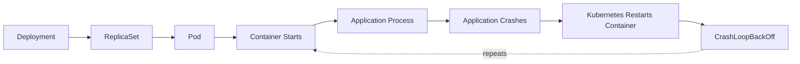
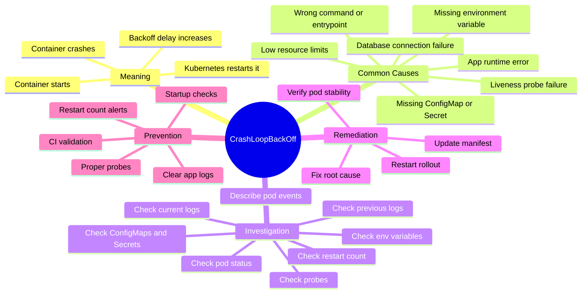

# Incident #002: CrashLoopBackOff in Kubernetes

## Scenario

A Kubernetes application pod is not staying in the `Running` state.

The pod repeatedly starts, crashes, and restarts.

Kubernetes shows:

```text
CrashLoopBackOff
```

---

## Meaning

`CrashLoopBackOff` means Kubernetes started the container, but the container process exited repeatedly.

Kubernetes waits before restarting it again. This waiting period is called backoff.

Important point:

`CrashLoopBackOff` is not the root cause. It is a symptom that the application or container process is repeatedly failing.

---

## Request Flow



---

## Mindmap


---

## Common Causes

- Application exits due to runtime error
- Missing environment variable
- Wrong command or entrypoint
- ConfigMap or Secret is missing
- Application cannot connect to database
- Port or config mismatch
- Image has a bug
- File permission issue
- Liveness probe is killing the container
- Resource limits are too low

---

## Investigation

### Goal

Find why the container process is exiting repeatedly.

### Investigation Flow

1. Check pod status.
2. Check restart count.
3. Check current container logs.
4. Check previous container logs.
5. Describe the pod events.
6. Check environment variables.
7. Check ConfigMaps and Secrets.
8. Check probes.
9. Check recent deployment changes.

### Key Commands

```bash
kubectl get pods -n <namespace>
kubectl get pods -n <namespace> -o wide
kubectl describe pod <pod-name> -n <namespace>
kubectl logs <pod-name> -n <namespace>
kubectl logs <pod-name> -n <namespace> --previous
kubectl get events -n <namespace> --sort-by=.lastTimestamp
```

### Evidence to Collect

- Pod name
- Namespace
- Restart count
- Last container exit reason
- Current logs
- Previous logs
- Pod events
- Recent deployment changes
- Missing ConfigMap or Secret
- Probe failures

---

## Example Root Cause

The application requires an environment variable called `DATABASE_URL`.

The variable was missing from the Deployment manifest.

Because of this, the application started and immediately exited.

---

## Remediation

Add the missing environment variable:

```yaml
env:
  - name: DATABASE_URL
    valueFrom:
      secretKeyRef:
        name: app-secret
        key: database-url
```

Then restart the deployment:

```bash
kubectl rollout restart deployment/<deployment-name> -n <namespace>
```

Verify:

```bash
kubectl get pods -n <namespace>
kubectl logs <pod-name> -n <namespace>
```

---

## Prevention

- Validate required environment variables in CI
- Use startup checks in the application
- Add clear application error logs
- Store sensitive values in Kubernetes Secrets
- Review ConfigMaps and Secrets during deployment
- Use readiness probes correctly
- Avoid aggressive liveness probes
- Monitor restart count
- Alert on repeated pod restarts

---

## Interview Answer

`CrashLoopBackOff` means the container starts but crashes repeatedly, so Kubernetes delays the next restart attempt.

I would check pod status, restart count, container logs, previous logs, pod events, environment variables, ConfigMaps, Secrets, probes, and recent deployment changes.

I would focus on why the main container process is exiting instead of blindly restarting the pod.

---

## LinkedIn Draft

Today I documented a production-style Kubernetes incident: `CrashLoopBackOff`.

`CrashLoopBackOff` means the container starts, crashes, and Kubernetes keeps trying to restart it with a delay.

The important point:

`CrashLoopBackOff` is not the root cause. It is a symptom.

My troubleshooting flow:

1. Check pod status
2. Check restart count
3. Read current logs
4. Read previous logs
5. Describe pod events
6. Check environment variables
7. Check ConfigMaps and Secrets
8. Check probes
9. Check recent deployment changes

One common root cause:

The application expects `DATABASE_URL`, but the environment variable is missing from the Deployment manifest.

Key lesson:

Do not blindly restart the pod.

Find why the main container process is exiting.

This is part of my DevSecOps platform portfolio where I document production-style incidents, troubleshooting flows, remediation steps, and interview-ready notes.

GitHub repo:
https://github.com/lingarajayli/devsecops-platform

#DevOps #DevSecOps #Kubernetes #SRE #PlatformEngineering #CloudEngineering