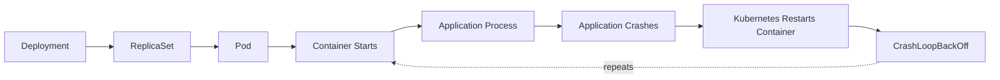

# Incident #002: CrashLoopBackOff in Kubernetes

## Scenario

A Kubernetes application pod is not staying in the `Running` state.

The pod repeatedly starts, crashes, and restarts.

Kubernetes shows:

```text
CrashLoopBackOff
```

---

## Meaning

`CrashLoopBackOff` means Kubernetes started the container, but the container process exited repeatedly.

Kubernetes waits before restarting it again. This waiting period is called backoff.

---

## Request Flow



---

## Common Causes

- Application exits due to runtime error
- Missing environment variable
- Wrong command or entrypoint
- ConfigMap or Secret is missing
- Application cannot connect to database
- Port/config mismatch
- Image has a bug
- File permission issue
- Liveness probe is killing the container
- Resource limits are too low

---

## Troubleshooting Steps

1. Check pod status.
2. Check container restart count.
3. Read container logs.
4. Read previous container logs.
5. Describe the pod events.
6. Check environment variables, ConfigMaps, and Secrets.
7. Check probes.
8. Check recent deployments.
9. Fix the root cause and restart safely.
10. Monitor pod stability.

---

## Useful Commands

### Check Pods

```bash
kubectl get pods -n <namespace>
kubectl get pods -n <namespace> -o wide
```

### Describe Pod

```bash
kubectl describe pod <pod-name> -n <namespace>
```

### Check Logs

```bash
kubectl logs <pod-name> -n <namespace>
kubectl logs <pod-name> -n <namespace> --previous
```

### Check Deployment

```bash
kubectl get deployment -n <namespace>
kubectl describe deployment <deployment-name> -n <namespace>
```

### Check Events

```bash
kubectl get events -n <namespace> --sort-by=.lastTimestamp
```

---

## Example Root Cause

The application requires an environment variable called `DATABASE_URL`.

The variable was missing from the Deployment manifest.

Because of this, the application started and immediately exited.

---

## Remediation

Add the missing environment variable:

```yaml
env:
  - name: DATABASE_URL
    valueFrom:
      secretKeyRef:
        name: app-secret
        key: database-url
```

Then restart the deployment:

```bash
kubectl rollout restart deployment/<deployment-name> -n <namespace>
```

Verify:

```bash
kubectl get pods -n <namespace>
kubectl logs <pod-name> -n <namespace>
```

---

## Prevention

- Validate required environment variables in CI
- Use startup checks in the application
- Add clear application error logs
- Store sensitive values in Kubernetes Secrets
- Review ConfigMaps and Secrets during deployment
- Use readiness probes correctly
- Avoid aggressive liveness probes
- Monitor restart count
- Alert on repeated pod restarts

---

## Interview Answer

`CrashLoopBackOff` means the container starts but crashes repeatedly, so Kubernetes delays the next restart attempt. I would check pod status, restart count, container logs, previous logs, pod events, environment variables, ConfigMaps, Secrets, probes, and recent deployment changes. I would focus on the reason the main container process is exiting instead of blindly restarting the pod.

---

## Key Takeaway

`CrashLoopBackOff` is not the root cause.

It is a symptom that the application or container process is repeatedly failing.