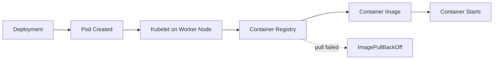
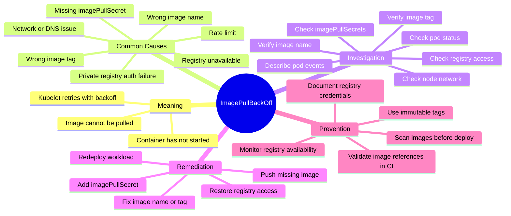

# Incident #003: ImagePullBackOff in Kubernetes

## Scenario

A Kubernetes pod is not starting.

The pod stays in a waiting state and Kubernetes shows:

```text
ImagePullBackOff
```

or:

```text
ErrImagePull
```

---

## Meaning

`ImagePullBackOff` means Kubernetes is unable to pull the container image from the container registry.

Kubernetes first shows `ErrImagePull`.

If the image pull keeps failing, Kubernetes waits before retrying again. This waiting state is called `ImagePullBackOff`.

Important point:

`ImagePullBackOff` is not an application runtime issue.

The container has not started yet because the image could not be downloaded.

---

## Request Flow



---

## Mindmap



---

## Common Causes

- Wrong image name
- Wrong image tag
- Image does not exist in registry
- Private registry authentication failed
- Missing or wrong `imagePullSecret`
- Registry is down or unreachable
- DNS/network issue from Kubernetes node
- Registry rate limit
- Image was deleted or moved
- Wrong registry URL

---

## Investigation

### Goal

Find why Kubernetes cannot pull the container image.

### Investigation Flow

1. Check pod status.
2. Describe the pod.
3. Read pod events.
4. Check exact image name and tag.
5. Verify the image exists in the registry.
6. Check if the registry is public or private.
7. Verify `imagePullSecrets`.
8. Check node network and DNS.
9. Fix image reference or registry authentication.

### Key Commands

```bash
kubectl get pods -n <namespace>
kubectl describe pod <pod-name> -n <namespace>
kubectl get events -n <namespace> --sort-by=.lastTimestamp
kubectl get deployment <deployment-name> -n <namespace> -o yaml
kubectl get secret -n <namespace>
```

Check image manually:

```bash
docker pull <image-name>:<tag>
```

Check image used by deployment:

```bash
kubectl get deployment <deployment-name> -n <namespace> -o jsonpath='{.spec.template.spec.containers[*].image}'
```

### Evidence to Collect

- Pod name
- Namespace
- Exact image name
- Image tag
- Registry URL
- Pod event error message
- Whether registry is public or private
- `imagePullSecret` name
- Recent deployment changes

---

## Example Root Cause

The Deployment manifest uses this image:

```yaml
image: myregistry.example.com/payments-api:v2
```

But the image tag `v2` was never pushed to the registry.

Because of this, Kubernetes cannot pull the image and the pod enters `ImagePullBackOff`.

---

## Remediation

Fix the image tag:

```yaml
image: myregistry.example.com/payments-api:v1
```

Or push the missing image tag to the registry:

```bash
docker build -t myregistry.example.com/payments-api:v2 .
docker push myregistry.example.com/payments-api:v2
```

If the registry is private, create an image pull secret:

```bash
kubectl create secret docker-registry regcred \
  --docker-server=<registry-url> \
  --docker-username=<username> \
  --docker-password=<password> \
  --docker-email=<email> \
  -n <namespace>
```

Reference it in the Deployment:

```yaml
imagePullSecrets:
  - name: regcred
```

Verify:

```bash
kubectl get pods -n <namespace>
kubectl describe pod <pod-name> -n <namespace>
```

---

## Prevention

- Validate image name and tag in CI
- Push image before deployment
- Use immutable image tags
- Avoid using only `latest` in production
- Store registry credentials securely
- Use proper `imagePullSecrets`
- Monitor registry availability
- Add deployment smoke checks
- Fail CI/CD pipeline if image does not exist
- Document registry naming standards

---

## Interview Answer

`ImagePullBackOff` means Kubernetes cannot pull the container image from the registry, so the container has not started yet.

I would describe the pod and check events to see the exact image pull error. Then I would verify the image name, tag, registry URL, image existence, registry authentication, `imagePullSecrets`, and node network access.

I would not debug application logs first because the application container has not started yet.

---

## LinkedIn Draft

Today I documented a production-style Kubernetes incident: ImagePullBackOff.

ImagePullBackOff means Kubernetes cannot pull the container image from the registry.

Important point:

This is not an application runtime issue.

The container has not started yet.

My troubleshooting flow:

1. Check pod status
2. Describe the pod
3. Read pod events
4. Verify image name
5. Verify image tag
6. Check if the image exists in the registry
7. Check imagePullSecrets
8. Check registry authentication
9. Check node network or DNS access

One common root cause:

The Deployment points to image tag v2, but v2 was never pushed to the registry.

Key lesson:

Do not start by checking application logs.

First confirm whether the container image was pulled successfully.

This is part of my DevSecOps platform portfolio where I document production-style incidents, troubleshooting flows, remediation steps, and interview-ready notes.

GitHub repo:
https://github.com/lingarajayli/devsecops-platform

#DevOps #DevSecOps #Kubernetes #SRE #PlatformEngineering #CloudEngineering