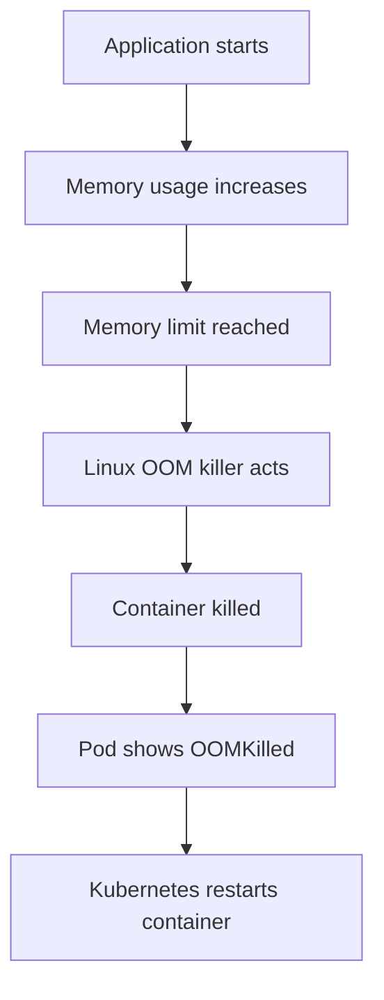
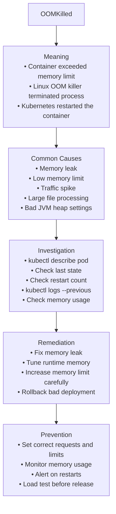

```mermaid
flowchart TD
    A["OOMKilled"]

    A --> B["Meaning"]
    B --> B1["Container exceeded memory limit"]
    B --> B2["Linux OOM killer terminated process"]
    B --> B3["Kubernetes restarted the container"]

    A --> C["Common Causes"]
    C --> C1["Memory leak"]
    C --> C2["Low memory limit"]
    C --> C3["Traffic spike"]
    C --> C4["Large file processing"]
    C --> C5["Bad JVM heap settings"]

    A --> D["Investigation"]
    D --> D1["kubectl describe pod"]
    D --> D2["Check last state"]
    D --> D3["Check restart count"]
    D --> D4["kubectl logs --previous"]
    D --> D5["Check memory usage"]

    A --> E["Remediation"]
    E --> E1["Fix memory leak"]
    E --> E2["Tune runtime memory"]
    E --> E3["Increase memory limit carefully"]
    E --> E4["Rollback bad deployment"]

    A --> F["Prevention"]
    F --> F1["Set correct requests and limits"]
    F --> F2["Monitor memory usage"]
    F --> F3["Alert on restarts"]
    F --> F4["Load test before release"]
```

# Incident #004: OOMKilled in Kubernetes

## Scenario

A Kubernetes pod starts successfully but later gets terminated.

The pod status or container last state shows:

```text
OOMKilled
```

The application may restart repeatedly or become unavailable.

---

## Meaning

`OOMKilled` means the container used more memory than its allowed memory limit.

Kubernetes then kills the container to protect the node from memory exhaustion.

Important point:

`OOMKilled` is usually a memory-related issue, not a CPU issue.

The container was running, but it exceeded its memory limit.

---

## Request Flow



---

## Troubleshooting Map



## Troubleshooting Map



---

## Common Causes

- Memory leak in application
- Memory limit is too low
- Sudden traffic spike
- Large file or batch processing
- JVM heap size is larger than container memory limit
- Node.js or Python process consuming too much memory
- Inefficient query or caching behavior
- Application loads too much data into memory
- Recent deployment increased memory usage
- Missing or incorrect Kubernetes resource limits

---

## Investigation

### Goal

Find why the container exceeded its memory limit and was killed.

### Investigation Flow

1. Check pod status.
2. Describe the pod.
3. Check container last state.
4. Check restart count.
5. Check memory requests and limits.
6. Check memory usage metrics.
7. Check application logs before the kill.
8. Check recent deployments or traffic changes.
9. Decide whether to tune memory, fix code, or roll back.

### Key Commands

Check pod status:

```bash
kubectl get pods -n <namespace>
kubectl get pod <pod-name> -n <namespace> -o wide
```

Describe pod:

```bash
kubectl describe pod <pod-name> -n <namespace>
```

Check container last state:

```bash
kubectl get pod <pod-name> -n <namespace> -o yaml
```

Check logs:

```bash
kubectl logs <pod-name> -n <namespace>
kubectl logs <pod-name> -n <namespace> --previous
```

Check resource usage:

```bash
kubectl top pod <pod-name> -n <namespace>
kubectl top pods -n <namespace>
kubectl top nodes
```

Check deployment resources:

```bash
kubectl get deployment <deployment-name> -n <namespace> -o yaml
```

### Evidence to Collect

- Pod name
- Namespace
- Restart count
- Container last state
- Exit code
- Memory request
- Memory limit
- Actual memory usage
- Application logs before restart
- Recent deployment changes
- Traffic spike timing
- Node memory pressure

---

## Example Root Cause

The application container has this memory limit:

```yaml
resources:
  limits:
    memory: "256Mi"
```

During peak traffic, the application memory usage grows above `256Mi`.

Kubernetes kills the container and marks the last state as:

```text
OOMKilled
```

---

## Remediation

Increase the memory limit carefully if the application genuinely needs more memory:

```yaml
resources:
  requests:
    memory: "512Mi"
  limits:
    memory: "1Gi"
```

Apply the updated manifest:

```bash
kubectl apply -f deployment.yaml
```

Restart rollout if required:

```bash
kubectl rollout restart deployment/<deployment-name> -n <namespace>
```

Verify rollout:

```bash
kubectl rollout status deployment/<deployment-name> -n <namespace>
kubectl get pods -n <namespace>
```

Check memory usage after the fix:

```bash
kubectl top pods -n <namespace>
```

If the issue started after a deployment, roll back:

```bash
kubectl rollout undo deployment/<deployment-name> -n <namespace>
```

---

## Prevention

- Set realistic memory requests and limits
- Monitor memory usage with Prometheus and Grafana
- Alert on container restarts
- Alert on high memory usage before OOM
- Load test before production release
- Profile application memory usage
- Tune JVM heap or runtime memory settings
- Avoid processing huge files fully in memory
- Review resource limits during deployment reviews
- Use horizontal scaling for traffic spikes
- Avoid blindly increasing limits without root cause analysis

---

## Interview Answer

`OOMKilled` means the container exceeded its memory limit and was killed by the Linux kernel.

I would check the pod description, container last state, restart count, memory requests and limits, memory usage metrics, previous logs, recent deployments, and traffic patterns.

I would not blindly increase the memory limit. First, I would verify whether the limit is too low, the traffic increased, or the application has a memory leak.

---

## Follow-up Interview Questions

- What is the difference between memory request and memory limit?
- What happens if a container exceeds CPU limit?
- What happens if a container exceeds memory limit?
- How do you check previous container logs?
- How would you detect a memory leak in Kubernetes?
- How do Prometheus and Grafana help with OOMKilled issues?
- Why should we avoid setting memory limits too low?

---

## LinkedIn Draft

Today I documented a production-style Kubernetes incident: OOMKilled.

OOMKilled means the container exceeded its memory limit and Kubernetes killed it.

Important point:

This is usually a memory issue, not a CPU issue.

My troubleshooting flow:

1. Check pod status
2. Describe the pod
3. Check container last state
4. Check restart count
5. Check memory requests and limits
6. Check memory usage metrics
7. Check previous logs
8. Check recent deployments
9. Check traffic spike timing

One common root cause:

The application memory limit is set to 256Mi, but during peak traffic the application needs more memory.

Key lesson:

Do not blindly increase memory limits.

First understand whether the issue is wrong sizing, traffic spike, or memory leak.

This is part of my DevSecOps platform portfolio where I document production-style incidents, troubleshooting flows, remediation steps, and interview-ready notes.

GitHub repo:
https://github.com/lingarajayli/devsecops-platform

#DevOps #DevSecOps #Kubernetes #SRE #PlatformEngineering #Linux #CloudEngineering