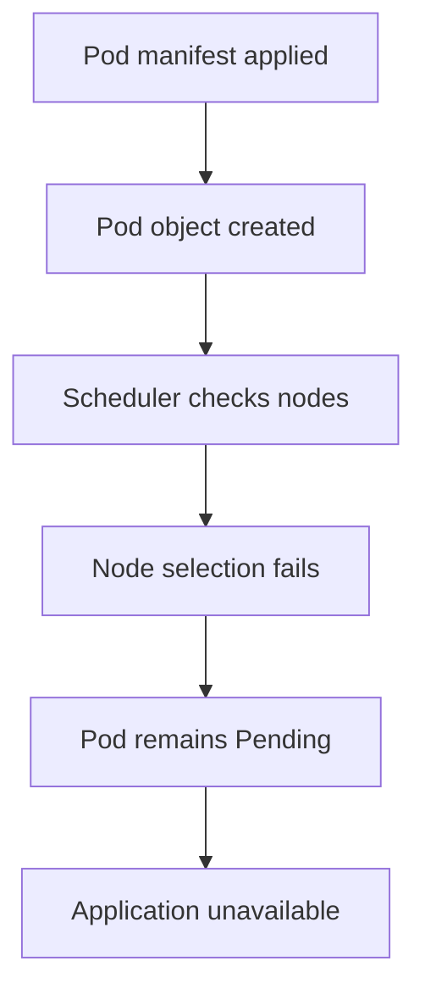
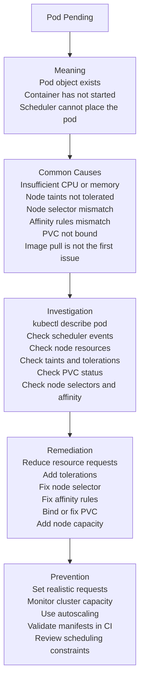

# Incident #005: Kubernetes Pod Pending

## Scenario

A Kubernetes pod is created, but it does not start running.

The pod status shows:

```text
Pending
```

The application is not available because the pod has not been scheduled onto a node.

---

## Meaning

`Pending` means Kubernetes accepted the pod object, but the pod has not been scheduled or started successfully.

Important point:

`Pending` usually means the scheduler cannot place the pod on any available node, or the pod is waiting for required resources like storage.

The container has not started yet.

---

## Request Flow



---

## Troubleshooting Map



---

## Common Causes

- Insufficient CPU on available nodes
- Insufficient memory on available nodes
- Pod resource requests are too high
- Node taints are blocking scheduling
- Missing tolerations
- Wrong `nodeSelector`
- Node affinity rules do not match any node
- Pod anti-affinity rules are too strict
- PersistentVolumeClaim is not bound
- StorageClass issue
- Cluster has no available nodes
- Namespace ResourceQuota is exceeded
- LimitRange policy blocks the pod
- Node is marked unschedulable
- Node is under pressure

---

## Investigation

### Goal

Find why Kubernetes scheduler cannot place the pod on a node.

### Investigation Flow

1. Check pod status.
2. Describe the pod.
3. Read the Events section carefully.
4. Check node capacity and allocatable resources.
5. Check pod CPU and memory requests.
6. Check taints and tolerations.
7. Check node selectors and affinity rules.
8. Check PVC status.
9. Check namespace quota and limits.
10. Apply the safest fix and verify scheduling.

### Key Commands

Check pending pods:

```bash
kubectl get pods -n <namespace>
kubectl get pods -A | grep Pending
```

Describe the pod:

```bash
kubectl describe pod <pod-name> -n <namespace>
```

Check events:

```bash
kubectl get events -n <namespace> --sort-by=.lastTimestamp
```

Check node status:

```bash
kubectl get nodes
kubectl describe node <node-name>
```

Check node resource usage:

```bash
kubectl top nodes
kubectl top pods -A
```

Check pod resource requests:

```bash
kubectl get pod <pod-name> -n <namespace> -o yaml
```

Check taints:

```bash
kubectl describe node <node-name> | grep -i taint
```

Check PVC:

```bash
kubectl get pvc -n <namespace>
kubectl describe pvc <pvc-name> -n <namespace>
```

Check quotas:

```bash
kubectl get resourcequota -n <namespace>
kubectl describe resourcequota -n <namespace>
```

Check limit ranges:

```bash
kubectl get limitrange -n <namespace>
kubectl describe limitrange -n <namespace>
```

### Evidence to Collect

- Pod name
- Namespace
- Scheduler event message
- CPU request
- Memory request
- Node allocatable CPU and memory
- Node taints
- Pod tolerations
- Node selector
- Affinity and anti-affinity rules
- PVC status
- ResourceQuota status
- Recent deployment changes

---

## Example Root Cause

The pod requests too much memory:

```yaml
resources:
  requests:
    memory: "8Gi"
```

But the available worker nodes have only `4Gi` memory allocatable.

The scheduler cannot find a suitable node, so the pod remains:

```text
Pending
```

The Events section may show:

```text
0/3 nodes are available: insufficient memory
```

---

## Remediation

Reduce the memory request if the application does not need that much memory:

```yaml
resources:
  requests:
    memory: "512Mi"
    cpu: "250m"
  limits:
    memory: "1Gi"
    cpu: "500m"
```

Apply the updated manifest:

```bash
kubectl apply -f deployment.yaml
```

Check pod scheduling:

```bash
kubectl get pods -n <namespace>
kubectl describe pod <pod-name> -n <namespace>
```

If the pod is blocked by taints, add a valid toleration:

```yaml
tolerations:
  - key: "workload"
    operator: "Equal"
    value: "app"
    effect: "NoSchedule"
```

If the pod is blocked by PVC issues, fix the PVC or StorageClass:

```bash
kubectl get pvc -n <namespace>
kubectl describe pvc <pvc-name> -n <namespace>
```

If the cluster genuinely lacks capacity, add more nodes or enable cluster autoscaling.

---

## Prevention

- Set realistic CPU and memory requests
- Avoid over-requesting resources
- Monitor cluster capacity
- Use Horizontal Pod Autoscaler for workload scaling
- Use Cluster Autoscaler for node scaling
- Validate Kubernetes manifests in CI
- Review taints, tolerations, node selectors, and affinity rules
- Monitor Pending pods
- Alert when pods stay Pending for too long
- Use ResourceQuota carefully
- Document workload scheduling requirements

---

## Interview Answer

`Pending` means the pod object has been created, but Kubernetes has not scheduled it onto a node yet.

I would start with `kubectl describe pod` and check the Events section. Most Pending issues are caused by insufficient CPU or memory, taints without tolerations, node selector mismatch, affinity rules, PVC binding issues, or quota restrictions.

I would verify node capacity, pod resource requests, taints, tolerations, affinity, PVC status, and namespace quotas. I would not check application logs first because the container has not started yet.

---

## Follow-up Interview Questions

- What is the role of the Kubernetes scheduler?
- What is the difference between `Pending`, `ContainerCreating`, and `Running`?
- How do CPU and memory requests affect scheduling?
- What are taints and tolerations?
- What is the difference between `nodeSelector` and node affinity?
- How can PVC issues cause a pod to remain Pending?
- How do you troubleshoot insufficient CPU or memory scheduling errors?
- Why should we not check application logs first for a Pending pod?

---

## LinkedIn Draft

Today I documented a production-style Kubernetes incident: Pod Pending.

A Pending pod means the pod object exists, but Kubernetes has not scheduled it onto a node yet.

Common causes include:

1. Insufficient CPU or memory
2. Resource requests are too high
3. Node taints without matching tolerations
4. Wrong nodeSelector
5. Strict affinity or anti-affinity rules
6. PVC not bound
7. Namespace quota restrictions

Important troubleshooting command:

kubectl describe pod

The Events section usually tells the real reason.

Key lesson:

Do not check application logs first.

If the pod is Pending, the container has not started yet.

This is part of my DevSecOps platform portfolio where I document production-style incidents, troubleshooting flows, remediation steps, and interview-ready notes.

GitHub repo:
https://github.com/lingarajayli/devsecops-platform

#DevOps #DevSecOps #Kubernetes #SRE #PlatformEngineering #Linux #CloudEngineering