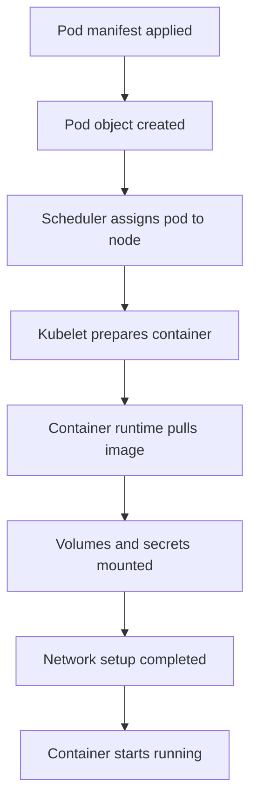
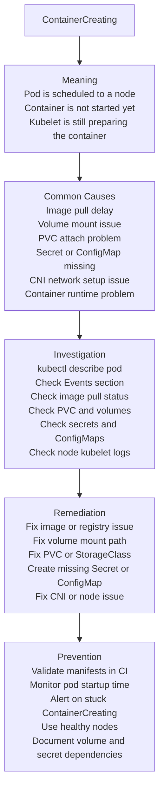

# Incident #006: Kubernetes ContainerCreating Stuck

## Scenario

A Kubernetes pod is scheduled to a node, but the container does not start.

The pod status shows:

```text
ContainerCreating
```

The application is not available because the container is still being prepared.

---

## Meaning

`ContainerCreating` means Kubernetes has scheduled the pod onto a node, but the container runtime has not finished creating and starting the container.

Important point:

`ContainerCreating` is different from `Pending`.

In `Pending`, the pod may not be scheduled yet.

In `ContainerCreating`, the pod is usually already assigned to a node, but something is blocking container startup.

---

## Request Flow



---

## Troubleshooting Map



---

## Common Causes

- Image pull is slow
- Image registry is unreachable
- Wrong image name or tag
- Missing image pull secret
- PersistentVolumeClaim is not bound
- Volume attach or mount failure
- Missing Secret
- Missing ConfigMap
- Invalid volume mount path
- CNI plugin network setup issue
- Container runtime issue on node
- Kubelet issue on node
- Node disk pressure
- Node network issue
- StorageClass or CSI driver issue

---

## Investigation

### Goal

Find why the container runtime or kubelet cannot complete container creation.

### Investigation Flow

1. Check pod status.
2. Describe the pod.
3. Read the Events section carefully.
4. Check whether the pod is assigned to a node.
5. Check image pull events.
6. Check volume mount events.
7. Check PVC status.
8. Check Secret and ConfigMap references.
9. Check node condition.
10. Check kubelet or container runtime logs if required.

### Key Commands

Check pod status:

```bash
kubectl get pods -n <namespace>
kubectl get pod <pod-name> -n <namespace> -o wide
```

Describe the pod:

```bash
kubectl describe pod <pod-name> -n <namespace>
```

Check events:

```bash
kubectl get events -n <namespace> --sort-by=.lastTimestamp
```

Check pod YAML:

```bash
kubectl get pod <pod-name> -n <namespace> -o yaml
```

Check PVC:

```bash
kubectl get pvc -n <namespace>
kubectl describe pvc <pvc-name> -n <namespace>
```

Check Secrets:

```bash
kubectl get secret -n <namespace>
kubectl describe secret <secret-name> -n <namespace>
```

Check ConfigMaps:

```bash
kubectl get configmap -n <namespace>
kubectl describe configmap <configmap-name> -n <namespace>
```

Check node:

```bash
kubectl get nodes
kubectl describe node <node-name>
```

Check kubelet logs on the node:

```bash
sudo journalctl -u kubelet --since "30 minutes ago"
```

Check container runtime:

```bash
sudo crictl ps -a
sudo crictl images
sudo crictl info
```

### Evidence to Collect

- Pod name
- Namespace
- Node name
- Pod status
- Events section
- Image name and tag
- Image pull secret status
- PVC status
- Volume mount errors
- Secret name
- ConfigMap name
- Node condition
- Kubelet logs
- Container runtime logs
- Recent deployment changes

---

## Example Root Cause

The pod references a Secret:

```yaml
envFrom:
  - secretRef:
      name: app-secret
```

But the Secret does not exist in the namespace.

The pod remains in:

```text
ContainerCreating
```

The Events section may show:

```text
Error: secret "app-secret" not found
```

---

## Remediation

Create the missing Secret:

```bash
kubectl create secret generic app-secret \
  --from-literal=DB_USERNAME=appuser \
  --from-literal=DB_PASSWORD=strongpassword \
  -n <namespace>
```

Verify the Secret exists:

```bash
kubectl get secret app-secret -n <namespace>
```

Restart the rollout if required:

```bash
kubectl rollout restart deployment/<deployment-name> -n <namespace>
```

Check pod status:

```bash
kubectl get pods -n <namespace>
kubectl describe pod <pod-name> -n <namespace>
```

If the issue is volume-related, check PVC and storage events:

```bash
kubectl get pvc -n <namespace>
kubectl describe pvc <pvc-name> -n <namespace>
```

If the issue is node-related, drain the problematic node carefully:

```bash
kubectl cordon <node-name>
kubectl drain <node-name> --ignore-daemonsets --delete-emptydir-data
```

Use node drain carefully in production after checking workload impact.

---

## Prevention

- Validate Kubernetes manifests in CI
- Check Secret and ConfigMap existence before deployment
- Monitor pod startup duration
- Alert when pods stay in ContainerCreating too long
- Monitor PVC binding and volume mount failures
- Monitor node health
- Monitor kubelet and container runtime errors
- Keep CNI and CSI drivers healthy
- Use readiness probes
- Document required Secrets, ConfigMaps, PVCs, and StorageClasses
- Avoid manual secret creation without GitOps or automation
- Use deployment smoke tests

---

## Interview Answer

`ContainerCreating` means the pod has usually been scheduled to a node, but the container has not started yet.

I would first run `kubectl describe pod` and check the Events section. Common causes include image pull delays, volume mount issues, PVC attach problems, missing Secrets or ConfigMaps, CNI networking issues, container runtime problems, or kubelet issues on the node.

I would not start with application logs because the container may not have started yet. I would troubleshoot from pod events, node assignment, volume status, image pull status, and node-level logs if needed.

---

## Follow-up Interview Questions

- What is the difference between `Pending` and `ContainerCreating`?
- What does kubelet do during container creation?
- How can missing Secrets cause ContainerCreating?
- How can PVC or volume mount issues block container startup?
- How do you check pod events?
- When would you check kubelet logs?
- What is the role of the container runtime?
- How can CNI issues affect pod startup?
- Why should we not check application logs first?

---

## LinkedIn Draft

Today I documented a production-style Kubernetes incident: ContainerCreating stuck.

ContainerCreating means the pod is usually scheduled to a node, but the container has not started yet.

Common causes include:

1. Image pull delay
2. Registry access issue
3. Volume mount failure
4. PVC attach problem
5. Missing Secret
6. Missing ConfigMap
7. CNI networking issue
8. Container runtime or kubelet issue

Important troubleshooting command:

kubectl describe pod

The Events section usually gives the strongest clue.

Key lesson:

Do not check application logs first.

If the container is still being created, the application may not have started yet.

This is part of my DevSecOps platform portfolio where I document production-style incidents, troubleshooting flows, remediation steps, and interview-ready notes.

GitHub repo:
https://github.com/lingarajayli/devsecops-platform

#DevOps #DevSecOps #Kubernetes #SRE #PlatformEngineering #Linux #CloudEngineering