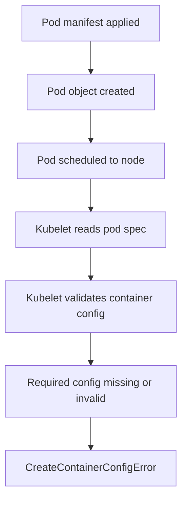
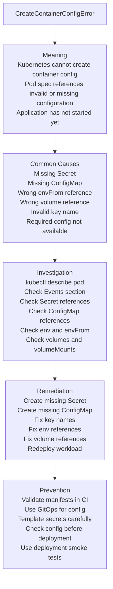

# Incident #007: CreateContainerConfigError

## Scenario

A Kubernetes pod is created, but the container does not start.

The pod status shows:

```text
CreateContainerConfigError
```

The application is unavailable because Kubernetes cannot create the container configuration correctly.

---

## Meaning

`CreateContainerConfigError` means Kubernetes cannot create the container because required configuration is missing, invalid, or incorrectly referenced.

Important point:

The image may be valid.

The pod may be scheduled.

But the container cannot be created because the pod configuration is wrong.

This often happens before the application starts.

---

## Request Flow



---

## Troubleshooting Map



---

## Common Causes

- Missing Secret
- Missing ConfigMap
- Wrong Secret name
- Wrong ConfigMap name
- Wrong key inside Secret or ConfigMap
- Invalid `envFrom` reference
- Invalid `env.valueFrom.secretKeyRef`
- Invalid `env.valueFrom.configMapKeyRef`
- Volume references a missing Secret
- Volume references a missing ConfigMap
- Required environment variable source is unavailable
- Helm values generated incorrect names
- Kustomize overlay references wrong resources
- Namespace mismatch between pod and Secret or ConfigMap

---

## Investigation

### Goal

Find which required configuration object is missing or invalid.

### Investigation Flow

1. Check pod status.
2. Describe the pod.
3. Read the Events section carefully.
4. Check referenced Secrets.
5. Check referenced ConfigMaps.
6. Check environment variable references.
7. Check volume references.
8. Check namespace correctness.
9. Fix the missing or invalid configuration.
10. Redeploy and verify the pod starts.

### Key Commands

Check pod status:

```bash
kubectl get pods -n <namespace>
kubectl get pod <pod-name> -n <namespace> -o wide
```

Describe pod:

```bash
kubectl describe pod <pod-name> -n <namespace>
```

Check events:

```bash
kubectl get events -n <namespace> --sort-by=.lastTimestamp
```

Check pod YAML:

```bash
kubectl get pod <pod-name> -n <namespace> -o yaml
```

Check Secrets:

```bash
kubectl get secrets -n <namespace>
kubectl describe secret <secret-name> -n <namespace>
```

Check ConfigMaps:

```bash
kubectl get configmaps -n <namespace>
kubectl describe configmap <configmap-name> -n <namespace>
```

Search for Secret references:

```bash
kubectl get deployment <deployment-name> -n <namespace> -o yaml | grep -i secret -A5 -B5
```

Search for ConfigMap references:

```bash
kubectl get deployment <deployment-name> -n <namespace> -o yaml | grep -i configmap -A5 -B5
```

Check Helm rendered manifests:

```bash
helm template <release-name> <chart-path> -n <namespace>
```

Check live deployment manifest:

```bash
kubectl get deployment <deployment-name> -n <namespace> -o yaml
```

### Evidence to Collect

- Pod name
- Namespace
- Events message
- Deployment name
- Referenced Secret names
- Referenced ConfigMap names
- Missing key name
- Environment variable references
- Volume references
- Helm values or Kustomize overlay used
- Recent config changes
- Recent deployment changes

---

## Example Root Cause

The deployment references this Secret:

```yaml
env:
  - name: DB_PASSWORD
    valueFrom:
      secretKeyRef:
        name: db-secret
        key: password
```

But the Secret does not exist in the namespace:

```text
db-secret
```

The pod shows:

```text
CreateContainerConfigError
```

The Events section may show:

```text
Error: secret "db-secret" not found
```

---

## Remediation

Create the missing Secret:

```bash
kubectl create secret generic db-secret \
  --from-literal=password='strong-password' \
  -n <namespace>
```

Verify the Secret:

```bash
kubectl get secret db-secret -n <namespace>
kubectl describe secret db-secret -n <namespace>
```

Restart the deployment if required:

```bash
kubectl rollout restart deployment/<deployment-name> -n <namespace>
```

Check pod status:

```bash
kubectl get pods -n <namespace>
kubectl describe pod <pod-name> -n <namespace>
```

If the Secret exists but the key is wrong, fix the manifest or recreate the Secret with the correct key:

```bash
kubectl create secret generic db-secret \
  --from-literal=password='strong-password' \
  -n <namespace> \
  --dry-run=client -o yaml | kubectl apply -f -
```

If the issue came from Helm values, update the values file and render before applying:

```bash
helm template <release-name> <chart-path> -n <namespace>
```

---

## Prevention

- Validate Kubernetes manifests in CI
- Check Secret and ConfigMap references before deployment
- Use Helm template or Kustomize build validation
- Use GitOps for predictable configuration management
- Keep environment-specific values clearly separated
- Avoid manually creating critical Secrets without documentation
- Use External Secrets or sealed secrets for production workflows
- Add smoke tests after deployment
- Monitor pods stuck in CreateContainerConfigError
- Review namespace-specific configuration carefully

---

## Interview Answer

`CreateContainerConfigError` means Kubernetes cannot create the container because required configuration is missing or invalid.

I would start with `kubectl describe pod` and check the Events section. Most commonly, this happens because of missing Secrets, missing ConfigMaps, wrong key names, invalid environment variable references, or invalid volume references.

I would verify the pod spec, Secret references, ConfigMap references, namespace, Helm or Kustomize rendered manifests, and recent configuration changes.

I would not check application logs first because the application container has not started yet.

---

## Follow-up Interview Questions

- What is the difference between `CreateContainerConfigError` and `CreateContainerError`?
- How can a missing Secret cause this error?
- How can a missing ConfigMap cause this error?
- How do you check pod events?
- Why should we check `kubectl describe pod` first?
- How do Helm values cause configuration errors?
- How would you prevent missing Secrets in CI/CD?
- Why are application logs usually not helpful here?

---

## LinkedIn Draft

Today I documented a production-style Kubernetes incident: CreateContainerConfigError.

This error means Kubernetes cannot create the container because required configuration is missing or invalid.

Common causes include:

1. Missing Secret
2. Missing ConfigMap
3. Wrong Secret name
4. Wrong ConfigMap name
5. Wrong key inside Secret or ConfigMap
6. Invalid environment variable reference
7. Invalid volume reference
8. Namespace mismatch

Important troubleshooting command:

kubectl describe pod

The Events section usually tells the exact missing resource.

Key lesson:

Do not check application logs first.

If the container configuration cannot be created, the application has not started yet.

This is part of my DevSecOps platform portfolio where I document production-style incidents, troubleshooting flows, remediation steps, and interview-ready notes.

GitHub repo:
https://github.com/lingarajayli/devsecops-platform

#DevOps #DevSecOps #Kubernetes #SRE #PlatformEngineering #Linux #CloudEngineering