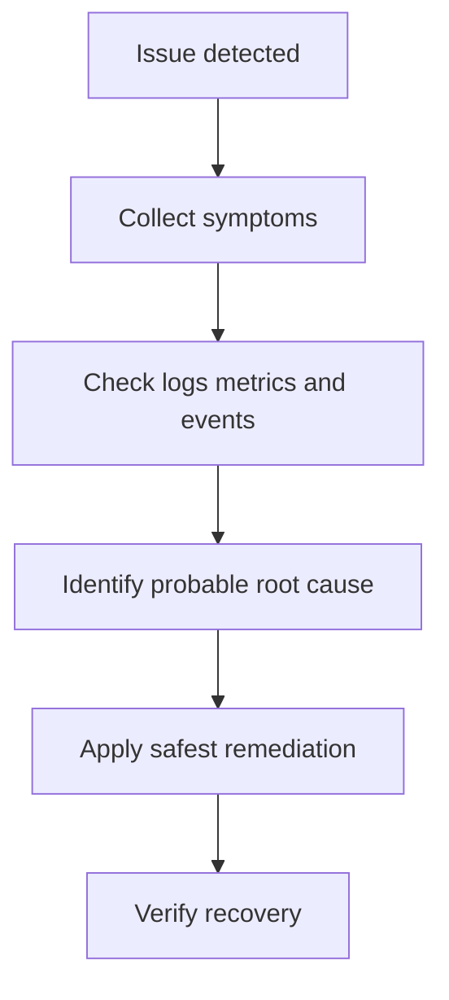
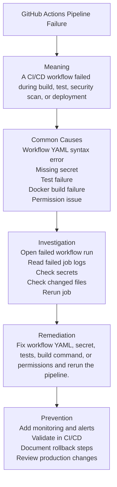

# Incident #016: GitHub Actions Pipeline Failure

## Scenario

A production workload shows the following incident:

```text
GitHub Actions Pipeline Failure
```

Impact: users may experience failed requests, slow responses, failed deployments, or unavailable services.

---

## Meaning

A CI/CD workflow failed during build, test, security scan, or deployment.

Important point:

Do not guess the root cause. Start from observable evidence: events, logs, metrics, configuration, and recent changes.

---

## Request Flow



---

## Troubleshooting Map



---

## Common Causes

- Workflow YAML syntax error
- Missing secret
- Test failure
- Docker build failure
- Permission issue
- Wrong working directory

---

## Investigation

### Goal

Identify the safest and most likely root cause using evidence.

### Investigation Flow

1. Confirm scope and impact.
2. Check recent deployments or configuration changes.
3. Check events, logs, and metrics.
4. Identify the failing layer.
5. Apply the safest remediation.
6. Verify recovery.
7. Document the incident.

### Key Commands

```bash
kubectl get pods -A
kubectl get events -A --sort-by=.lastTimestamp
kubectl describe pod <pod-name> -n <namespace>
kubectl logs <pod-name> -n <namespace>
kubectl logs <pod-name> -n <namespace> --previous
kubectl get nodes
kubectl describe node <node-name>
```

For CI/CD incidents:

```bash
git status
git log --oneline -5
git diff HEAD~1
```

### Evidence to Collect

- Incident start time
- Affected service
- Error message
- Recent deployment or config change
- Logs
- Metrics
- Events
- Current version
- Previous known-good version
- Remediation applied

---

## Example Root Cause

Pipeline failed because the workflow referenced a missing repository secret.

---

## Remediation

Fix workflow YAML, secret, tests, build command, or permissions and rerun the pipeline.

Verify recovery:

```bash
kubectl get pods -A
kubectl get events -A --sort-by=.lastTimestamp
```

---

## Prevention

- Add monitoring and alerting
- Add CI/CD validation
- Review configuration changes carefully
- Keep rollback steps documented
- Add post-deployment smoke tests
- Keep runbooks updated
- Use production change reviews

---

## Interview Answer

`GitHub Actions Pipeline Failure` means a CI/CD workflow failed during build, test, security scan, or deployment.

I would confirm the impact, check recent changes, inspect events/logs/metrics, identify the failing layer, apply the safest remediation, and verify recovery. I would avoid random restarts and troubleshoot using evidence.

---

## Follow-up Interview Questions

- How would you confirm the root cause?
- What logs, metrics, or events would you check first?
- How would you prevent this from happening again?
- When would you roll back?
- What would you document after recovery?

---

## LinkedIn Draft

Today I documented production-style incident #016: GitHub Actions Pipeline Failure.

Key lesson:

Troubleshooting should be evidence-based, not guess-based.

My investigation flow:

1. Confirm impact
2. Check recent changes
3. Check logs, metrics, and events
4. Identify the failing layer
5. Apply the safest fix
6. Verify recovery

GitHub repo:
https://github.com/lingarajayli/devsecops-platform

#DevOps #DevSecOps #SRE #PlatformEngineering #Kubernetes #CICD
