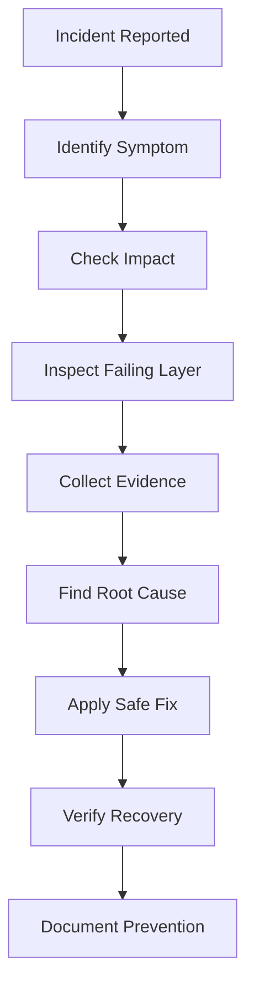
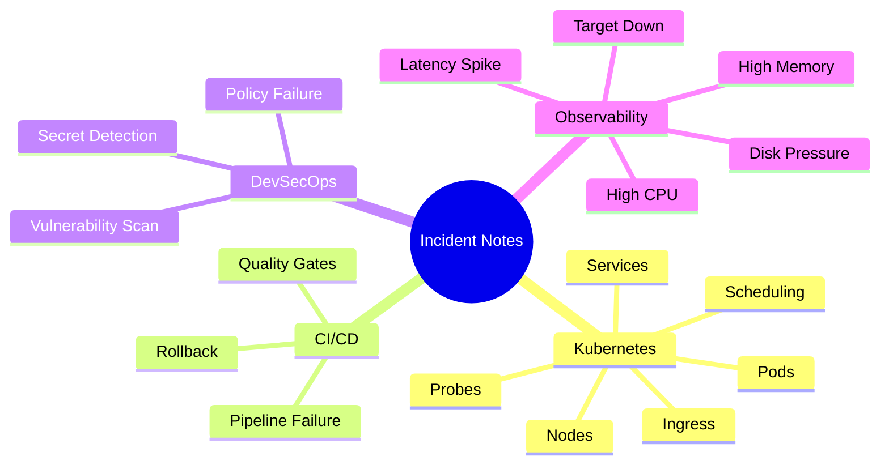
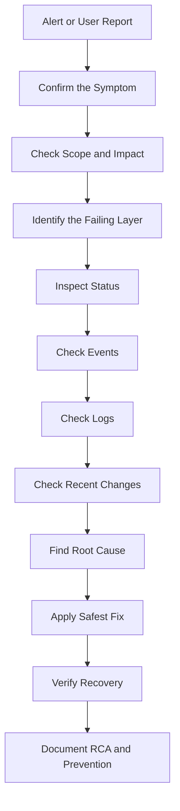
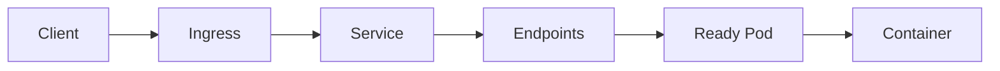
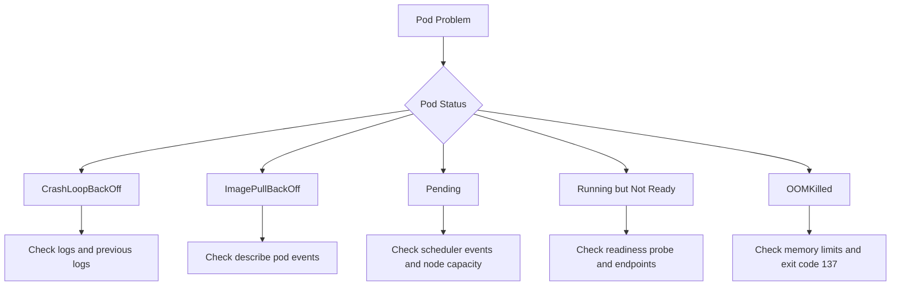
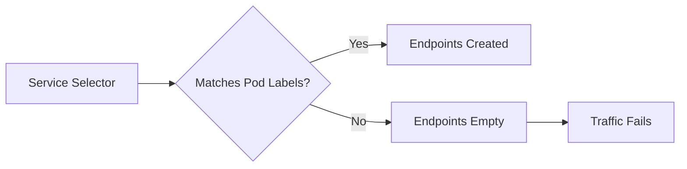

# Kubernetes & DevOps Incident Notes


---

## Overview

This directory contains production-style incident notes for Kubernetes, CI/CD, DevSecOps, and observability issues.

Each incident note is written to explain:

```text
What happened
Why it happened
How to investigate
How to fix safely
How to prevent it
How to explain it in interviews
```

> [!NOTE]
> These notes are designed as both learning documentation and interview preparation material.

---

## Why These Incident Notes Matter

In production, engineers are expected to troubleshoot under pressure.

Good incident handling requires:

```text
Clear symptom identification
Correct command selection
Event and log analysis
Root cause thinking
Safe remediation
Prevention planning
Documentation
```



---

## Incident Categories



---

## Kubernetes Incidents

| ID | Incident | Focus Area |
|---|---|---|
| 001 | [502 Bad Gateway](001-502-bad-gateway.md) | Ingress, Service, backend availability |
| 002 | [CrashLoopBackOff](002-crashloopbackoff.md) | App crash, logs, restart count |
| 003 | [ImagePullBackOff](003-imagepullbackoff.md) | Image pull, registry, image tags |
| 004 | [OOMKilled](004-oomkilled.md) | Memory limits, exit code 137 |
| 005 | [Pending Pod](005-pending-pod.md) | Scheduling, resources, taints |
| 006 | [ContainerCreating Stuck](006-containercreating-stuck.md) | Volumes, networking, image setup |
| 007 | [CreateContainerConfigError](007-createcontainerconfigerror.md) | ConfigMap, Secret, env configuration |
| 008 | [CreateContainerError](008-createcontainererror.md) | Runtime container creation failure |
| 009 | [Evicted Pod](009-evicted-pod.md) | Node pressure, resource eviction |
| 010 | [Node NotReady](010-node-notready.md) | Node health, kubelet, networking |
| 011 | [DNS Resolution Failure](011-dns-resolution-failure.md) | CoreDNS, Service discovery |
| 012 | [Service Endpoints Empty](012-service-endpoints-empty.md) | Labels, selectors, endpoints |
| 013 | [Ingress 404/503](013-ingress-404-503.md) | Ingress routing, backend service |
| 014 | [Readiness Probe Failure](014-readiness-probe-failure.md) | Health checks, traffic routing |
| 015 | [Liveness Probe Failure](015-liveness-probe-failure.md) | Container restarts, probe tuning |

---

## CI/CD Incidents

| ID | Incident | Focus Area |
|---|---|---|
| 016 | [GitHub Actions Pipeline Failure](016-github-actions-pipeline-failure.md) | Workflow debugging, CI logs |
| 020 | [Failed Deployment Rollback](020-failed-deployment-rollback.md) | Rollback strategy, deployment safety |

---

## DevSecOps Incidents

| ID | Incident | Focus Area |
|---|---|---|
| 017 | [Trivy Image Vulnerability](017-trivy-image-vulnerability.md) | Container image scanning |
| 018 | [Gitleaks Secret Detected](018-gitleaks-secret-detected.md) | Secret scanning, credential safety |
| 019 | [SonarQube Quality Gate Failed](019-sonarqube-quality-gate-failed.md) | Code quality, CI gates |

---

## Observability Incidents

| ID | Incident | Focus Area |
|---|---|---|
| 021 | [High CPU Usage](021-high-cpu-usage.md) | Metrics, resource saturation |
| 022 | [High Memory Usage](022-high-memory-usage.md) | Memory pressure, leaks |
| 023 | [Disk Pressure](023-disk-pressure.md) | Node storage, eviction risk |
| 024 | [Prometheus Target Down](024-prometheus-target-down.md) | Monitoring, scraping failures |
| 025 | [Application Latency Spike](025-application-latency-spike.md) | Performance, tracing, bottlenecks |

---

## Standard Incident Investigation Flow

Use this flow for most production incidents:



---

## Kubernetes Traffic Troubleshooting Flow

For Service, Ingress, and application connectivity issues:



Check in this order:

```text
1. Ingress host/path
2. Ingress backend Service name and port
3. Service selector
4. Endpoints
5. Pod labels
6. Pod readiness
7. Container port
8. Application logs
```

---

## Pod Troubleshooting Flow



---

## Key Commands

```bash
kubectl get pods -A
kubectl get pods -n <namespace>
kubectl get pods -n <namespace> -o wide
kubectl get pods -n <namespace> --show-labels
kubectl describe pod <pod-name> -n <namespace>
kubectl logs <pod-name> -n <namespace>
kubectl logs <pod-name> -n <namespace> --previous
kubectl get events -n <namespace> --sort-by=.lastTimestamp
kubectl get deployment <deployment-name> -n <namespace> -o yaml
kubectl rollout status deployment/<deployment-name> -n <namespace>
kubectl rollout history deployment/<deployment-name> -n <namespace>
kubectl rollout undo deployment/<deployment-name> -n <namespace>
kubectl get svc -n <namespace>
kubectl describe svc <service-name> -n <namespace>
kubectl get endpoints -n <namespace>
kubectl get ingress -n <namespace>
kubectl describe ingress <ingress-name> -n <namespace>
kubectl get nodes
kubectl describe node <node-name>
```

---

## Common Production Lessons

### Events are often more useful than logs

For these issues, logs may not be enough:

```text
ImagePullBackOff
Pod Pending
CreateContainerConfigError
Service Endpoints Empty
Readiness Probe Failure
Ingress backend issues
```

Use:

```bash
kubectl describe pod <pod-name> -n <namespace>
kubectl get events -n <namespace> --sort-by=.lastTimestamp
```

---

### Running does not always mean Ready

A Pod can be:

```text
STATUS: Running
READY: 0/1
```

This usually means Kubernetes will not send traffic to it.

Common causes:

```text
Readiness probe failure
Application dependency unavailable
Wrong health check path
Slow startup
```

---

### A Service needs matching Pod labels

A Service routes traffic only to Pods selected by its selector.



---

### Rollbacks should be safe and verified

Do not rollback blindly.

Check:

```text
What changed?
Which version is currently deployed?
Is the previous revision healthy?
Will rollback affect database or schema compatibility?
```

---

## Incident Note Template

Each incident note should follow this structure:

```text
1. Symptom
2. What it means
3. Common causes
4. Investigation commands
5. Root cause
6. Fix
7. Verification
8. Prevention
9. Interview explanation
```

---

## Interview Value

These notes prepare for common DevOps/SRE interview questions:

```text
How do you troubleshoot CrashLoopBackOff?
What causes ImagePullBackOff?
What does OOMKilled mean?
Why is a Pod stuck in Pending?
Why does a Service have no endpoints?
How do you debug Ingress 404 or 503?
How do you investigate high CPU or memory usage?
How do you handle a failed deployment?
How do you respond when Prometheus target is down?
How do you explain root cause analysis?
```

---

## Portfolio Value

This incident documentation demonstrates:

```text
Production troubleshooting mindset
Kubernetes debugging knowledge
CI/CD failure analysis
DevSecOps tool awareness
Observability understanding
Root cause analysis discipline
Interview readiness
Documentation quality
```

Useful for roles such as:

```text
DevOps Engineer
DevSecOps Engineer
Site Reliability Engineer
Platform Engineer
Cloud Engineer
Kubernetes Support Engineer
```

---

## Related Hands-On Labs

These incident notes are connected to hands-on Kubernetes labs:

```text
labs/kubernetes/
labs/kubernetes/SERIES-01-SUMMARY.md
```

The labs reproduce several of these incidents locally using Kind.

---

## Status

```text
Incident notes: 25
Status: Active
Purpose: Learning + Portfolio + Interview Preparation
```