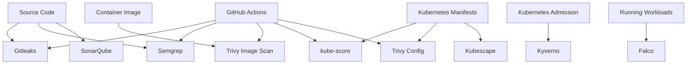

# DevSecOps Security Project Interview Explanation

## Project Summary

I built a local-first DevSecOps security portfolio project to demonstrate practical security checks across source code, containers, Kubernetes manifests, policy enforcement, runtime detection, and CI/CD automation.

The project was built using free and open-source tools, mainly on a local Kind Kubernetes cluster and local Docker environment, with GitHub Actions used for CI/CD security gates.

---

## What Problem This Project Solves

In real production environments, security issues can enter at multiple stages:

```text
Secrets can be committed into Git
Application code can contain insecure patterns
Container images can include vulnerable packages
Kubernetes manifests can be misconfigured
Unsafe workloads can be deployed without policy checks
Runtime behavior can become suspicious after deployment
CI/CD pipelines may miss security gates
```

This project solves that by applying layered DevSecOps controls.

---

## Tools Used

| Area | Tool | Purpose |
|---|---|---|
| Secret Scanning | Gitleaks | Detect hardcoded secrets |
| Container Security | Trivy | Scan container images for vulnerabilities |
| SAST | Semgrep | Detect insecure code patterns |
| Code Quality / Security | SonarQube | Analyze code quality and security issues |
| Kubernetes Readiness | kube-score | Check Kubernetes production-readiness |
| Kubernetes Misconfiguration | Trivy config | Scan Kubernetes YAML for misconfigurations |
| Kubernetes Security Posture | Kubescape | Check security framework controls |
| Admission Policy | Kyverno | Enforce policies before workload admission |
| Runtime Security | Falco | Detect suspicious activity in running workloads |
| CI/CD | GitHub Actions | Automate security gates |

---

## Architecture



---

## Security Lifecycle Demonstrated

```text
Prevent -> Scan -> Analyze -> Enforce -> Detect
```

### 1. Prevent

I used Gitleaks to detect hardcoded secrets before committing or pushing code.

I configured:

```text
Local pre-commit hook
Local pre-push hook
GitHub Actions secret scanning workflow
```

This helps prevent credentials from entering Git history.

---

### 2. Scan

I used Trivy to scan container images and Kubernetes manifests.

For image scanning, I compared vulnerable and safer container images.

For Kubernetes scanning, I used Trivy config scanning to detect issues such as:

```text
Privileged containers
Missing resource limits
Root containers
Writable root filesystem
Unsafe image tags
Missing namespace
```

---

### 3. Analyze

I used Semgrep and SonarQube for application security and code quality.

Semgrep detected insecure code patterns such as:

```text
Command injection
SQL injection
```

SonarQube detected a security issue caused by a hardcoded password. I fixed the code and verified that the quality gate passed.

---

### 4. Enforce

I used Kyverno for Kubernetes admission control.

I created a ClusterPolicy to block workloads using the `latest` image tag.

Result:

```text
nginx:latest       -> denied
nginx:1.27-alpine -> allowed
```

This shows how detection can be converted into enforcement.

---

### 5. Detect

I used Falco for runtime threat detection.

I deployed a test Nginx Pod, executed into the container, and attempted to read `/etc/shadow`.

Falco detected:

```text
Shell spawned inside container
Sensitive file opened for reading
```

This proves runtime security visibility after deployment.

---

## Kubernetes Security Layer

For Kubernetes, I used multiple tools because one scanner cannot cover everything.

| Tool | What It Checks |
|---|---|
| kube-score | Production-readiness |
| Trivy config | Security misconfigurations |
| Kubescape | Security posture and framework controls |
| Kyverno | Admission enforcement |
| Falco | Runtime detection |

Key Kubernetes best practices demonstrated:

```text
Use fixed image tags
Set CPU and memory requests
Set CPU and memory limits
Run containers as non-root
Disable privilege escalation
Drop unnecessary Linux capabilities
Use read-only root filesystem where possible
Disable service account token auto-mount where not needed
Use NetworkPolicy
Use PodDisruptionBudget
Use admission policies
Use runtime detection
```

---

## CI/CD Security Gates

I added GitHub Actions workflows to automate security checks.

| Workflow | Purpose |
|---|---|
| Gitleaks Secret Scan | Detect secrets |
| Trivy Image Scan | Scan images |
| Trivy Critical Gate | Fail CI on critical vulnerabilities |
| Semgrep SAST Scan | Run SAST |
| Semgrep SAST Gate | Fail CI on serious insecure code patterns |
| Trivy Kubernetes Config Scan | Scan fixed Kubernetes manifests |
| kube-score Kubernetes Scan | Check fixed Kubernetes manifests for production-readiness |

Important design decision:

```text
Vulnerable manifests are kept in the repository for learning evidence.
CI/CD gates scan only fixed/deployable manifests.
```

This keeps the repository useful for learning while keeping CI/CD gates realistic.

---

## Important Troubleshooting I Faced

### 1. Trivy Kubernetes CI Failed Initially

The first Trivy Kubernetes config workflow scanned the entire Kubernetes security folder.

That folder contained:

```text
Vulnerable manifests
Bad test workloads
Helm-generated Kyverno manifests
Helm-generated Falco manifests
Dockerfile for Kubescape CLI
```

So Trivy correctly failed.

I fixed it by scoping the CI scan only to:

```text
labs/security/kubernetes-scanning/trivy-k8s/fixed-manifests
```

Lesson:

```text
Security gates should scan deployable artifacts, not every training artifact.
```

---

### 2. kube-score CI Failed on imagePullPolicy

kube-score failed because the manifest used:

```text
imagePullPolicy: IfNotPresent
```

That was acceptable for local Kind labs, but kube-score expected a stricter production policy.

I changed it to:

```text
imagePullPolicy: Always
```

Lesson:

```text
Local lab convenience and production CI policy can differ.
CI gates should represent production expectations.
```

---

### 3. GitHub Email Privacy Blocked a Push

On another machine, Git was configured with my private Gmail address.

GitHub rejected the push because email privacy protection was enabled.

I fixed it by setting my GitHub noreply email locally:

```text
294873984+lingarajayli@users.noreply.github.com
```

Lesson:

```text
Every development machine should have correct Git identity and commit email configuration.
```

---

## How I Would Explain This in an Interview

I built a local-first DevSecOps platform project to demonstrate practical security across the full software delivery lifecycle.

I started with secret scanning using Gitleaks, where I configured local pre-commit and pre-push hooks along with GitHub Actions. Then I used Trivy to scan container images and compare vulnerable and safer images.

For application security, I used Semgrep to detect command injection and SQL injection patterns, and SonarQube to analyze code quality and detect a hardcoded password issue. I fixed the issues and verified the results with before-and-after reports.

For Kubernetes security, I created a complete local Kind-based lab series. I used kube-score for production-readiness, Trivy config for Kubernetes misconfiguration scanning, and Kubescape for security posture scanning. Then I used Kyverno to enforce admission policies and block workloads using the `latest` image tag.

Finally, I used Falco to detect runtime activity. I executed into a running Nginx container and attempted to read `/etc/shadow`; Falco generated alerts for shell execution and sensitive file access.

After building the local labs, I added GitHub Actions CI/CD gates for secrets, images, SAST, Kubernetes misconfiguration scanning, and kube-score production-readiness checks.

This project demonstrates layered DevSecOps controls: prevent, scan, analyze, enforce, and detect.

---

## Short Interview Version

I built a local-first DevSecOps security portfolio using open-source tools.

I used Gitleaks for secret scanning, Trivy for image and Kubernetes misconfiguration scanning, Semgrep and SonarQube for code security and quality, kube-score and Kubescape for Kubernetes readiness and posture, Kyverno for admission control, and Falco for runtime detection.

I also automated key checks in GitHub Actions, including secret scanning, image scanning, SAST, Trivy Kubernetes config scanning, and kube-score scanning.

The main idea was to show a complete security lifecycle: prevent secrets, scan code and images, validate Kubernetes manifests, enforce admission policies, and detect suspicious runtime behavior.

---

## What This Proves

This project proves hands-on experience with:

```text
DevSecOps fundamentals
CI/CD security gates
Kubernetes security
Container security
SAST
Secret scanning
Policy-as-code
Runtime threat detection
GitHub Actions
Local-first engineering
Security troubleshooting
Production-style documentation
```

---

## Possible Interview Questions

### Q1. Why did you use multiple security tools instead of one?

Because each tool solves a different problem. Gitleaks scans secrets, Semgrep scans source code patterns, Trivy scans images and manifests, kube-score checks production-readiness, Kubescape checks posture, Kyverno enforces policy, and Falco detects runtime threats.

---

### Q2. What is the difference between Trivy config and kube-score?

Trivy config focuses on security misconfigurations in YAML files. kube-score focuses more on Kubernetes production-readiness, such as probes, resources, image pull policy, NetworkPolicy, and PodDisruptionBudget.

---

### Q3. What is the difference between Kyverno and Falco?

Kyverno works before workload admission. It blocks or mutates resources before they enter the cluster.

Falco works at runtime. It detects suspicious behavior after the workload is already running.

---

### Q4. Why did the CI scan only fixed manifests?

The repository intentionally contains vulnerable manifests for learning and evidence. CI/CD gates should scan deployable artifacts. So I scoped CI scans to fixed manifests to keep the pipeline realistic.

---

### Q5. What would you improve next?

Next, I would add:

```text
Branch protection rules
Required GitHub Actions checks
SARIF uploads for security findings
Artifact uploads for scan reports
Pull request comments with security summaries
OPA/Gatekeeper policy examples
Argo CD GitOps deployment flow
Prometheus and Grafana monitoring for deployed workloads
```