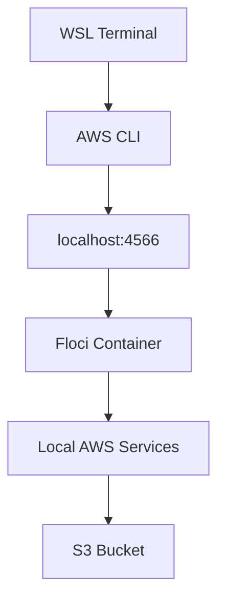

# Floci Lab 01: Local AWS Emulator

## Goal

Run a local AWS-like environment using Floci and Docker Compose.

This allows us to practice AWS services locally without using a real AWS account and without cloud cost.

---

## What Are We Running?

We are running Floci as a Docker container.

Floci provides local AWS-style services such as:

```text
S3
EC2
IAM
Lambda
RDS
EKS
Secrets Manager
CloudWatch
```

For this lab, we start with S3.

---

## Why Docker Compose?

Docker Compose makes the setup repeatable.

Instead of running a long `docker run` command every time, we define the service once in:

```text
docker-compose.yml
```

Then start it using:

```bash
docker compose up -d
```

---

## Architecture



---

## Docker Compose File

```yaml
services:
  floci-aws:
    image: floci/floci:latest
    container_name: floci-aws
    ports:
      - "4566:4566"
    volumes:
      - /var/run/docker.sock:/var/run/docker.sock
    environment:
      - AWS_DEFAULT_REGION=us-east-1
    restart: unless-stopped
```

---

## Start Floci

```bash
cd labs/floci/01-local-aws-emulator

docker compose up -d
docker compose ps
```

Expected:

```text
floci-aws   Up   healthy   0.0.0.0:4566->4566/tcp
```

---

## AWS CLI Default Setup

This WSL environment is configured so normal `aws` commands point to Floci.

Credentials:

```text
~/.aws/credentials
```

```ini
[default]
aws_access_key_id = test
aws_secret_access_key = test
```

Config:

```text
~/.aws/config
```

```ini
[default]
region = us-east-1
output = json
```

Shell environment:

```bash
export AWS_ENDPOINT_URL=http://localhost:4566
export AWS_DEFAULT_REGION=us-east-1
```

---

## Verify Floci

```bash
aws sts get-caller-identity
```

Expected account:

```json
{
  "UserId": "000000000000",
  "Account": "000000000000",
  "Arn": "arn:aws:iam::000000000000:root"
}
```

---

## Test S3

```bash
aws s3 ls
```

Create a bucket:

```bash
aws s3 mb s3://devsecops-floci-demo
```

List buckets:

```bash
aws s3 ls
```

Upload a file:

```bash
echo "Hello from Floci local AWS S3" > hello-floci.txt

aws s3 cp hello-floci.txt s3://devsecops-floci-demo/

aws s3 ls s3://devsecops-floci-demo/
```

---

## Restart Behavior

The container uses:

```yaml
restart: unless-stopped
```

So after reboot, it should restart automatically when Docker Desktop starts.

Check:

```bash
docker ps | grep floci
aws sts get-caller-identity
```

If not running:

```bash
cd labs/floci/01-local-aws-emulator
docker compose up -d
```

---

## Interview Summary

I built a local AWS-style lab using Floci and Docker Compose. I configured AWS CLI to use the local Floci endpoint by default, so I can practice AWS services like S3, IAM, EC2, and Secrets Manager without using a real AWS account or spending cloud money.