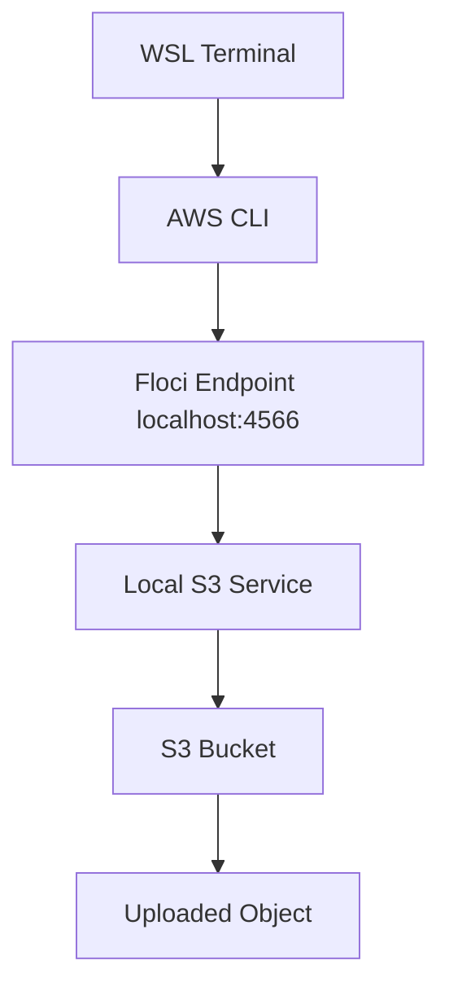

# Floci Lab 02: S3 Bucket Operations

## Goal

Practice AWS S3-style object storage locally using Floci.

No real AWS account is used.

---

## What Are We Creating?

We are creating a local S3 bucket inside Floci.

Bucket name:

```text
devsecops-floci-s3-demo
```

S3 is commonly used for:

```text
application artifacts
logs
backups
static website files
Terraform remote state
CI/CD reports
```

---

## Architecture



---

## Verify Floci

```bash
aws sts get-caller-identity
```

Expected account:

```text
000000000000
```

List buckets:

```bash
aws s3 ls
```

---

## Create S3 Bucket

```bash
aws s3 mb s3://devsecops-floci-s3-demo
```

Verify:

```bash
aws s3 ls
```

---

## Upload Object

Create a test file:

```bash
echo "Hello from local Floci S3" > hello-s3.txt
```

Upload it:

```bash
aws s3 cp hello-s3.txt s3://devsecops-floci-s3-demo/
```

List bucket objects:

```bash
aws s3 ls s3://devsecops-floci-s3-demo/
```

---

## Download Object

```bash
aws s3 cp s3://devsecops-floci-s3-demo/hello-s3.txt downloaded-hello-s3.txt
```

Verify:

```bash
cat downloaded-hello-s3.txt
```

---

## Delete Object

```bash
aws s3 rm s3://devsecops-floci-s3-demo/hello-s3.txt
```

Verify bucket is empty:

```bash
aws s3 ls s3://devsecops-floci-s3-demo/
```

---

## Delete Bucket

```bash
aws s3 rb s3://devsecops-floci-s3-demo
```

Verify:

```bash
aws s3 ls
```

---

## Important Notes

S3 bucket names must be unique in real AWS.

In Floci, the bucket is local, so there is no real AWS cost.

This lab uses normal AWS CLI commands because this WSL is configured with:

```bash
AWS_ENDPOINT_URL=http://localhost:4566
```

So plain `aws` commands go to Floci.

---

## Interview Summary

I practiced S3 bucket operations locally using Floci. I created a bucket, uploaded an object, listed objects, downloaded the object, deleted it, and removed the bucket using AWS CLI commands. This helped me understand S3 basics without using a real AWS account.