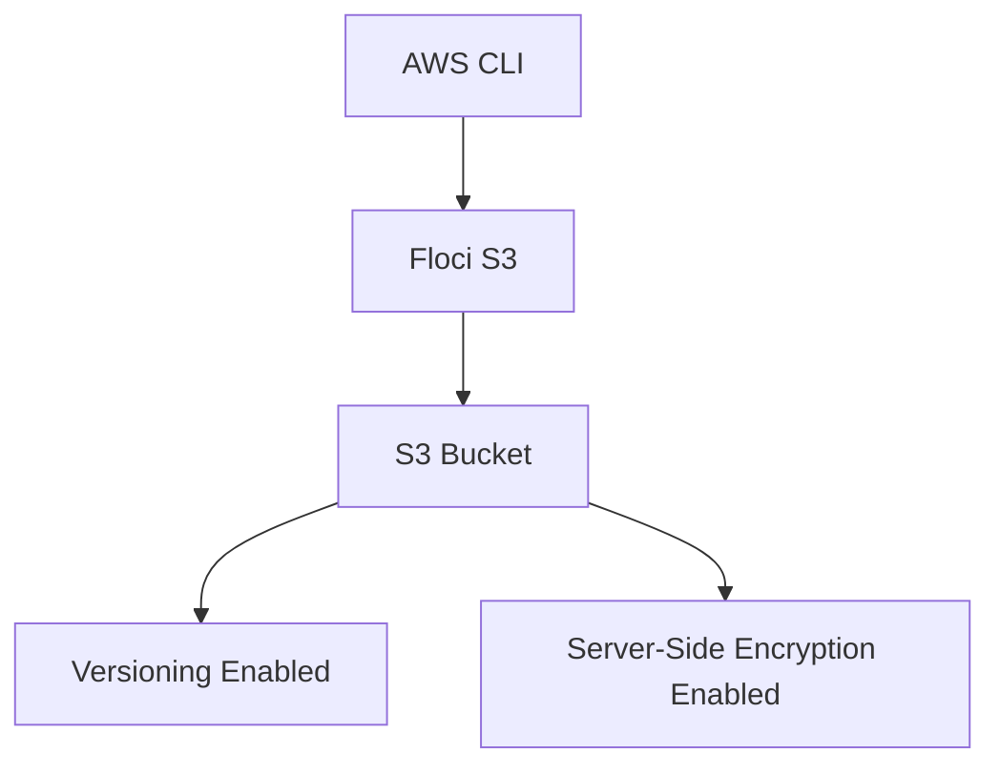
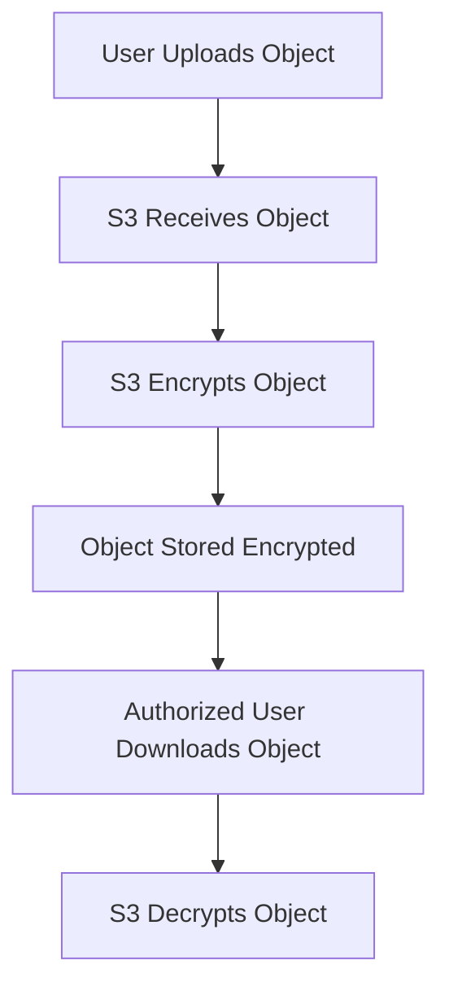

# Floci Lab 03: S3 Versioning and Encryption

## Goal

Practice production-style S3 bucket safety settings locally using Floci.

This lab covers:

```text
S3 versioning
S3 server-side encryption
```

---

## Why This Matters

In production, S3 buckets often store important data such as:

```text
application backups
logs
Terraform state files
CI/CD artifacts
security scan reports
```

So we should protect buckets from:

```text
accidental deletion
object overwrite
unencrypted storage
```

---

## Architecture



---

## Verify Floci

```bash
aws sts get-caller-identity
```

Expected account:

```text
000000000000
```

---

## Create Bucket

```bash
aws s3 mb s3://devsecops-secure-s3-demo
```

Verify:

```bash
aws s3 ls
```

---

## Enable Versioning

```bash
aws s3api put-bucket-versioning \
  --bucket devsecops-secure-s3-demo \
  --versioning-configuration Status=Enabled
```

Verify:

```bash
aws s3api get-bucket-versioning \
  --bucket devsecops-secure-s3-demo
```

Expected:

```json
{
  "Status": "Enabled"
}
```

---

## Upload Same File Twice

Create first version:

```bash
echo "version one" > app-config.txt

aws s3 cp app-config.txt s3://devsecops-secure-s3-demo/
```

Create second version:

```bash
echo "version two" > app-config.txt

aws s3 cp app-config.txt s3://devsecops-secure-s3-demo/
```

List object versions:

```bash
aws s3api list-object-versions \
  --bucket devsecops-secure-s3-demo
```

---

## Enable Server-Side Encryption

```bash
aws s3api put-bucket-encryption \
  --bucket devsecops-secure-s3-demo \
  --server-side-encryption-configuration '{
    "Rules": [
      {
        "ApplyServerSideEncryptionByDefault": {
          "SSEAlgorithm": "AES256"
        }
      }
    ]
  }'
```

Verify:

```bash
aws s3api get-bucket-encryption \
  --bucket devsecops-secure-s3-demo
```

Expected encryption algorithm:

```text
AES256
```

## What Is Server-Side Encryption?

Server-Side Encryption means S3 encrypts the object after receiving it and stores it encrypted.

The user uploads a normal file, but S3 stores the file in encrypted form.



---

## Why Server-Side Encryption Is Needed

S3 buckets often store sensitive or important data such as:

```text
backups
logs
Terraform state files
CI/CD artifacts
security scan reports
application configuration
```

Encryption helps protect data at rest.

---

## What Does AES256 Mean?

In this lab, we used:

```text
AES256
```

This means S3-managed server-side encryption.

In real AWS, this is commonly called:

```text
SSE-S3
```

S3 manages the encryption keys automatically.

---

## Cleanup

Remove all object versions:

```bash
aws s3 rm s3://devsecops-secure-s3-demo/app-config.txt
```

Delete bucket:

```bash
aws s3 rb s3://devsecops-secure-s3-demo
```

If bucket deletion fails because versions still exist, delete the versions first.

---

## Interview Summary

I practiced S3 production safety controls locally using Floci. I enabled bucket versioning to protect against accidental overwrite or deletion, and enabled server-side encryption using AES256 so stored objects are encrypted at rest.