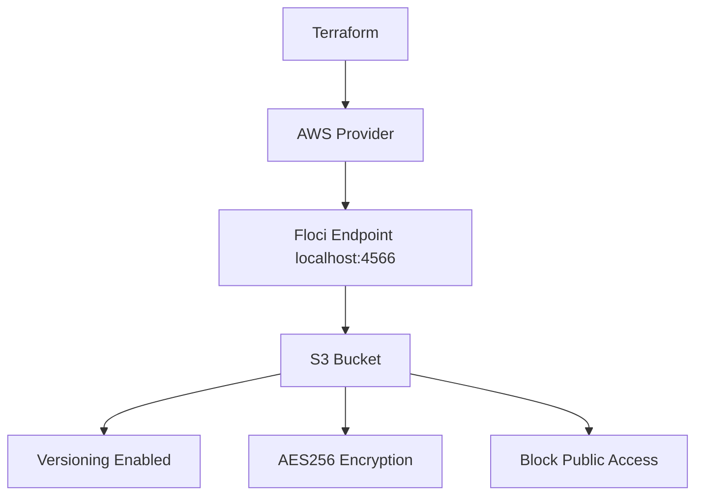

# Floci Lab 05: Terraform Secure S3 Bucket

## Goal

Create a production-style secure S3 bucket locally using Terraform and Floci.

No real AWS account is used.

---

## What Terraform Creates

```text
aws_s3_bucket
aws_s3_bucket_versioning
aws_s3_bucket_server_side_encryption_configuration
aws_s3_bucket_public_access_block
```

---

## Architecture



---

## Why Separate Resources?

S3 bucket settings are managed as separate Terraform resources because AWS exposes them as separate bucket configurations.

```text
aws_s3_bucket = create bucket
aws_s3_bucket_versioning = protect object versions
aws_s3_bucket_server_side_encryption_configuration = encrypt objects at rest
aws_s3_bucket_public_access_block = prevent public exposure
```

---

## Terraform Provider for Floci

```hcl
provider "aws" {
  region     = var.aws_region
  access_key = "test"
  secret_key = "test"

  s3_use_path_style           = true
  skip_credentials_validation = true
  skip_metadata_api_check     = true
  skip_requesting_account_id  = true

  endpoints {
    s3  = var.floci_endpoint
    sts = var.floci_endpoint
  }
}
```

---

## Commands

```bash
terraform init
terraform fmt
terraform plan
terraform apply --auto-approve
terraform output
```

---

## Verification

```bash
aws s3 ls

aws s3api get-bucket-versioning \
  --bucket devsecops-terraform-secure-s3

aws s3api get-bucket-encryption \
  --bucket devsecops-terraform-secure-s3

aws s3api get-public-access-block \
  --bucket devsecops-terraform-secure-s3
```

---

## Verified Output

```text
bucket_name = "devsecops-terraform-secure-s3"
bucket_arn = "arn:aws:s3:::devsecops-terraform-secure-s3"
encryption_algorithm = "AES256"
versioning_status = "Enabled"
```

---

## Interview Summary

I created a secure S3 bucket using Terraform against a local AWS emulator called Floci. The bucket includes versioning, AES256 server-side encryption, and Block Public Access. This demonstrates infrastructure automation, cloud security defaults, and local-first AWS learning without using a real AWS account.