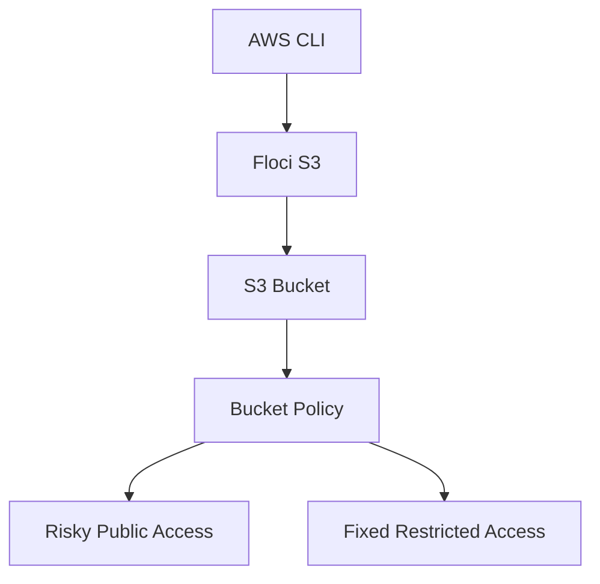

# Floci Lab 04: S3 Bucket Policy and Public Access Risk

## Goal

Understand how S3 bucket policies work and why public access can become a security risk.

This is a DevSecOps-focused lab.

---

## What Are We Creating?

We will create:

```text
S3 bucket
sample object
risky public-style bucket policy
fixed restricted bucket policy
```

Bucket name:

```text
devsecops-policy-demo
```

---

## Why This Matters

S3 misconfiguration is a common cloud security issue.

A wrong bucket policy can expose:

```text
logs
backups
Terraform state files
customer files
application artifacts
security reports
```

---

## Architecture



---

## Verify Floci

```bash
aws sts get-caller-identity
```

Expected account:

```text
000000000000
```

---

## Create Bucket

```bash
aws s3 mb s3://devsecops-policy-demo
```

Verify:

```bash
aws s3 ls
```

---

## Upload Test Object

```bash
echo "Sensitive demo file" > sensitive-file.txt

aws s3 cp sensitive-file.txt s3://devsecops-policy-demo/
```

Verify:

```bash
aws s3 ls s3://devsecops-policy-demo/
```

---

## Risky Public Bucket Policy

Create a policy file:

```bash
cat > public-read-policy.json <<'EOF'
{
  "Version": "2012-10-17",
  "Statement": [
    {
      "Sid": "PublicReadRisk",
      "Effect": "Allow",
      "Principal": "*",
      "Action": "s3:GetObject",
      "Resource": "arn:aws:s3:::devsecops-policy-demo/*"
    }
  ]
}
EOF
```

Apply policy:

```bash
aws s3api put-bucket-policy \
  --bucket devsecops-policy-demo \
  --policy file://public-read-policy.json
```

View policy:

```bash
aws s3api get-bucket-policy \
  --bucket devsecops-policy-demo
```

---

## Why This Policy Is Risky

This line is dangerous:

```json
"Principal": "*"
```

It means:

```text
anyone
```

This action allows object reads:

```json
"Action": "s3:GetObject"
```

This resource applies to all objects inside the bucket:

```json
"Resource": "arn:aws:s3:::devsecops-policy-demo/*"
```

So the meaning is:

```text
Anyone can read any object in this bucket.
```

---

## Fixed Restricted Policy

Create a safer policy:

```bash
cat > restricted-read-policy.json <<'EOF'
{
  "Version": "2012-10-17",
  "Statement": [
    {
      "Sid": "RestrictedRead",
      "Effect": "Allow",
      "Principal": {
        "AWS": "arn:aws:iam::000000000000:root"
      },
      "Action": "s3:GetObject",
      "Resource": "arn:aws:s3:::devsecops-policy-demo/*"
    }
  ]
}
EOF
```

Apply fixed policy:

```bash
aws s3api put-bucket-policy \
  --bucket devsecops-policy-demo \
  --policy file://restricted-read-policy.json
```

Verify:

```bash
aws s3api get-bucket-policy \
  --bucket devsecops-policy-demo
```

---

## Cleanup

Delete policy:

```bash
aws s3api delete-bucket-policy \
  --bucket devsecops-policy-demo
```

Delete object:

```bash
aws s3 rm s3://devsecops-policy-demo/sensitive-file.txt
```

Delete bucket:

```bash
aws s3 rb s3://devsecops-policy-demo
```

Remove local generated files:

```bash
rm -f sensitive-file.txt public-read-policy.json restricted-read-policy.json
```

---

## Interview Summary

I practiced S3 bucket policy security locally using Floci. I created a risky public-read policy using `Principal: "*"`, understood why it can expose bucket objects, and then replaced it with a restricted policy. This demonstrates how DevSecOps engineers review and fix cloud storage access risks.