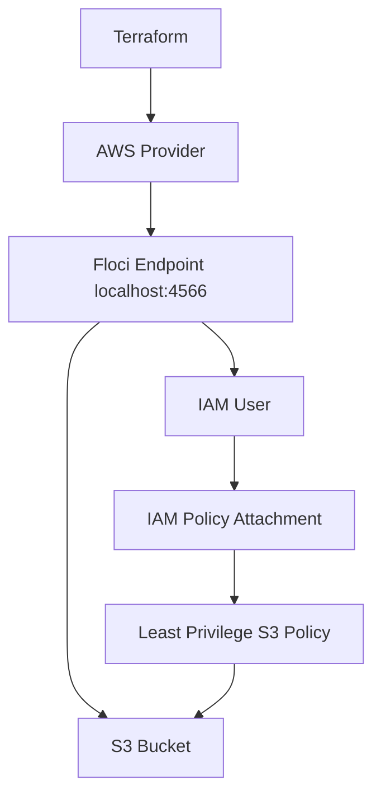

# Floci Lab 04: Terraform IAM Least Privilege

## Goal

Create an IAM user and least-privilege S3 policy using Terraform against Floci.

No real AWS account is used.

---

## What Terraform Creates

```text
S3 bucket
IAM user
IAM policy
IAM policy attachment
```

---

## Architecture



---

## Least Privilege Meaning

Least privilege means giving only the permissions required for the job.

For this lab, the CI user can access only one bucket:

```text
devsecops-ci-artifacts
```

Allowed bucket-level action:

```text
s3:ListBucket
```

Allowed object-level actions:

```text
s3:GetObject
s3:PutObject
s3:DeleteObject
```

Not allowed:

```text
admin access
all buckets access
IAM management
EC2 management
Secrets Manager access
```

---

## Terraform Resources

```text
aws_s3_bucket
aws_iam_user
aws_iam_policy
aws_iam_user_policy_attachment
```

---

## Commands

```bash
terraform init
terraform fmt
terraform plan
terraform apply --auto-approve
terraform output
```

---

## Verification

```bash
aws iam list-users

aws iam list-policies --scope Local

aws iam list-attached-user-policies \
  --user-name devsecops-ci-user

aws s3 ls
```

---

## Interview Summary

I created an IAM user with a least-privilege S3 policy using Terraform against Floci. The policy allows only list, read, write, and delete access for a specific S3 bucket. This avoids broad permissions like administrator access or access to all AWS services.