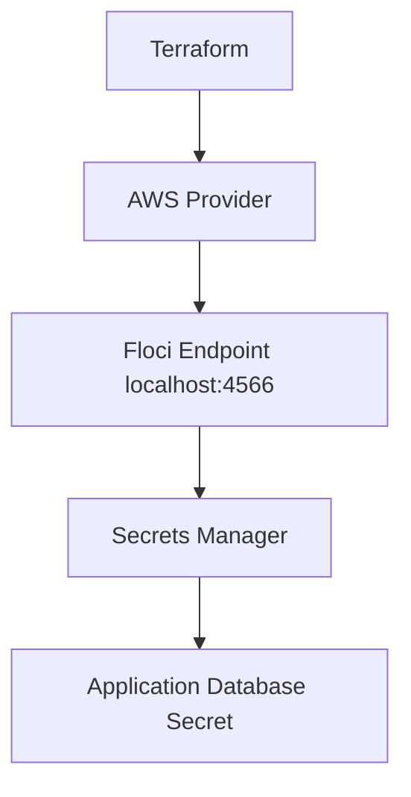

# Floci Lab 05: Terraform Secrets Manager

## Goal

Create and manage an application secret locally using Terraform and Floci.

No real AWS account is used.

---

## What Terraform Creates

```text
Secrets Manager secret
Secret version/value
```

---

## Architecture



---

## Why Secrets Manager?

Applications often need sensitive values:

```text
database passwords
API keys
tokens
webhook secrets
certificate passwords
```

These should not be hardcoded in:

```text
source code
Dockerfiles
Kubernetes YAML
GitHub Actions workflows
Terraform files committed to Git
```

Secrets Manager gives a central place to store and retrieve secrets securely.

---

## Important DevSecOps Note: Terraform Sensitive Variables

Even if a Terraform variable is marked as `sensitive`, Terraform state can still store the actual secret value.

So we should not commit even a dummy password as a default value in `variables.tf`.

---

## Bad Example

Avoid this:

```hcl
variable "database_password" {
  type      = string
  sensitive = true
  default   = "local-dev-password"
}
```

Problem:

```text
The password value can still be stored in Terraform state.
```

---

## Better Example

Use this instead:

```hcl
variable "database_password" {
  type        = string
  sensitive   = true
  description = "Database password for local Floci demo. Pass using TF_VAR_database_password."
}
```

This removes the password from the Terraform code.

---

## How to Pass the Secret Locally

Before running Terraform, export the value from your terminal:

```bash
export TF_VAR_database_password="local-dev-password"
```

Then run:

```bash
terraform plan
terraform apply --auto-approve
```

---

## Production Reminder

For real environments, do not pass production secrets manually like this.

Use approved secret sources such as:

```text
CI/CD secret variables
AWS Secrets Manager
Vault
secure parameter stores
OIDC-based secret access
```

Also avoid committing:

```text
real secrets
terraform.tfstate
*.tfvars containing secrets
.env files
```