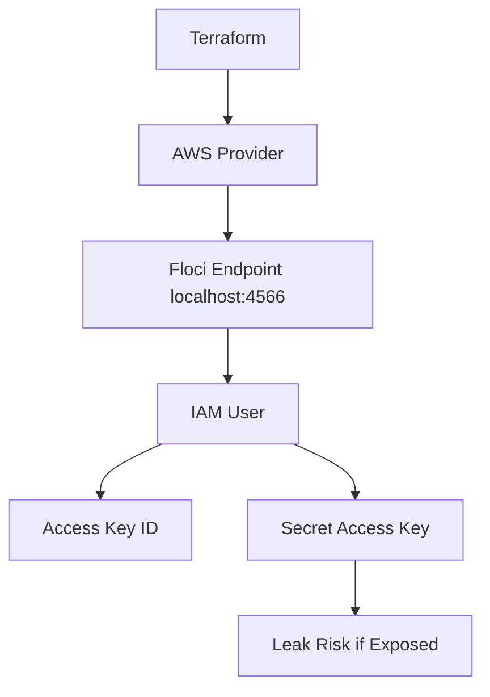

# Floci Lab 06: Terraform IAM Access Key Risk

## Goal

Create an IAM access key using Terraform against Floci and understand why long-lived access keys are risky.

No real AWS account is used.

---

## What Terraform Creates

```text
IAM user
IAM access key
secret access key
```

---

## Architecture



---

## What Is an Access Key?

An IAM access key has two parts:

```text
Access Key ID
Secret Access Key
```

The access key ID is like a username.

The secret access key is like a password.

Together, they allow tools such as AWS CLI, CI/CD pipelines, SDKs, and automation scripts to authenticate to AWS.

---

## Why Access Keys Are Risky

Access keys are dangerous if leaked because they can be used outside AWS by anyone who has them.

Common leak locations:

```text
GitHub repositories
CI/CD logs
.env files
Terraform state files
Docker images
Slack messages
local shell history
```

---

## Important Terraform State Warning

Even if an output is marked as `sensitive`, Terraform state can still contain the secret value.

This is why we do not commit:

```text
terraform.tfstate
terraform.tfstate.backup
.tfvars files containing secrets
.env files
```

---

## Terraform Resources

```text
aws_iam_user
aws_iam_access_key
```

---

## Commands

```bash
terraform init
terraform fmt
terraform plan
terraform apply --auto-approve
terraform output
```

To view sensitive output locally:

```bash
terraform output secret_access_key
```

---

## Verification

```bash
aws iam list-users

aws iam list-access-keys \
  --user-name devsecops-ci-access-key-user
```

---

## Cleanup

Destroy lab resources:

```bash
terraform destroy --auto-approve
```

---

## Production Best Practice

Avoid long-lived IAM access keys where possible.

Prefer:

```text
OIDC federation for GitHub Actions or GitLab CI
IAM roles instead of IAM users
short-lived temporary credentials
Secrets Manager or Vault for controlled secret storage
regular key rotation
least-privilege permissions
```

---

## Interview Summary

I created an IAM access key using Terraform against Floci to understand how CI/CD tools authenticate with AWS. I also documented the risk that secret access keys can be stored in Terraform state and leaked through repositories, logs, or local files. In production, I would prefer OIDC or short-lived IAM role credentials instead of long-lived access keys.

## Important Note: Secret Access Key Is Not Base64

The IAM secret access key is not a base64 value.

Do not decode it using:

```bash
terraform output secret_access_key | base64 -d
```

That will fail because the secret access key is already the raw credential string.

Treat it like a password.

```text
Access Key ID = <ACCESS_KEY_ID>
Secret Access Key = <SECRET_ACCESS_KEY>
```

In real AWS, never expose or paste the secret access key in chat, GitHub, logs, screenshots, or documentation.