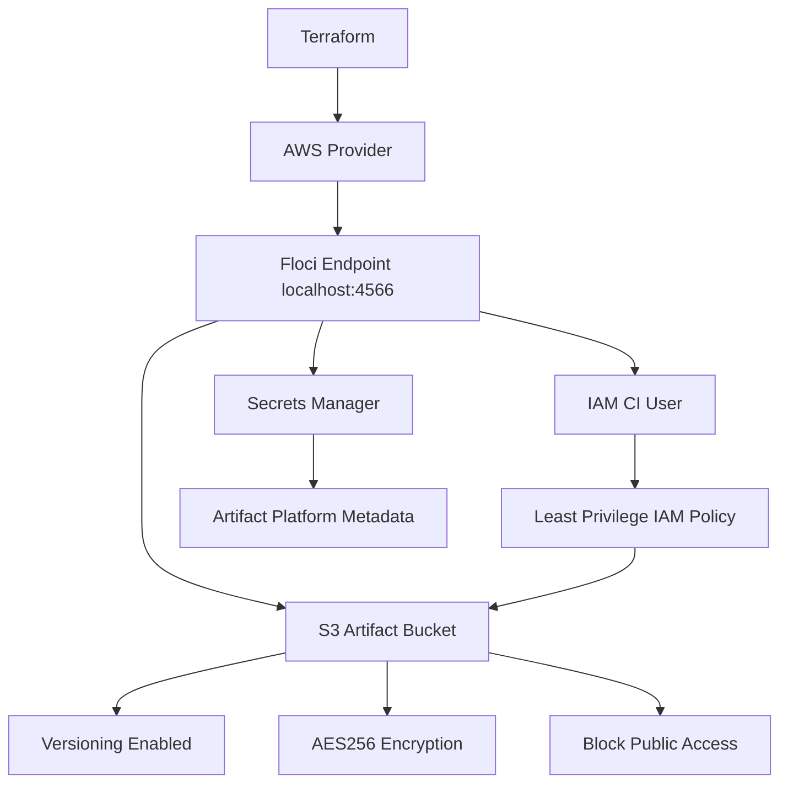

# Floci Lab 07: Secure S3 Artifact Platform

## Goal

Build a local AWS-style secure artifact storage platform using Terraform and Floci.

No real AWS account is used.

---

## What This Lab Combines

```text
Secure S3 bucket
S3 versioning
S3 server-side encryption
S3 Block Public Access
IAM least-privilege policy
IAM CI user
Secrets Manager metadata
Terraform automation
```

---

## Architecture



---

## Why This Matters

CI/CD systems often need a place to store build outputs.

Examples:

```text
application packages
Docker image scan reports
SBOM files
test reports
security scan reports
release artifacts
```

This storage must be secure by default.

---

## Security Controls Used

| Control | Purpose |
|---|---|
| Versioning | Protects against accidental overwrite/delete |
| AES256 encryption | Encrypts objects at rest |
| Block Public Access | Prevents public exposure |
| IAM least privilege | Limits CI user access |
| Secrets Manager | Stores platform metadata outside source code |

---

## Terraform Resources

```text
aws_s3_bucket
aws_s3_bucket_versioning
aws_s3_bucket_server_side_encryption_configuration
aws_s3_bucket_public_access_block
aws_iam_user
aws_iam_policy
aws_iam_user_policy_attachment
aws_secretsmanager_secret
aws_secretsmanager_secret_version
```

---

## Commands

```bash
terraform init
terraform fmt
terraform plan
terraform apply --auto-approve
terraform output
```

---

## Verification

```bash
aws s3 ls

aws s3api get-bucket-versioning \
  --bucket devsecops-artifact-platform

aws s3api get-bucket-encryption \
  --bucket devsecops-artifact-platform

aws s3api get-public-access-block \
  --bucket devsecops-artifact-platform

aws iam list-users

aws iam list-attached-user-policies \
  --user-name devsecops-artifact-ci-user

aws secretsmanager get-secret-value \
  --secret-id dev/artifact-platform/metadata
```

---

## Test Artifact Upload

```bash
echo "sample build artifact" > build-artifact.txt

aws s3 cp build-artifact.txt s3://devsecops-artifact-platform/

aws s3 ls s3://devsecops-artifact-platform/
```

Cleanup local test file:

```bash
rm -f build-artifact.txt
```

---

## Interview Summary

I built a secure local AWS-style artifact platform using Terraform and Floci. The platform creates an encrypted and versioned S3 bucket with Block Public Access, a least-privilege IAM user for CI/CD artifact operations, and Secrets Manager metadata. This demonstrates secure infrastructure automation without using a real AWS account.