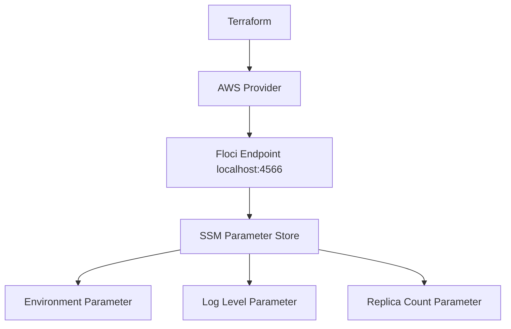

# Floci Lab 10: Terraform SSM Parameter Store

## Goal

Store non-secret application configuration in SSM Parameter Store using Terraform and Floci.

No real AWS account is used.

---

## What Terraform Creates

```text
SSM Parameter for environment
SSM Parameter for log level
SSM Parameter for replica count
```

---

## Architecture



---

## What Is SSM Parameter Store?

SSM Parameter Store is used to store configuration values centrally.

Examples:

```text
environment name
feature flags
log level
replica count
API endpoint URL
non-secret application settings
```

---

## SSM Parameter Store vs Secrets Manager

| Service | Best For |
|---|---|
| SSM Parameter Store | Non-secret configuration |
| Secrets Manager | Sensitive secrets like passwords, tokens, API keys |

For this lab, we store non-secret values only.

---

## Terraform Resources

```text
aws_ssm_parameter
```

---

## Parameter Names

```text
/dev/flask-health-api/environment
/dev/flask-health-api/log-level
/dev/flask-health-api/replicas
```

---

## Commands

```bash
terraform init
terraform fmt
terraform plan
terraform apply --auto-approve
terraform output
```

---

## Verification

```bash
aws ssm describe-parameters

aws ssm get-parameter \
  --name /dev/flask-health-api/environment

aws ssm get-parameter \
  --name /dev/flask-health-api/log-level

aws ssm get-parameter \
  --name /dev/flask-health-api/replicas
```

---

## Interview Summary

I created application configuration parameters using Terraform and Floci SSM Parameter Store. This demonstrates how application runtime configuration can be managed outside source code. I use SSM Parameter Store for non-secret configuration and Secrets Manager for sensitive values.