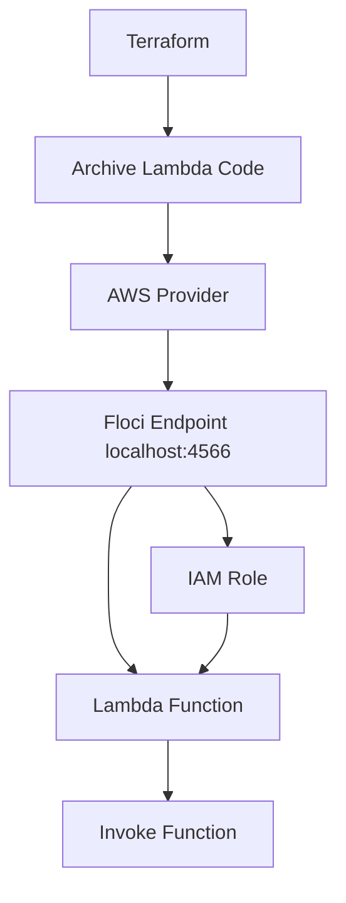

# Floci Lab 11: Terraform Lambda Basics

## Goal

Create a local AWS-style Lambda function using Terraform and Floci.

No real AWS account is used.

---

## What Terraform Creates

```text
Lambda function package
IAM role for Lambda
Lambda function
```

---

## Architecture



---

## What Is Lambda?

Lambda is a serverless compute service.

Instead of managing servers, you deploy a function.

The platform runs the function when it is invoked.

Common use cases:

```text
event processing
API backends
file processing
automation tasks
CI/CD helper jobs
security automation
```

---

## Why IAM Role Is Needed

Lambda needs an IAM role because AWS services need permissions to act.

In this lab:

```text
IAM role = identity Lambda assumes when running
Lambda function = code package executed by platform
```

---

## Terraform Resources

```text
archive_file
aws_iam_role
aws_lambda_function
```

---

## Commands

```bash
terraform init
terraform fmt
terraform plan
terraform apply --auto-approve
terraform output
```

---

## Verification

List Lambda functions:

```bash
aws lambda list-functions
```

Invoke function:

```bash
aws lambda invoke \
  --function-name dev-flask-health-api-hello-lambda \
  response.json
```

View response:

```bash
cat response.json
```

---

## Cleanup Local Generated Files

```bash
rm -f lambda_function.zip response.json
```

---

## Interview Summary

I created a Lambda function locally using Terraform and Floci. The lab packages Python code, creates an IAM role, deploys the Lambda function, and invokes it using AWS CLI. This demonstrates serverless basics, IAM role usage, and Terraform-based deployment without using a real AWS account.