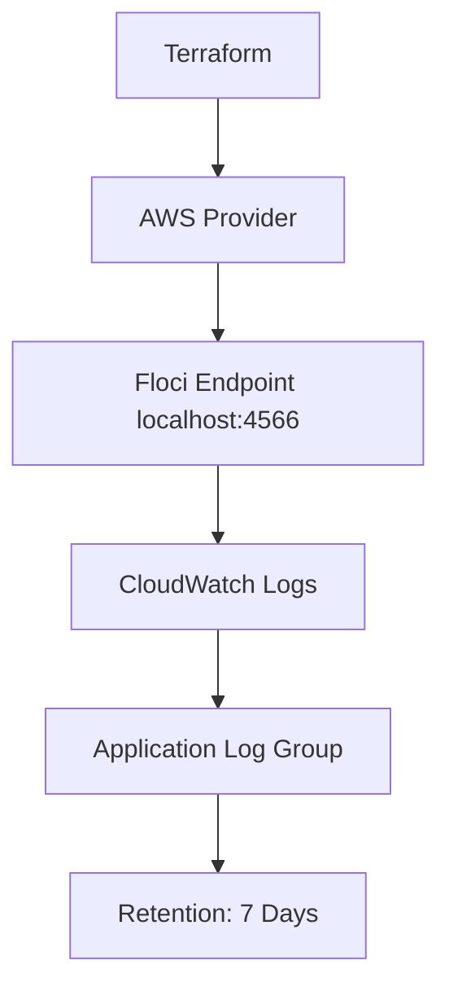

# Floci Lab 12: Terraform CloudWatch Logs

## Goal

Create a CloudWatch log group using Terraform and Floci.

No real AWS account is used.

---

## What Terraform Creates

```text
CloudWatch Log Group
Log retention policy
```

---

## Architecture



---

## What Is CloudWatch Logs?

CloudWatch Logs is used to collect and store application, system, and service logs.

Common production use cases:

```text
application logs
Lambda logs
ECS logs
EKS workload logs
audit logs
deployment logs
security investigation logs
```

---

## Why Log Retention Matters

Without retention, logs may grow forever and increase cost.

Retention helps with:

```text
cost control
compliance
log lifecycle management
storage hygiene
```

In this lab, retention is set to:

```text
7 days
```

---

## Terraform Resource

```text
aws_cloudwatch_log_group
```

---

## Log Group Name

```text
/dev/flask-health-api/application
```

---

## Commands

```bash
terraform init
terraform fmt
terraform plan
terraform apply --auto-approve
terraform output
```

---

## Verification

```bash
aws logs describe-log-groups
```

Expected log group:

```text
/dev/flask-health-api/application
```

---

## Interview Summary

I created a CloudWatch log group using Terraform against Floci and configured log retention. This demonstrates centralized logging basics and cost-aware log lifecycle management.