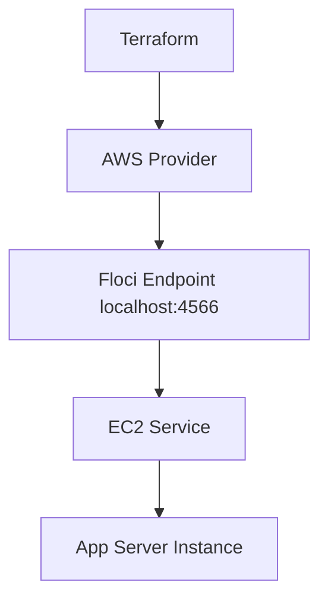

# Floci Lab 13: Terraform EC2 Basics

## Goal

Create an EC2-style compute instance using Terraform and Floci.

No real AWS account is used.

---

## What Terraform Creates

```text
EC2 instance
instance tags
```

---

## Architecture



---

## What Is EC2?

EC2 is AWS virtual machine compute.

In real AWS, an EC2 instance needs:

```text
AMI
instance type
network/subnet
security group
IAM role optionally
storage volume
tags
```

For this basic lab, we start with:

```text
AMI
instance type
tags
```

---

## What Is an AMI?

AMI means Amazon Machine Image.

It is the operating system image used to launch an EC2 instance.

Examples in real AWS:

```text
Ubuntu AMI
Amazon Linux AMI
Red Hat AMI
Windows AMI
```

In this Floci lab, we use a dummy AMI:

```text
ami-12345678
```

---

## What Is Instance Type?

Instance type defines CPU, memory, network, and cost class.

Example:

```text
t3.micro
```

In real AWS, choosing the wrong instance type can cause:

```text
high cost
poor performance
memory pressure
CPU throttling
```

---

## Terraform Resource

```text
aws_instance
```

---

## Commands

```bash
terraform init
terraform fmt
terraform plan
terraform apply --auto-approve
terraform output
```

---

## Verification

```bash
aws ec2 describe-instances
```

Expected:

```text
InstanceId
InstanceType
State
Tags
```

---

## Cleanup

```bash
terraform destroy --auto-approve
```

---

## Interview Summary

I created an EC2-style instance using Terraform against Floci. This helped me understand the basic EC2 inputs such as AMI, instance type, and tags. In real AWS, I would also attach the instance to a subnet, security group, IAM role, and monitoring configuration.