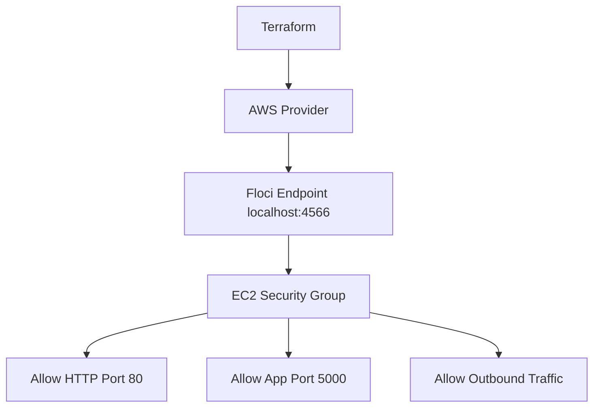

# Floci Lab 14: Terraform Security Groups

## Goal

Create an AWS-style security group using Terraform and Floci.

No real AWS account is used.

---

## What Terraform Creates

```text
Security group
HTTP ingress rule
Flask app port ingress rule
Outbound egress rule
```

---

## Architecture



---

## What Is a Security Group?

A security group is a virtual firewall for AWS resources.

It controls:

```text
inbound traffic
outbound traffic
allowed ports
allowed IP ranges
```

---

## Ingress vs Egress

| Direction | Meaning |
|---|---|
| Ingress | Traffic coming into the resource |
| Egress | Traffic going out from the resource |

---

## Security Rules in This Lab

| Rule | Port | Source |
|---|---:|---|
| HTTP | 80 | `10.0.0.0/16` |
| Flask App | 5000 | `10.0.0.0/16` |
| Outbound | All | `0.0.0.0/0` |

---

## Why Not Allow Everything Inbound?

This is risky:

```text
0.0.0.0/0 on all ports
```

It means anyone from the internet can try to connect.

Better approach:

```text
allow only required ports
allow only trusted CIDR ranges
document why each rule exists
```

---

## Terraform Resources

```text
aws_security_group
aws_vpc_security_group_ingress_rule
aws_vpc_security_group_egress_rule
```

---

## Commands

```bash
terraform init
terraform fmt
terraform plan
terraform apply --auto-approve
terraform output
```

---

## Verification

```bash
aws ec2 describe-security-groups
```

Expected:

```text
GroupName
GroupId
IpPermissions
IpPermissionsEgress
```

---

## Interview Summary

I created a security group using Terraform against Floci. The security group allows only required inbound ports, HTTP and the Flask app port, from a trusted CIDR range. This demonstrates least-privilege network access and infrastructure-as-code based firewall management.