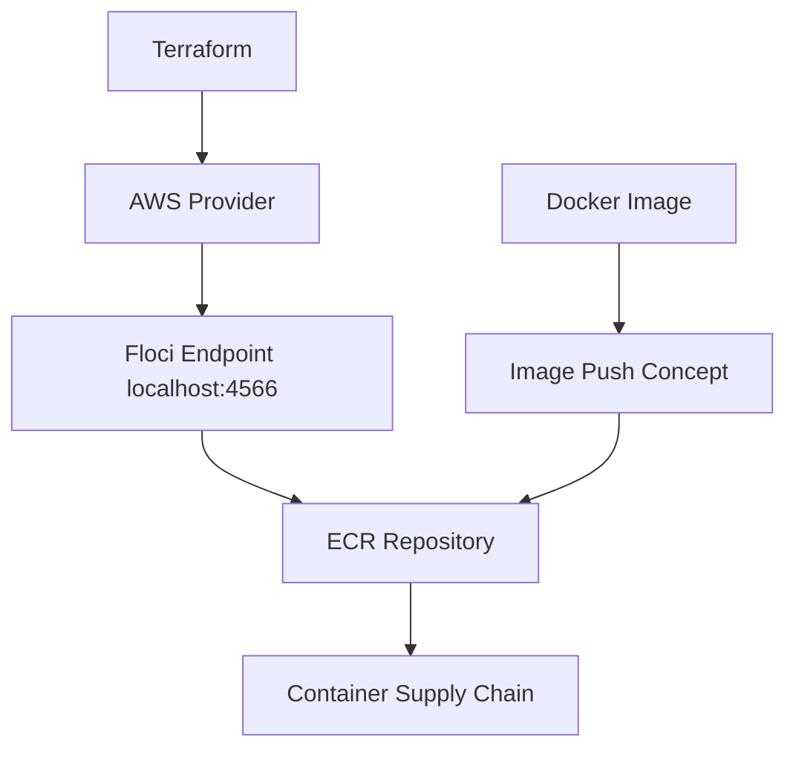

# Floci Lab 15: Terraform ECR Image Registry

## Goal

Create an AWS-style container image registry using Terraform and Floci.

No real AWS account is used.

---

## What Terraform Creates

```text
ECR repository
Image tag mutability setting
Scan-on-push setting
Repository tags
```

---

## Architecture



---

## What Is ECR?

ECR means Elastic Container Registry.

It is AWS managed Docker image registry.

It stores container images used by:

```text
ECS
EKS
Lambda container images
CI/CD pipelines
deployment platforms
```

---

## Why ECR Matters in DevOps

A CI/CD pipeline usually does this:

```text
build Docker image
scan Docker image
tag Docker image
push image to registry
deploy image to Kubernetes/ECS
```

ECR is the registry part.

---

## Important Security Notes

Container registries should be protected because they store deployable application artifacts.

Common controls:

```text
least-privilege push/pull access
image scanning
immutable tags for production
signed images
SBOM generation
vulnerability gates
lifecycle cleanup
```

In this lab, we enable:

```text
scan_on_push = true
```

---

## Terraform Resource

```text
aws_ecr_repository
```

---

## Commands

```bash
terraform init
terraform fmt
terraform plan
terraform apply --auto-approve
terraform output
```

---

## Verification

```bash
aws ecr describe-repositories
```

Expected repository:

```text
flask-health-api
```

---

## Interview Summary

I created an ECR-style container registry using Terraform against Floci. This demonstrates container supply chain basics, image repository provisioning, scan-on-push configuration, and Terraform-based registry automation without using a real AWS account.