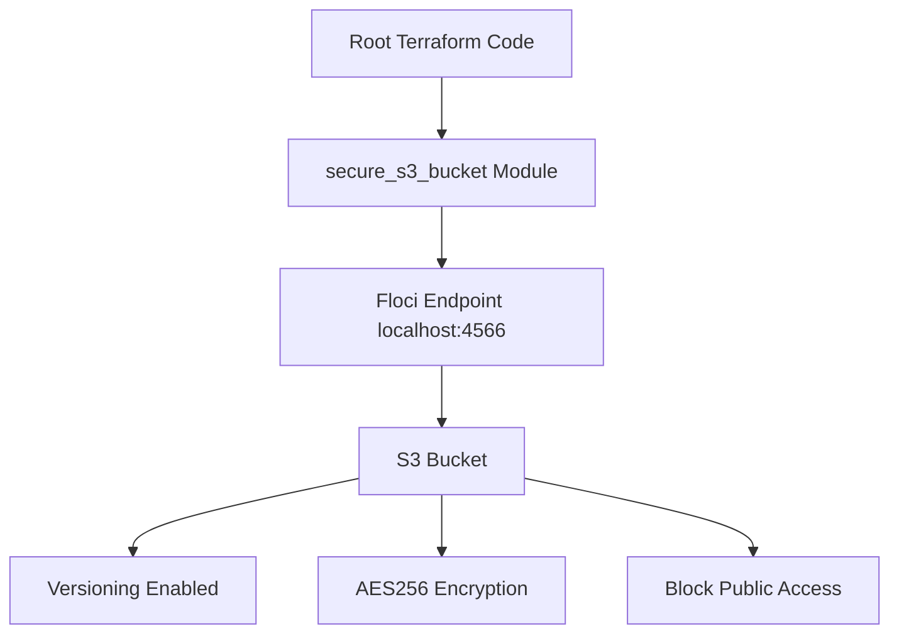

# Floci Lab 16: Terraform Modules for Floci

## Goal

Refactor repeated Terraform code into a reusable module.

No real AWS account is used.

---

## What This Lab Creates

```text
Reusable secure S3 bucket module
S3 bucket
Versioning
AES256 encryption
Block Public Access
```

---

## Architecture



---

## Why Terraform Modules?

Modules help avoid repeating the same Terraform code.

Without modules:

```text
copy/paste resources in every lab
harder to maintain
higher chance of mistakes
```

With modules:

```text
write once
reuse many times
standardize security controls
make code cleaner
```

---

## Module Used

```text
modules/secure_s3_bucket
```

This module creates:

```text
aws_s3_bucket
aws_s3_bucket_versioning
aws_s3_bucket_server_side_encryption_configuration
aws_s3_bucket_public_access_block
```

---

## Root Module vs Child Module

| Part | Meaning |
|---|---|
| Root module | Main Terraform folder where commands are run |
| Child module | Reusable module called from root module |

Root module calls child module:

```hcl
module "secure_s3_bucket" {
  source = "./modules/secure_s3_bucket"

  bucket_name      = var.bucket_name
  environment      = var.environment
  application_name = var.application_name
}
```

---

## Commands

```bash
terraform init
terraform fmt -recursive
terraform plan
terraform apply --auto-approve
terraform output
```

---

## Verification

```bash
aws s3 ls

aws s3api get-bucket-versioning \
  --bucket devsecops-module-secure-s3

aws s3api get-bucket-encryption \
  --bucket devsecops-module-secure-s3

aws s3api get-public-access-block \
  --bucket devsecops-module-secure-s3
```

---

## Interview Summary

I created a reusable Terraform module for secure S3 buckets using Floci. The module standardizes versioning, AES256 encryption, and Block Public Access. This demonstrates reusable infrastructure design and secure-by-default Terraform patterns.