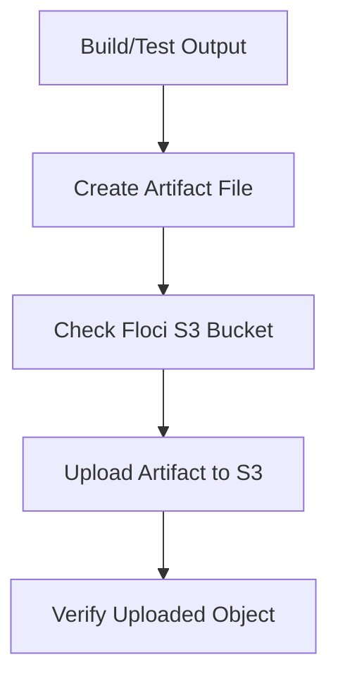

# Floci Lab 17: CI/CD Artifact Upload to Local S3

## Goal

Simulate a CI/CD artifact upload workflow locally using Floci S3.

No real AWS account is used.

---

## Why Local Simulation?

GitHub Actions cloud runners cannot access Floci running on your WSL `localhost`.

So this lab simulates the CI/CD artifact upload flow locally.

---

## Flow



---

## What This Lab Uses

```text
AWS CLI
Floci S3
Bash script
Local artifact file
Secure S3 artifact bucket from Lab 07
```

Bucket used:

```text
devsecops-artifact-platform
```

---

## Script

```text
scripts/upload-artifact.sh
```

The script:

```text
checks AWS identity
checks target bucket
creates local artifact
uploads artifact to S3
verifies uploaded object
removes local generated file
```

---

## Run

```bash
chmod +x scripts/upload-artifact.sh

./scripts/upload-artifact.sh
```

---

## Verify Manually

```bash
aws s3 ls s3://devsecops-artifact-platform/
```

---

## Why This Matters

In real CI/CD pipelines, build outputs are often uploaded to artifact storage.

Examples:

```text
test reports
security scan reports
SBOM files
release packages
application binaries
deployment manifests
```

Artifact storage should be:

```text
encrypted
versioned
access-controlled
not public
managed by Terraform
```

---

## GitHub Actions Limitation

A normal GitHub-hosted runner cannot directly access:

```text
http://localhost:4566
```

because that `localhost` exists inside the GitHub runner, not your WSL machine.

To run this from GitHub Actions, options include:

```text
run Floci inside the workflow
use a self-hosted runner on your machine
use real AWS later
```

---

## Interview Summary

I built a local CI/CD artifact upload simulation using Bash, AWS CLI, Floci S3, and a Terraform-managed secure S3 artifact bucket. This demonstrates how CI/CD systems can publish build artifacts to secure object storage while keeping the setup local and cost-free.