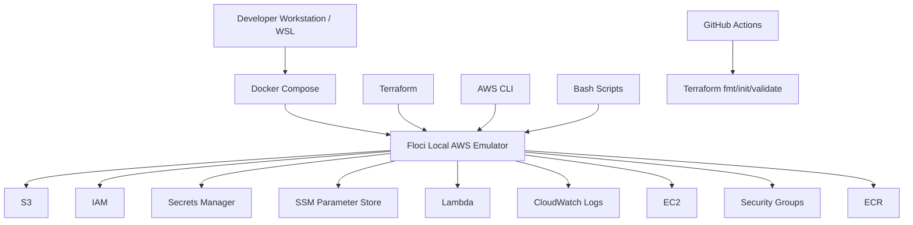
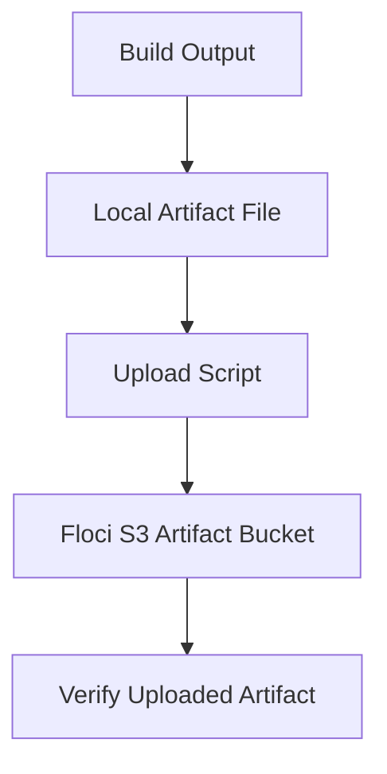

# Floci Local AWS Platform Labs

## Goal

Build a local AWS-style DevSecOps platform using Floci, Terraform, AWS CLI, Docker, Bash, and GitHub Actions.

No real AWS account is used.

---

## Architecture



---

## Completed Labs

| Lab | Topic | Status |
|---|---|---|
| 01 | Local AWS emulator with Docker Compose | ✅ |
| 03 | Terraform secure S3 bucket | ✅ |
| 04 | Terraform IAM least privilege | ✅ |
| 05 | Terraform Secrets Manager | ✅ |
| 06 | Terraform IAM access key risk | ✅ |
| 07 | Secure S3 artifact platform mini-project | ✅ |
| 08 | Floci Terraform validation workflow | ✅ |
| 09 | Root README dashboard update | ✅ |
| 10 | Terraform SSM Parameter Store | ✅ |
| 11 | Terraform Lambda basics | ✅ |
| 12 | Terraform CloudWatch Logs | ✅ |
| 13 | Terraform EC2 basics | ✅ |
| 14 | Terraform Security Groups | ✅ |
| 15 | Terraform ECR image registry | ✅ |
| 16 | Terraform modules for Floci | ✅ |
| 17 | Local CI/CD artifact upload to S3 | ✅ |

---

## Core Skills Demonstrated

```text
Local AWS emulation
Terraform infrastructure automation
AWS CLI operations
S3 security
IAM least privilege
Secrets management
SSM Parameter Store
Lambda basics
CloudWatch Logs
EC2 basics
Security Groups
ECR image registry
Terraform modules
CI/CD artifact upload simulation
Gitleaks secret scanning
GitHub Actions Terraform validation
```

---

## Security Concepts Practiced

```text
Block Public Access
Server-side encryption
S3 versioning
IAM least privilege
Access key risk
Terraform state secret exposure
Secret scanning
Non-secret vs secret configuration
Secure artifact storage
```

---

## Main Mini Project

### Secure S3 Artifact Platform

The main mini project is:

```text
07-secure-s3-artifact-platform
```

It creates:

```text
secure S3 artifact bucket
versioning
AES256 encryption
Block Public Access
IAM CI user
least-privilege IAM policy
Secrets Manager metadata
```

This simulates a secure artifact storage platform for CI/CD pipelines.

---

## CI/CD Simulation

Lab 17 simulates a local CI/CD artifact upload flow:



This demonstrates how build artifacts, reports, SBOMs, or security scan outputs can be uploaded to secure object storage.

---

## GitHub Actions Validation

The repository includes Floci Terraform validation using GitHub Actions.

The workflow validates Terraform labs with:

```text
terraform fmt -check
terraform init -backend=false
terraform validate
```

This ensures the Terraform code stays clean and valid.

---

## Important Local-First Note

Floci runs locally using Docker Compose.

GitHub-hosted runners cannot directly access your local Floci endpoint:

```text
http://localhost:4566
```

So GitHub Actions are used for Terraform validation, while actual Floci resource creation is tested locally.

---

## Interview Summary

I built a local AWS-style DevSecOps platform using Floci and Terraform. I provisioned secure S3 buckets, IAM users and policies, Secrets Manager secrets, SSM parameters, Lambda functions, CloudWatch log groups, EC2-style instances, security groups, and ECR repositories. I also created a secure artifact platform mini-project and simulated CI/CD artifact upload to local S3. The project demonstrates infrastructure automation, cloud security basics, least privilege, secret safety, and local-first AWS learning without cloud cost.