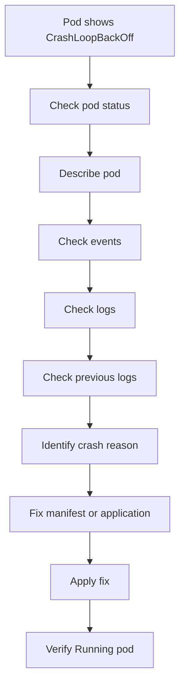

# Lab 001: CrashLoopBackOff

## Objective

Reproduce and troubleshoot a Kubernetes `CrashLoopBackOff` incident using Kind.

This lab demonstrates how to identify why a container is repeatedly crashing and how to fix it safely.

---

## Incident Meaning

`CrashLoopBackOff` means the container starts, crashes, and Kubernetes keeps restarting it with increasing delay.

Important point:

The pod exists, but the application process inside the container is failing.

---

## Lab Structure

```text
labs/kubernetes/001-crashloopbackoff/
├── README.md
├── broken/
│   └── deployment.yaml
├── fixed/
│   └── deployment.yaml
└── evidence/
    └── .gitkeep
```

---

## Prerequisites

Create or use the Kind cluster:

```bash
kind create cluster --name devsecops-lab
```

Verify:

```bash
kubectl cluster-info --context kind-devsecops-lab
kubectl get nodes
```

Create namespace:

```bash
kubectl create namespace incident-labs
```

---

## Scenario

A deployment is applied to Kubernetes.

The pod starts but immediately crashes.

The pod status becomes:

```text
CrashLoopBackOff
```

Your task is to investigate, identify the root cause, apply the fixed manifest, and verify recovery.

---

## Step 1: Deploy Broken Manifest

From this lab directory:

```bash
cd labs/kubernetes/001-crashloopbackoff
kubectl apply -f broken/deployment.yaml
```

Check pods:

```bash
kubectl get pods -n incident-labs
```

Expected symptom:

```text
NAME                             READY   STATUS             RESTARTS
crashloop-demo-xxxxxxxxxx-xxxxx  0/1     CrashLoopBackOff   1+
```

---

## Step 2: Observe the Problem

Check pod status:

```bash
kubectl get pods -n incident-labs
```

Check more details:

```bash
kubectl get pods -n incident-labs -o wide
```

Describe the pod:

```bash
kubectl describe pod <pod-name> -n incident-labs
```

Check events:

```bash
kubectl get events -n incident-labs --sort-by=.lastTimestamp
```

---

## Step 3: Investigate Logs

Check current logs:

```bash
kubectl logs <pod-name> -n incident-labs
```

Check previous container logs:

```bash
kubectl logs <pod-name> -n incident-labs --previous
```

Why `--previous` matters:

When a container crashes and restarts quickly, the current container may not have useful logs. The previous container logs often show the actual error that caused the crash.

---

## Step 4: Identify Root Cause

In this lab, the broken manifest runs a command that exits with a non-zero exit code.

Example failure pattern:

```text
Starting application...
Simulating application crash...
exit code 1
```

This causes Kubernetes to restart the container repeatedly.

---

## Step 5: Apply Fixed Manifest

Apply the fixed deployment:

```bash
kubectl apply -f fixed/deployment.yaml
```

Wait for rollout:

```bash
kubectl rollout status deployment/crashloop-demo -n incident-labs
```

---

## Step 6: Verify Recovery

Check pods:

```bash
kubectl get pods -n incident-labs
```

Expected result:

```text
NAME                             READY   STATUS    RESTARTS
crashloop-demo-xxxxxxxxxx-xxxxx  1/1     Running   0
```

Check logs:

```bash
kubectl logs deployment/crashloop-demo -n incident-labs
```

Expected logs:

```text
Application started successfully
```

---

## Step 7: Cleanup

Delete the lab deployment:

```bash
kubectl delete -f fixed/deployment.yaml
```

Or delete the namespace if you want to clean all labs:

```bash
kubectl delete namespace incident-labs
```

---

## Key Commands Used

```bash
kubectl get pods -n incident-labs
kubectl describe pod <pod-name> -n incident-labs
kubectl get events -n incident-labs --sort-by=.lastTimestamp
kubectl logs <pod-name> -n incident-labs
kubectl logs <pod-name> -n incident-labs --previous
kubectl rollout status deployment/crashloop-demo -n incident-labs
```

---

## Troubleshooting Flow



---

## Common Causes in Production

- Application exits due to missing configuration
- Wrong command or arguments
- Missing environment variable
- Application dependency unavailable
- Permission issue
- Bad container image
- Failed database connection
- Liveness probe killing the container
- Secret or ConfigMap issue
- Runtime exception in application startup

---

## Prevention

- Validate application startup in CI
- Add smoke tests after deployment
- Use proper readiness and liveness probes
- Avoid deploying untested image tags
- Validate Secrets and ConfigMaps before deployment
- Monitor restart count
- Alert on `CrashLoopBackOff`
- Check logs before restarting blindly

---

## Interview Answer

`CrashLoopBackOff` means the container starts, crashes, and Kubernetes keeps restarting it with increasing delay.

I would first check the pod status using `kubectl get pods`, then run `kubectl describe pod` to inspect events. After that, I would check logs using `kubectl logs` and especially `kubectl logs --previous` because the previous crashed container often contains the real error.

Common causes include application startup failure, wrong command, missing environment variables, missing config, dependency failure, or liveness probe issues.

I would fix the root cause, apply the corrected manifest or image, and verify that the pod becomes `Running` with stable restart count.

---

## Evidence to Capture

Save screenshots or command outputs under:

```text
labs/kubernetes/001-crashloopbackoff/evidence/
```

Recommended evidence:

```text
01-broken-pod-status.txt
02-describe-pod-events.txt
03-previous-container-logs.txt
04-fixed-pod-running.txt
05-rollout-status.txt
```

Example:

```bash
kubectl get pods -n incident-labs > evidence/01-broken-pod-status.txt
kubectl describe pod <pod-name> -n incident-labs > evidence/02-describe-pod-events.txt
kubectl logs <pod-name> -n incident-labs --previous > evidence/03-previous-container-logs.txt
kubectl get pods -n incident-labs > evidence/04-fixed-pod-running.txt
kubectl rollout status deployment/crashloop-demo -n incident-labs > evidence/05-rollout-status.txt
```

---

## Related Incident Note

See:

```text
docs/incidents/002-crashloopbackoff.md
```