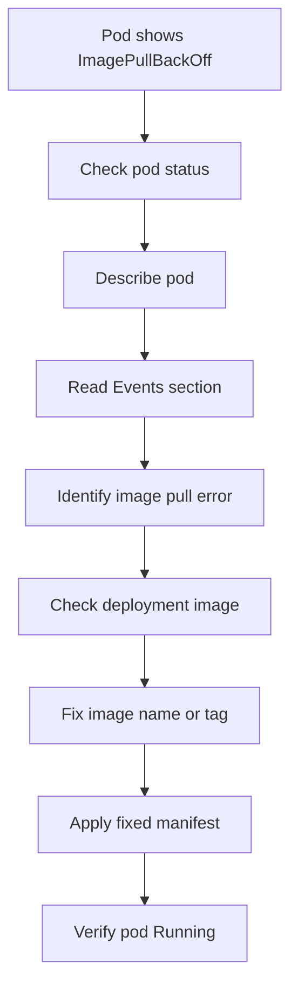

# Lab 002: ImagePullBackOff

## Objective

Reproduce and troubleshoot a Kubernetes `ImagePullBackOff` incident using Kind.

This lab demonstrates how to identify container image pull failures caused by wrong image names, wrong tags, or registry access issues.

---

## Incident Meaning

`ImagePullBackOff` means Kubernetes tried to pull a container image but failed.

After repeated failures, Kubernetes waits before trying again. This waiting state is called backoff.

Important point:

The container never starts because Kubernetes cannot download the image.

---

## Lab Structure

```text
labs/kubernetes/002-imagepullbackoff/
├── README.md
├── broken/
│   └── deployment.yaml
├── fixed/
│   └── deployment.yaml
└── evidence/
    └── .gitkeep
```

---

## Prerequisites

Use the existing Kind cluster:

```bash
kubectl get nodes
```

Verify the lab namespace exists:

```bash
kubectl get namespace incident-labs
```

If the namespace does not exist, create it:

```bash
kubectl create namespace incident-labs
```

---

## Scenario

A deployment is applied to Kubernetes.

The pod is created, but the container image cannot be pulled.

The pod status becomes:

```text
ImagePullBackOff
```

Your task is to investigate the image pull failure, identify the wrong image reference, apply the fixed manifest, and verify recovery.

---

## Step 1: Deploy Broken Manifest

From this lab directory:

```bash
cd labs/kubernetes/002-imagepullbackoff
kubectl apply -f broken/deployment.yaml
```

Check pods:

```bash
kubectl get pods -n incident-labs
```

Expected symptom:

```text
NAME                                READY   STATUS             RESTARTS
imagepull-demo-xxxxxxxxxx-xxxxx     0/1     ImagePullBackOff   0
```

Sometimes you may first see:

```text
ErrImagePull
```

After Kubernetes retries, it usually becomes:

```text
ImagePullBackOff
```

---

## Step 2: Observe the Problem

Check pod status:

```bash
kubectl get pods -n incident-labs
```

Check more details:

```bash
kubectl get pods -n incident-labs -o wide
```

Describe the pod:

```bash
kubectl describe pod <pod-name> -n incident-labs
```

Check events:

```bash
kubectl get events -n incident-labs --sort-by=.lastTimestamp
```

---

## Step 3: Identify the Root Cause

For `ImagePullBackOff`, logs usually do not help because the container never started.

So this command may fail:

```bash
kubectl logs <pod-name> -n incident-labs
```

The best command is:

```bash
kubectl describe pod <pod-name> -n incident-labs
```

Look in the Events section for messages like:

```text
Failed to pull image
pull access denied
repository does not exist
not found
manifest unknown
```

---

## Step 4: Check the Deployment Image

Check the image used by the deployment:

```bash
kubectl get deployment imagepull-demo -n incident-labs -o yaml
```

Or shorter:

```bash
kubectl get deployment imagepull-demo -n incident-labs -o jsonpath='{.spec.template.spec.containers[0].image}{"\n"}'
```

In this lab, the broken manifest uses an invalid image name.

Example:

```text
nginx:does-not-exist
```

This image tag does not exist, so Kubernetes cannot pull it.

---

## Step 5: Apply Fixed Manifest

Apply the fixed deployment:

```bash
kubectl apply -f fixed/deployment.yaml
```

Wait for rollout:

```bash
kubectl rollout status deployment/imagepull-demo -n incident-labs
```

---

## Step 6: Verify Recovery

Check pods:

```bash
kubectl get pods -n incident-labs
```

Expected result:

```text
NAME                                READY   STATUS    RESTARTS
imagepull-demo-xxxxxxxxxx-xxxxx     1/1     Running   0
```

Check the image:

```bash
kubectl get deployment imagepull-demo -n incident-labs -o jsonpath='{.spec.template.spec.containers[0].image}{"\n"}'
```

Expected image:

```text
nginx:1.27-alpine
```

Check logs:

```bash
kubectl logs deployment/imagepull-demo -n incident-labs
```

---

## Step 7: Cleanup

Delete the lab deployment:

```bash
kubectl delete -f fixed/deployment.yaml
```

Or delete the namespace if you want to clean all labs:

```bash
kubectl delete namespace incident-labs
```

---

## Key Commands Used

```bash
kubectl get pods -n incident-labs
kubectl describe pod <pod-name> -n incident-labs
kubectl get events -n incident-labs --sort-by=.lastTimestamp
kubectl get deployment imagepull-demo -n incident-labs -o yaml
kubectl get deployment imagepull-demo -n incident-labs -o jsonpath='{.spec.template.spec.containers[0].image}{"\n"}'
kubectl rollout status deployment/imagepull-demo -n incident-labs
```

---

## Troubleshooting Flow



---

## Common Causes in Production

- Wrong image name
- Wrong image tag
- Image tag does not exist
- Private registry requires authentication
- Missing `imagePullSecrets`
- Registry outage
- Network or DNS issue from node to registry
- Rate limiting from public registries
- Incorrect registry URL
- Image deleted from registry

---

## Prevention

- Avoid using random or untested image tags
- Use immutable tags or image digests in production
- Validate image existence in CI before deployment
- Scan images before deployment
- Use proper `imagePullSecrets` for private registries
- Monitor image pull failures
- Keep registry credentials rotated and tested
- Use internal registry mirrors where required

---

## Interview Answer

`ImagePullBackOff` means Kubernetes cannot pull the container image, so the container never starts.

I would first run `kubectl get pods` to confirm the status. Then I would run `kubectl describe pod` and check the Events section because logs usually do not exist when the image was never pulled.

Common causes include wrong image name, wrong tag, missing registry credentials, private registry access issues, or registry/network problems.

I would verify the image reference in the deployment, fix the image name or tag, apply the corrected manifest, and confirm that the pod becomes `Running`.

---

## Evidence to Capture

Save screenshots or command outputs under:

```text
labs/kubernetes/002-imagepullbackoff/evidence/
```

Recommended evidence:

```text
01-broken-pod-status.txt
02-describe-pod-events.txt
03-broken-image-reference.txt
04-fixed-pod-running.txt
05-fixed-image-reference.txt
06-rollout-status.txt
```

Example:

```bash
kubectl get pods -n incident-labs > evidence/01-broken-pod-status.txt
kubectl describe pod <pod-name> -n incident-labs > evidence/02-describe-pod-events.txt
kubectl get deployment imagepull-demo -n incident-labs -o jsonpath='{.spec.template.spec.containers[0].image}{"\n"}' > evidence/03-broken-image-reference.txt
kubectl get pods -n incident-labs > evidence/04-fixed-pod-running.txt
kubectl get deployment imagepull-demo -n incident-labs -o jsonpath='{.spec.template.spec.containers[0].image}{"\n"}' > evidence/05-fixed-image-reference.txt
kubectl rollout status deployment/imagepull-demo -n incident-labs > evidence/06-rollout-status.txt
```

---

## Related Incident Note

See:

```text
docs/incidents/003-imagepullbackoff.md
```