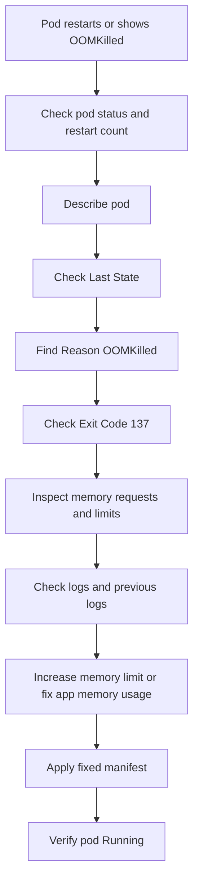

# Lab 003: OOMKilled

## Objective

Reproduce and troubleshoot a Kubernetes `OOMKilled` incident using Kind.

This lab demonstrates how memory limits work in Kubernetes and how a container gets killed when it uses more memory than allowed.

---

## Incident Meaning

`OOMKilled` means the container was killed because it exceeded its memory limit.

OOM means:

```text
Out Of Memory
```

Important point:

The container starts successfully, but later consumes more memory than allowed. Kubernetes then terminates the container.

---

## Lab Structure

```text
labs/kubernetes/003-oomkilled/
├── README.md
├── broken/
│   └── deployment.yaml
├── fixed/
│   └── deployment.yaml
└── evidence/
    └── .gitkeep
```

---

## Prerequisites

Use the existing Kind cluster:

```bash
kubectl get nodes
```

Verify the lab namespace exists:

```bash
kubectl get namespace incident-labs
```

If the namespace does not exist, create it:

```bash
kubectl create namespace incident-labs
```

---

## Scenario

A deployment is applied to Kubernetes.

The container starts, but it is given a very low memory limit.

The application intentionally allocates more memory than the limit.

The container gets killed and the pod shows signs of:

```text
OOMKilled
```

Your task is to investigate the memory failure, identify the memory limit issue, apply the fixed manifest, and verify recovery.

---

## Step 1: Deploy Broken Manifest

From this lab directory:

```bash
cd labs/kubernetes/003-oomkilled
kubectl apply -f broken/deployment.yaml
```

Check pods:

```bash
kubectl get pods -n incident-labs
```

Expected symptom:

```text
NAME                         READY   STATUS      RESTARTS
oom-demo-xxxxxxxxxx-xxxxx    0/1     OOMKilled   1+
```

Sometimes you may see:

```text
CrashLoopBackOff
```

The important clue is found in `kubectl describe pod`.

---

## Step 2: Observe the Problem

Check pod status:

```bash
kubectl get pods -n incident-labs
```

Check restart count:

```bash
kubectl get pods -n incident-labs -o wide
```

Describe the pod:

```bash
kubectl describe pod <pod-name> -n incident-labs
```

Check events:

```bash
kubectl get events -n incident-labs --sort-by=.lastTimestamp
```

---

## Step 3: Identify OOMKilled

In the pod description, look for:

```text
Last State:     Terminated
Reason:         OOMKilled
Exit Code:      137
```

Exit code `137` usually means the process was killed using `SIGKILL`.

In Kubernetes memory incidents, this commonly means the container exceeded its memory limit.

---

## Step 4: Check the Memory Limit

Check the deployment manifest:

```bash
kubectl get deployment oom-demo -n incident-labs -o yaml
```

Or check only resource limits:

```bash
kubectl get deployment oom-demo -n incident-labs -o jsonpath='{.spec.template.spec.containers[0].resources}{"\n"}'
```

In this lab, the broken manifest has a very low memory limit.

Example:

```yaml
resources:
  limits:
    memory: "32Mi"
```

The application tries to allocate more memory than this limit, so it gets killed.

---

## Step 5: Check Logs

Check logs:

```bash
kubectl logs <pod-name> -n incident-labs
```

Check previous logs:

```bash
kubectl logs <pod-name> -n incident-labs --previous
```

Why `--previous` matters:

When a container is killed and restarted, the previous container logs may show what happened just before termination.

---

## Step 6: Apply Fixed Manifest

Apply the fixed deployment:

```bash
kubectl apply -f fixed/deployment.yaml
```

Wait for rollout:

```bash
kubectl rollout status deployment/oom-demo -n incident-labs
```

---

## Step 7: Verify Recovery

Check pods:

```bash
kubectl get pods -n incident-labs
```

Expected result:

```text
NAME                         READY   STATUS    RESTARTS
oom-demo-xxxxxxxxxx-xxxxx    1/1     Running   0
```

Check memory limits:

```bash
kubectl get deployment oom-demo -n incident-labs -o jsonpath='{.spec.template.spec.containers[0].resources}{"\n"}'
```

Check logs:

```bash
kubectl logs deployment/oom-demo -n incident-labs
```

Expected logs:

```text
Application running within memory limit
```

---

## Step 8: Cleanup

Delete the lab deployment:

```bash
kubectl delete -f fixed/deployment.yaml
```

Or delete the namespace if you want to clean all labs:

```bash
kubectl delete namespace incident-labs
```

---

## Key Commands Used

```bash
kubectl get pods -n incident-labs
kubectl describe pod <pod-name> -n incident-labs
kubectl get events -n incident-labs --sort-by=.lastTimestamp
kubectl logs <pod-name> -n incident-labs
kubectl logs <pod-name> -n incident-labs --previous
kubectl get deployment oom-demo -n incident-labs -o yaml
kubectl get deployment oom-demo -n incident-labs -o jsonpath='{.spec.template.spec.containers[0].resources}{"\n"}'
kubectl rollout status deployment/oom-demo -n incident-labs
```

---

## Troubleshooting Flow



---

## Common Causes in Production

- Memory limit too low
- Memory leak in application
- Sudden traffic spike
- Large file loaded into memory
- Bad JVM heap settings
- Python process consuming too much memory
- Node.js heap limit issue
- Missing resource tuning
- Sidecar consuming unexpected memory
- Incorrect container sizing

---

## Prevention

- Set realistic memory requests and limits
- Monitor memory usage with Prometheus
- Alert on high memory usage before OOM
- Load test before production release
- Tune JVM, Node.js, or Python memory behavior
- Avoid loading huge files fully into memory
- Use horizontal scaling where appropriate
- Review memory trends after every deployment
- Add dashboards for pod memory usage and restart count

---

## Interview Answer

`OOMKilled` means the container exceeded its memory limit and was killed by the system.

I would first check `kubectl get pods` to see the pod status and restart count. Then I would run `kubectl describe pod` and look for `Last State: Terminated`, `Reason: OOMKilled`, and `Exit Code: 137`.

After that, I would check the container memory requests and limits, review logs using `kubectl logs --previous`, and compare actual memory usage from monitoring if available.

The fix may be to increase the memory limit, tune the application memory usage, fix a memory leak, or scale the workload properly.

---

## Evidence to Capture

Save screenshots or command outputs under:

```text
labs/kubernetes/003-oomkilled/evidence/
```

Recommended evidence:

```text
01-broken-pod-status.txt
02-describe-pod-oomkilled.txt
03-broken-resource-limits.txt
04-previous-container-logs.txt
05-fixed-pod-running.txt
06-fixed-resource-limits.txt
07-rollout-status.txt
```

Example:

```bash
kubectl get pods -n incident-labs > evidence/01-broken-pod-status.txt
kubectl describe pod <pod-name> -n incident-labs > evidence/02-describe-pod-oomkilled.txt
kubectl get deployment oom-demo -n incident-labs -o jsonpath='{.spec.template.spec.containers[0].resources}{"\n"}' > evidence/03-broken-resource-limits.txt
kubectl logs <pod-name> -n incident-labs --previous > evidence/04-previous-container-logs.txt
kubectl get pods -n incident-labs > evidence/05-fixed-pod-running.txt
kubectl get deployment oom-demo -n incident-labs -o jsonpath='{.spec.template.spec.containers[0].resources}{"\n"}' > evidence/06-fixed-resource-limits.txt
kubectl rollout status deployment/oom-demo -n incident-labs > evidence/07-rollout-status.txt
```

---

## Related Incident Note

See:

```text
docs/incidents/004-oomkilled.md
```