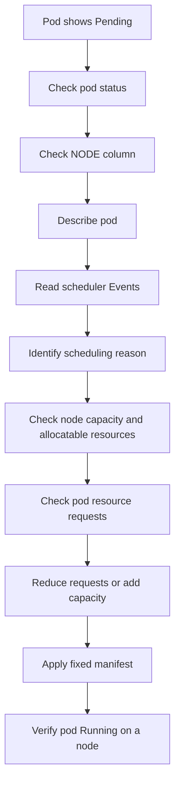

# Lab 004: Pod Pending

## Objective

Reproduce and troubleshoot a Kubernetes `Pending` pod incident using Kind.

This lab demonstrates how Kubernetes scheduling works and why a pod may remain `Pending` when the scheduler cannot place it on any available node.

---

## Incident Meaning

`Pending` means the pod has been accepted by Kubernetes, but it has not been scheduled successfully onto a node.

Important point:

The container has not started yet.

This is different from `CrashLoopBackOff`, where the container starts and crashes.

---

## Lab Structure

```text
labs/kubernetes/004-pod-pending/
├── README.md
├── broken/
│   └── deployment.yaml
├── fixed/
│   └── deployment.yaml
└── evidence/
    └── .gitkeep
```

---

## Prerequisites

Use the existing Kind cluster:

```bash
kubectl get nodes
```

Verify the lab namespace exists:

```bash
kubectl get namespace incident-labs
```

If the namespace does not exist, create it:

```bash
kubectl create namespace incident-labs
```

---

## Scenario

A deployment is applied to Kubernetes.

The pod is created, but it remains in `Pending` state because the resource request is too high for the available node.

The pod status becomes:

```text
Pending
```

Your task is to investigate why the scheduler cannot place the pod, identify the resource request issue, apply the fixed manifest, and verify recovery.

---

## Step 1: Deploy Broken Manifest

From this lab directory:

```bash
cd labs/kubernetes/004-pod-pending
kubectl apply -f broken/deployment.yaml
```

Check pods:

```bash
kubectl get pods -n incident-labs
```

Expected symptom:

```text
NAME                            READY   STATUS    RESTARTS
pending-demo-xxxxxxxxxx-xxxxx   0/1     Pending   0
```

---

## Step 2: Observe the Problem

Check pod status:

```bash
kubectl get pods -n incident-labs
```

Check more details:

```bash
kubectl get pods -n incident-labs -o wide
```

Important clue:

```text
NODE column will usually be empty
```

That means the pod has not been scheduled to any node.

---

## Step 3: Describe the Pod

Run:

```bash
kubectl describe pod <pod-name> -n incident-labs
```

Look at the Events section.

You should see a scheduler message similar to:

```text
0/1 nodes are available: insufficient cpu, insufficient memory
```

This means the scheduler checked available nodes but could not find a node with enough requested resources.

---

## Step 4: Check Node Capacity

Check node details:

```bash
kubectl describe node
```

Useful sections:

```text
Capacity
Allocatable
Allocated resources
```

Check node resource summary:

```bash
kubectl get nodes
```

For deeper inspection:

```bash
kubectl describe node devsecops-lab-control-plane
```

---

## Step 5: Check Deployment Resource Requests

Check the deployment manifest:

```bash
kubectl get deployment pending-demo -n incident-labs -o yaml
```

Or check only resources:

```bash
kubectl get deployment pending-demo -n incident-labs -o jsonpath='{.spec.template.spec.containers[0].resources}{"\n"}'
```

In this lab, the broken manifest requests too much CPU and memory.

Example:

```yaml
resources:
  requests:
    cpu: "100"
    memory: "128Gi"
```

This is too high for a local Kind node, so Kubernetes cannot schedule the pod.

---

## Step 6: Apply Fixed Manifest

Apply the fixed deployment:

```bash
kubectl apply -f fixed/deployment.yaml
```

Wait for rollout:

```bash
kubectl rollout status deployment/pending-demo -n incident-labs
```

---

## Step 7: Verify Recovery

Check pods:

```bash
kubectl get pods -n incident-labs -o wide
```

Expected result:

```text
NAME                            READY   STATUS    RESTARTS   NODE
pending-demo-xxxxxxxxxx-xxxxx   1/1     Running   0          devsecops-lab-control-plane
```

Check resources:

```bash
kubectl get deployment pending-demo -n incident-labs -o jsonpath='{.spec.template.spec.containers[0].resources}{"\n"}'
```

Check logs:

```bash
kubectl logs deployment/pending-demo -n incident-labs
```

---

## Step 8: Cleanup

Delete the lab deployment:

```bash
kubectl delete -f fixed/deployment.yaml
```

Or delete the namespace if you want to clean all labs:

```bash
kubectl delete namespace incident-labs
```

---

## Key Commands Used

```bash
kubectl get pods -n incident-labs
kubectl get pods -n incident-labs -o wide
kubectl describe pod <pod-name> -n incident-labs
kubectl get events -n incident-labs --sort-by=.lastTimestamp
kubectl describe node
kubectl describe node devsecops-lab-control-plane
kubectl get deployment pending-demo -n incident-labs -o yaml
kubectl get deployment pending-demo -n incident-labs -o jsonpath='{.spec.template.spec.containers[0].resources}{"\n"}'
kubectl rollout status deployment/pending-demo -n incident-labs
```

---

## Troubleshooting Flow



---

## Common Causes in Production

- CPU request too high
- Memory request too high
- No matching node selector
- Required node affinity cannot be satisfied
- Taints exist but pod has no toleration
- PersistentVolumeClaim not bound
- Cluster autoscaler not scaling
- Too many pods already running on the node
- Namespace resource quota blocking scheduling
- PodDisruptionBudget or topology constraints limiting placement

---

## Prevention

- Set realistic CPU and memory requests
- Use monitoring data before defining resource requests
- Review node allocatable resources
- Use cluster autoscaler in cloud environments
- Avoid hard node selectors unless required
- Validate taints, tolerations, and affinity rules
- Use resource quotas carefully
- Alert on pods stuck in `Pending`
- Review scheduler events during deployment failures

---

## Interview Answer

`Pending` means the pod has been accepted by Kubernetes but has not been scheduled onto a node.

I would first run `kubectl get pods -o wide` and check whether the NODE column is empty. Then I would run `kubectl describe pod` and inspect the Events section because scheduling failures are clearly shown there.

Common causes include insufficient CPU or memory, node selector mismatch, taints without tolerations, node affinity issues, PVC binding problems, or resource quota limits.

In this case, the pod requested more CPU and memory than the Kind node could provide, so the scheduler could not place it. The fix is to reduce the resource requests or add more node capacity.

---

## Evidence to Capture

Save screenshots or command outputs under:

```text
labs/kubernetes/004-pod-pending/evidence/
```

Recommended evidence:

```text
01-broken-pod-status.txt
02-broken-pod-wide.txt
03-describe-pod-scheduler-events.txt
04-broken-resource-requests.txt
05-node-capacity.txt
06-fixed-pod-running.txt
07-fixed-resource-requests.txt
08-rollout-status.txt
```

Example:

```bash
kubectl get pods -n incident-labs > evidence/01-broken-pod-status.txt
kubectl get pods -n incident-labs -o wide > evidence/02-broken-pod-wide.txt
kubectl describe pod <pod-name> -n incident-labs > evidence/03-describe-pod-scheduler-events.txt
kubectl get deployment pending-demo -n incident-labs -o jsonpath='{.spec.template.spec.containers[0].resources}{"\n"}' > evidence/04-broken-resource-requests.txt
kubectl describe node devsecops-lab-control-plane > evidence/05-node-capacity.txt
kubectl get pods -n incident-labs -o wide > evidence/06-fixed-pod-running.txt
kubectl get deployment pending-demo -n incident-labs -o jsonpath='{.spec.template.spec.containers[0].resources}{"\n"}' > evidence/07-fixed-resource-requests.txt
kubectl rollout status deployment/pending-demo -n incident-labs > evidence/08-rollout-status.txt
```

---

## Related Incident Note

See:

```text
docs/incidents/005-pending-pod.md
```