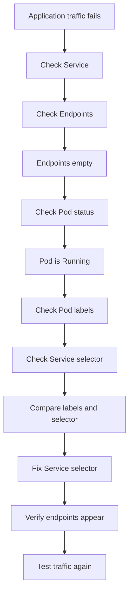

# Lab 005: Service Endpoints Empty

## Objective

Reproduce and troubleshoot a Kubernetes Service with empty endpoints using Kind.

This lab demonstrates how Kubernetes Services route traffic to Pods using labels and selectors.

---

## Incident Meaning

A Service with empty endpoints means:

```text
Service exists, but it has no matching Pods behind it.
```

Important point:

The Pod may be running successfully, but the Service cannot send traffic to it because the Service selector does not match the Pod labels.

---

## Why This Matters

This is a very common production issue.

Example:

```text
Frontend calls backend Service
Backend Pod is Running
Backend Service exists
But request fails
```

Root cause:

```text
Service selector does not match Pod labels
```

In real environments, this can cause:

```text
HTTP 503
Connection refused
Timeout
Ingress backend unavailable
Application-to-application communication failure
```

---

## Lab Structure

```text
labs/kubernetes/005-service-endpoints-empty/
├── README.md
├── broken/
│   └── deployment-service.yaml
├── fixed/
│   └── deployment-service.yaml
└── evidence/
    └── .gitkeep
```

---

## Prerequisites

Use the existing Kind cluster:

```bash
kubectl get nodes
```

Verify the lab namespace exists:

```bash
kubectl get namespace incident-labs
```

If the namespace does not exist, create it:

```bash
kubectl create namespace incident-labs
```

---

## Scenario

A Deployment and Service are applied.

The Pod becomes `Running`.

The Service is created successfully.

But the Service has no endpoints because the selector is wrong.

Your task is to identify why the Service cannot find the Pod, fix the selector, and verify that endpoints are created.

---

## Step 1: Deploy Broken Manifest

From this lab directory:

```bash
cd labs/kubernetes/005-service-endpoints-empty
kubectl apply -f broken/deployment-service.yaml
```

Check resources:

```bash
kubectl get pods -n incident-labs
kubectl get svc -n incident-labs
kubectl get endpoints -n incident-labs
```

Expected symptom:

```text
service-endpoint-demo   10.x.x.x   <none>   80/TCP
```

The important clue is:

```text
ENDPOINTS column is empty or shows <none>
```

---

## Step 2: Check the Pod

Check Pod status:

```bash
kubectl get pods -n incident-labs --show-labels
```

Expected:

```text
service-endpoint-demo-xxxxx   1/1   Running   app=backend-demo
```

The Pod is healthy.

So this is not an image problem, crash problem, or scheduling problem.

---

## Step 3: Check the Service

Check the Service:

```bash
kubectl get svc service-endpoint-demo -n incident-labs -o yaml
```

Look for:

```yaml
selector:
  app: wrong-backend-demo
```

The Service is looking for Pods with:

```text
app=wrong-backend-demo
```

But the Pod actually has:

```text
app=backend-demo
```

So the Service finds no matching Pods.

---

## Step 4: Confirm Empty Endpoints

Run:

```bash
kubectl describe svc service-endpoint-demo -n incident-labs
```

Look for:

```text
Endpoints: <none>
```

Also run:

```bash
kubectl get endpoints service-endpoint-demo -n incident-labs
```

Expected:

```text
NAME                    ENDPOINTS   AGE
service-endpoint-demo   <none>      ...
```

---

## Step 5: Compare Labels and Selectors

Check Pod labels:

```bash
kubectl get pods -n incident-labs --show-labels
```

Check Service selector:

```bash
kubectl get svc service-endpoint-demo -n incident-labs -o jsonpath='{.spec.selector}{"\n"}'
```

Root cause:

```text
Pod label:        app=backend-demo
Service selector: app=wrong-backend-demo
```

They must match.

---

## Step 6: Apply Fixed Manifest

Apply the fixed manifest:

```bash
kubectl apply -f fixed/deployment-service.yaml
```

Check rollout:

```bash
kubectl rollout status deployment/service-endpoint-demo -n incident-labs
```

---

## Step 7: Verify Recovery

Check Pods:

```bash
kubectl get pods -n incident-labs --show-labels
```

Check Service:

```bash
kubectl get svc -n incident-labs
```

Check Endpoints:

```bash
kubectl get endpoints service-endpoint-demo -n incident-labs
```

Expected:

```text
NAME                    ENDPOINTS          AGE
service-endpoint-demo   10.x.x.x:80        ...
```

Now the Service has endpoints.

You can also test from inside the cluster:

```bash
kubectl run curl-test -n incident-labs --rm -it --image=curlimages/curl -- sh
```

Inside the container, run:

```sh
curl http://service-endpoint-demo
```

Expected response:

```text
Welcome to nginx!
```

---

## Step 8: Cleanup

Delete the lab resources:

```bash
kubectl delete -f fixed/deployment-service.yaml
```

If you created the curl test pod and it is still present:

```bash
kubectl delete pod curl-test -n incident-labs --ignore-not-found=true
```

---

## Key Commands Used

```bash
kubectl get pods -n incident-labs --show-labels
kubectl get svc -n incident-labs
kubectl get endpoints -n incident-labs
kubectl describe svc service-endpoint-demo -n incident-labs
kubectl get svc service-endpoint-demo -n incident-labs -o yaml
kubectl get svc service-endpoint-demo -n incident-labs -o jsonpath='{.spec.selector}{"\n"}'
kubectl rollout status deployment/service-endpoint-demo -n incident-labs
```

---

## Troubleshooting Flow



---

## Common Causes in Production

- Service selector does not match Pod labels
- Deployment labels changed but Service selector was not updated
- Helm chart values mismatch
- Different labels used across environments
- App migrated from one label standard to another
- Pods not Ready, so endpoints may not be usable
- Wrong namespace checked
- Service points to old application labels
- Manual hotfix changed labels incorrectly

---

## Prevention

- Use consistent labels across Deployment and Service
- Define labels from common Helm values
- Validate selectors during CI
- Use `kubectl get pods --show-labels` during troubleshooting
- Keep Service selectors simple and stable
- Avoid manually changing labels in production
- Add smoke tests after deployment
- Monitor Service endpoint count
- Alert when critical Services have zero endpoints

---

## Interview Answer

A Service with empty endpoints means the Service exists but it has no matching backend Pods.

I would first check `kubectl get endpoints` or `kubectl describe svc` to confirm that endpoints are empty. Then I would check whether the Pods are running and inspect their labels using `kubectl get pods --show-labels`.

After that, I would compare the Pod labels with the Service selector. If they do not match, the Service cannot route traffic to the Pods.

The fix is to correct the Service selector or the Pod labels, then verify that endpoints appear and test traffic again.

---

## Evidence to Capture

Save command outputs under:

```text
labs/kubernetes/005-service-endpoints-empty/evidence/
```

Recommended evidence:

```text
01-broken-pods-labels.txt
02-broken-service.txt
03-broken-endpoints-empty.txt
04-broken-service-describe.txt
05-broken-service-selector.txt
06-fixed-pods-labels.txt
07-fixed-service-selector.txt
08-fixed-endpoints-present.txt
09-rollout-status.txt
```

Example:

```bash
kubectl get pods -n incident-labs --show-labels > evidence/01-broken-pods-labels.txt
kubectl get svc service-endpoint-demo -n incident-labs -o yaml > evidence/02-broken-service.txt
kubectl get endpoints service-endpoint-demo -n incident-labs > evidence/03-broken-endpoints-empty.txt
kubectl describe svc service-endpoint-demo -n incident-labs > evidence/04-broken-service-describe.txt
kubectl get svc service-endpoint-demo -n incident-labs -o jsonpath='{.spec.selector}{"\n"}' > evidence/05-broken-service-selector.txt

kubectl get pods -n incident-labs --show-labels > evidence/06-fixed-pods-labels.txt
kubectl get svc service-endpoint-demo -n incident-labs -o jsonpath='{.spec.selector}{"\n"}' > evidence/07-fixed-service-selector.txt
kubectl get endpoints service-endpoint-demo -n incident-labs > evidence/08-fixed-endpoints-present.txt
kubectl rollout status deployment/service-endpoint-demo -n incident-labs > evidence/09-rollout-status.txt
```

---

## Related Incident Note

See:

```text
docs/incidents/012-service-endpoints-empty.md
```