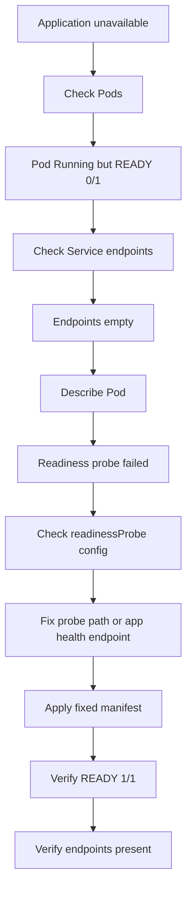

# Lab 006: Readiness Probe Failure

## Objective

Reproduce and troubleshoot a Kubernetes readiness probe failure using Kind.

This lab demonstrates why a Pod can be `Running` but still not receive traffic from a Service.

---

## Incident Meaning

A readiness probe failure means:

```text
The container is running, but Kubernetes does not consider it ready to serve traffic.
```

Important point:

```text
Running does not always mean Ready.
```

A Pod can show:

```text
STATUS: Running
READY: 0/1
```

This means the container process is alive, but Kubernetes will not send Service traffic to it.

---

## Why This Matters

In production, this is very common.

Example:

```text
Pod is Running
Application container is alive
Service exists
But traffic does not reach the Pod
```

Root cause:

```text
Readiness probe is failing
```

This can cause:

```text
Service has no ready endpoints
Ingress returns 503
Deployment rollout gets stuck
Application is unavailable even though Pods are Running
```

---

## Lab Structure

```text
labs/kubernetes/006-readiness-probe-failure/
├── README.md
├── broken/
│   └── deployment-service.yaml
├── fixed/
│   └── deployment-service.yaml
└── evidence/
    └── .gitkeep
```

---

## Prerequisites

Use the existing Kind cluster:

```bash
kubectl get nodes
```

Verify the lab namespace exists:

```bash
kubectl get namespace incident-labs
```

If the namespace does not exist, create it:

```bash
kubectl create namespace incident-labs
```

---

## Scenario

A Deployment and Service are applied.

The Pod starts successfully.

But the readiness probe checks the wrong path.

Because the readiness probe fails, Kubernetes does not mark the Pod as Ready.

Your task is to identify the readiness probe failure, fix the probe path, and verify that the Pod becomes Ready.

---

## Step 1: Deploy Broken Manifest

From this lab directory:

```bash
cd labs/kubernetes/006-readiness-probe-failure
kubectl apply -f broken/deployment-service.yaml
```

Check Pods:

```bash
kubectl get pods -n incident-labs
```

Expected symptom:

```text
NAME                              READY   STATUS    RESTARTS
readiness-demo-xxxxxxxxxx-xxxxx   0/1     Running   0
```

Important:

```text
STATUS is Running, but READY is 0/1
```

---

## Step 2: Check Service and Endpoints

Check the Service:

```bash
kubectl get svc -n incident-labs
```

Check endpoints:

```bash
kubectl get endpoints readiness-demo -n incident-labs
```

Expected symptom:

```text
readiness-demo   <none>
```

The Pod exists, but because it is not Ready, it is not added as a usable Service endpoint.

---

## Step 3: Describe the Pod

Copy the Pod name:

```bash
kubectl get pods -n incident-labs
```

Describe the Pod:

```bash
kubectl describe pod <pod-name> -n incident-labs
```

Look in the Events section for readiness probe failures.

Expected clue:

```text
Readiness probe failed
HTTP probe failed with statuscode: 404
```

---

## Step 4: Check the Readiness Probe

Check the Deployment:

```bash
kubectl get deployment readiness-demo -n incident-labs -o yaml
```

Or check only the readiness probe:

```bash
kubectl get deployment readiness-demo -n incident-labs -o jsonpath='{.spec.template.spec.containers[0].readinessProbe}{"\n"}'
```

In this lab, the broken manifest checks this path:

```text
/wrong-health
```

But nginx does not serve that path by default.

So the HTTP probe gets `404`, and Kubernetes keeps the Pod as not Ready.

---

## Step 5: Check Logs

Check logs:

```bash
kubectl logs deployment/readiness-demo -n incident-labs
```

Logs may show nginx access logs for the failed probe.

You may see requests to:

```text
/wrong-health
```

---

## Step 6: Apply Fixed Manifest

Apply the fixed manifest:

```bash
kubectl apply -f fixed/deployment-service.yaml
```

Wait for rollout:

```bash
kubectl rollout status deployment/readiness-demo -n incident-labs
```

---

## Step 7: Verify Recovery

Check Pods:

```bash
kubectl get pods -n incident-labs
```

Expected result:

```text
NAME                              READY   STATUS    RESTARTS
readiness-demo-xxxxxxxxxx-xxxxx   1/1     Running   0
```

Check endpoints:

```bash
kubectl get endpoints readiness-demo -n incident-labs
```

Expected:

```text
readiness-demo   10.x.x.x:80
```

Check the readiness probe:

```bash
kubectl get deployment readiness-demo -n incident-labs -o jsonpath='{.spec.template.spec.containers[0].readinessProbe}{"\n"}'
```

Expected fixed path:

```text
/
```

---

## Step 8: Cleanup

Delete the lab resources:

```bash
kubectl delete -f fixed/deployment-service.yaml
```

---

## Key Commands Used

```bash
kubectl get pods -n incident-labs
kubectl get svc -n incident-labs
kubectl get endpoints readiness-demo -n incident-labs
kubectl describe pod <pod-name> -n incident-labs
kubectl logs deployment/readiness-demo -n incident-labs
kubectl get deployment readiness-demo -n incident-labs -o yaml
kubectl get deployment readiness-demo -n incident-labs -o jsonpath='{.spec.template.spec.containers[0].readinessProbe}{"\n"}'
kubectl rollout status deployment/readiness-demo -n incident-labs
```

---

## Troubleshooting Flow



---

## Common Causes in Production

- Wrong readiness probe path
- Wrong readiness probe port
- Application health endpoint returns non-200
- Application starts slowly
- Database dependency not ready
- External dependency unavailable
- Probe timeout too low
- Initial delay too short
- Authentication required on health endpoint
- App listens on a different port than the probe checks

---

## Prevention

- Create a dedicated `/healthz` or `/readyz` endpoint
- Keep readiness checks lightweight
- Do not require authentication for internal health endpoints
- Set realistic `initialDelaySeconds`
- Tune `timeoutSeconds`, `periodSeconds`, and `failureThreshold`
- Test probes in CI or staging
- Monitor pods with `READY 0/1`
- Alert on rollout stuck due to readiness failures
- Keep liveness and readiness probes separate

---

## Interview Answer

A readiness probe failure means the container is running, but Kubernetes does not consider it ready to receive traffic.

I would first check `kubectl get pods` and look for `READY 0/1` with `STATUS Running`. Then I would check Service endpoints using `kubectl get endpoints`. If endpoints are empty, I would describe the Pod and inspect Events for readiness probe failures.

Common causes include wrong probe path, wrong port, slow startup, app dependency failure, or probe timeout issues.

The fix is to correct the readiness probe configuration or fix the application health endpoint, then verify that the Pod becomes `READY 1/1` and Service endpoints appear.

---

## Evidence to Capture

Save command outputs under:

```text
labs/kubernetes/006-readiness-probe-failure/evidence/
```

Recommended evidence:

```text
01-broken-pod-status.txt
02-broken-endpoints-empty.txt
03-describe-pod-readiness-failure.txt
04-broken-readiness-probe.txt
05-broken-logs.txt
06-fixed-pod-ready.txt
07-fixed-endpoints-present.txt
08-fixed-readiness-probe.txt
09-rollout-status.txt
```

Example:

```bash
kubectl get pods -n incident-labs > evidence/01-broken-pod-status.txt
kubectl get endpoints readiness-demo -n incident-labs > evidence/02-broken-endpoints-empty.txt
kubectl describe pod <pod-name> -n incident-labs > evidence/03-describe-pod-readiness-failure.txt
kubectl get deployment readiness-demo -n incident-labs -o jsonpath='{.spec.template.spec.containers[0].readinessProbe}{"\n"}' > evidence/04-broken-readiness-probe.txt
kubectl logs deployment/readiness-demo -n incident-labs > evidence/05-broken-logs.txt

kubectl get pods -n incident-labs > evidence/06-fixed-pod-ready.txt
kubectl get endpoints readiness-demo -n incident-labs > evidence/07-fixed-endpoints-present.txt
kubectl get deployment readiness-demo -n incident-labs -o jsonpath='{.spec.template.spec.containers[0].readinessProbe}{"\n"}' > evidence/08-fixed-readiness-probe.txt
kubectl rollout status deployment/readiness-demo -n incident-labs > evidence/09-rollout-status.txt
```

---

## Related Incident Note

See:

```text
docs/incidents/014-readiness-probe-failure.md
```