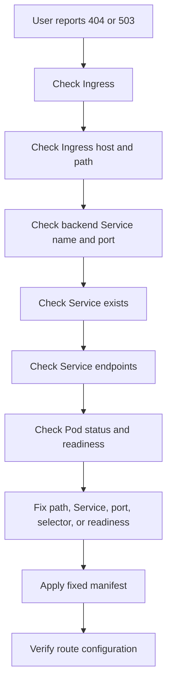

# Lab 007: Ingress 404/503

## Objective

Reproduce and troubleshoot common Kubernetes Ingress routing failures using Kind.

This lab demonstrates how Ingress, Service, Pods, labels, endpoints, and paths work together.

---

## Incident Meaning

Ingress `404` or `503` usually means traffic reached the cluster, but routing failed.

Common meanings:

```text
404 = Ingress rule/path did not match
503 = Ingress matched, but backend Service has no usable endpoints
```

Important point:

Ingress issues are usually not solved by checking only the Ingress object.

You must check the full traffic path:

```text
Client → Ingress → Service → Endpoints → Pod
```

---

## Why This Matters

This is one of the most common Kubernetes production issues.

Example:

```text
Application Pod is Running
Service exists
Ingress exists
But browser shows 404 or 503
```

Possible causes:

```text
Wrong Ingress path
Wrong Service name
Wrong Service port
Service has no endpoints
Pod not Ready
Service selector mismatch
Ingress controller missing
```

---

## Lab Structure

```text
labs/kubernetes/007-ingress-404-503/
├── README.md
├── broken/
│   └── ingress-app.yaml
├── fixed/
│   └── ingress-app.yaml
└── evidence/
    └── .gitkeep
```

---

## Prerequisites

Use the existing Kind cluster:

```bash
kubectl get nodes
```

Verify the lab namespace exists:

```bash
kubectl get namespace incident-labs
```

If the namespace does not exist, create it:

```bash
kubectl create namespace incident-labs
```

---

## Important Note About Kind

Kind does not expose Ingress automatically.

For this lab, we will still create Ingress resources and troubleshoot their configuration locally using:

```bash
kubectl get ingress
kubectl describe ingress
kubectl get svc
kubectl get endpoints
```

Later, when we install an Ingress controller such as NGINX Ingress Controller, the same troubleshooting flow will apply with real HTTP traffic.

---

## Scenario

A Deployment, Service, and Ingress are applied.

The Pod becomes `Running`.

The Service is created.

But the Ingress points to the wrong Service name.

This causes the Ingress backend to be invalid.

Your task is to identify the wrong backend Service, fix the Ingress, and verify the route configuration.

---

## Step 1: Deploy Broken Manifest

From this lab directory:

```bash
cd labs/kubernetes/007-ingress-404-503
kubectl apply -f broken/ingress-app.yaml
```

Check resources:

```bash
kubectl get pods -n incident-labs
kubectl get svc -n incident-labs
kubectl get ingress -n incident-labs
```

Expected symptom:

```text
Ingress exists, Service exists, Pod is Running, but Ingress backend points to the wrong Service.
```

---

## Step 2: Check the Pod

Check Pods:

```bash
kubectl get pods -n incident-labs --show-labels
```

Expected:

```text
ingress-demo-xxxxx   1/1   Running   app=ingress-demo
```

The Pod is healthy.

So this is not a container crash, image pull, or scheduling issue.

---

## Step 3: Check the Service

Check Service:

```bash
kubectl get svc ingress-demo -n incident-labs
```

Check endpoints:

```bash
kubectl get endpoints ingress-demo -n incident-labs
```

Expected:

```text
ingress-demo   10.x.x.x:80
```

This confirms that the Service has a valid backend Pod.

---

## Step 4: Check the Ingress

Check Ingress:

```bash
kubectl get ingress ingress-demo -n incident-labs -o yaml
```

Or describe it:

```bash
kubectl describe ingress ingress-demo -n incident-labs
```

In the broken manifest, the Ingress backend points to:

```text
wrong-ingress-demo
```

But the actual Service name is:

```text
ingress-demo
```

So the Ingress backend is wrong.

---

## Step 5: Understand 404 vs 503

In production:

```text
404 usually means the host/path rule did not match any Ingress route.
503 usually means the Ingress route matched, but the backend Service has no usable endpoints.
```

Examples:

```text
Wrong path: /wrong-app instead of /app       → 404
Service exists but endpoints are empty       → 503
Ingress points to non-existing Service       → backend error
Pod Running but not Ready                    → 503
```

---

## Step 6: Apply Fixed Manifest

Apply the fixed manifest:

```bash
kubectl apply -f fixed/ingress-app.yaml
```

Wait for rollout:

```bash
kubectl rollout status deployment/ingress-demo -n incident-labs
```

---

## Step 7: Verify Recovery

Check all resources:

```bash
kubectl get pods -n incident-labs
kubectl get svc -n incident-labs
kubectl get endpoints ingress-demo -n incident-labs
kubectl get ingress -n incident-labs
```

Check fixed Ingress backend:

```bash
kubectl get ingress ingress-demo -n incident-labs -o jsonpath='{.spec.rules[0].http.paths[0].backend.service.name}{"\n"}'
```

Expected:

```text
ingress-demo
```

---

## Step 8: Cleanup

Delete the lab resources:

```bash
kubectl delete -f fixed/ingress-app.yaml
```

---

## Key Commands Used

```bash
kubectl get pods -n incident-labs --show-labels
kubectl get svc -n incident-labs
kubectl get endpoints ingress-demo -n incident-labs
kubectl get ingress -n incident-labs
kubectl describe ingress ingress-demo -n incident-labs
kubectl get ingress ingress-demo -n incident-labs -o yaml
kubectl get ingress ingress-demo -n incident-labs -o jsonpath='{.spec.rules[0].http.paths[0].backend.service.name}{"\n"}'
kubectl rollout status deployment/ingress-demo -n incident-labs
```

---

## Troubleshooting Flow



---

## Common Causes in Production

- Wrong Ingress path
- Wrong Ingress host
- Wrong backend Service name
- Wrong backend Service port
- Service selector mismatch
- Service endpoints empty
- Pod not Ready
- Ingress controller not installed
- Ingress class mismatch
- TLS secret missing or wrong
- Rewrite-target annotation issue
- Application expects a different base path

---

## Prevention

- Validate Ingress backend Service names in CI
- Keep Service names stable
- Use smoke tests after deployment
- Monitor Ingress 4xx and 5xx rates
- Alert on Services with zero endpoints
- Verify readiness probes before exposing traffic
- Use consistent labels and selectors
- Document routing paths clearly
- Avoid manual hotfixes to Ingress rules in production

---

## Interview Answer

For Ingress `404` or `503`, I would troubleshoot the full traffic path: Ingress, Service, Endpoints, and Pod.

A `404` usually means the request did not match an Ingress host or path rule. A `503` usually means the route matched, but the backend Service has no usable endpoints.

I would check `kubectl describe ingress`, verify the backend Service name and port, check that the Service exists, check endpoints, and then verify Pod labels and readiness.

The fix depends on the root cause: correct the Ingress path, Service name, Service port, Service selector, or readiness probe.

---

## Evidence to Capture

Save command outputs under:

```text
labs/kubernetes/007-ingress-404-503/evidence/
```

Recommended evidence:

```text
01-broken-pods.txt
02-broken-service.txt
03-broken-endpoints.txt
04-broken-ingress.yaml
05-broken-ingress-describe.txt
06-broken-ingress-backend-service.txt
07-fixed-ingress-backend-service.txt
08-fixed-endpoints.txt
09-rollout-status.txt
```

Example:

```bash
kubectl get pods -n incident-labs --show-labels > evidence/01-broken-pods.txt
kubectl get svc ingress-demo -n incident-labs > evidence/02-broken-service.txt
kubectl get endpoints ingress-demo -n incident-labs > evidence/03-broken-endpoints.txt
kubectl get ingress ingress-demo -n incident-labs -o yaml > evidence/04-broken-ingress.yaml
kubectl describe ingress ingress-demo -n incident-labs > evidence/05-broken-ingress-describe.txt
kubectl get ingress ingress-demo -n incident-labs -o jsonpath='{.spec.rules[0].http.paths[0].backend.service.name}{"\n"}' > evidence/06-broken-ingress-backend-service.txt

kubectl get ingress ingress-demo -n incident-labs -o jsonpath='{.spec.rules[0].http.paths[0].backend.service.name}{"\n"}' > evidence/07-fixed-ingress-backend-service.txt
kubectl get endpoints ingress-demo -n incident-labs > evidence/08-fixed-endpoints.txt
kubectl rollout status deployment/ingress-demo -n incident-labs > evidence/09-rollout-status.txt
```

---

## Related Incident Note

See:

```text
docs/incidents/013-ingress-404-503.md
```