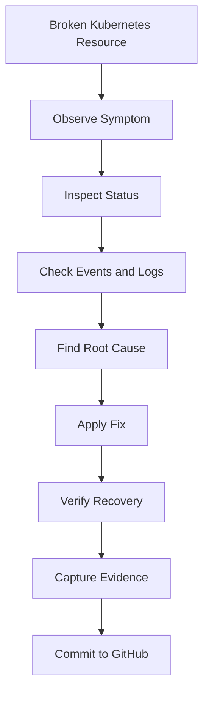
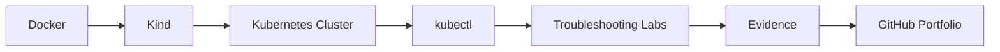
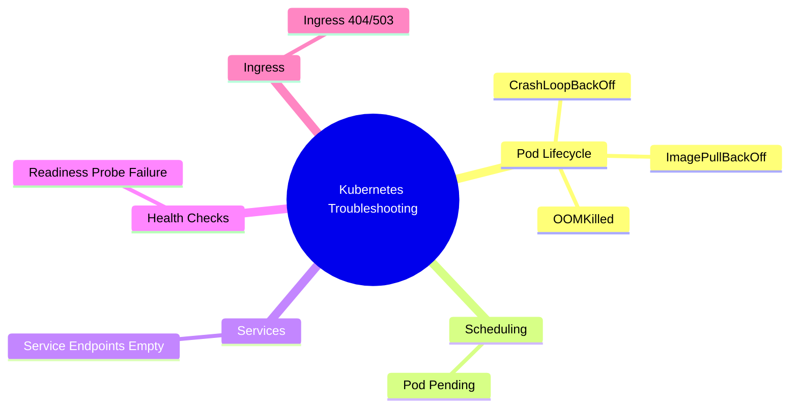
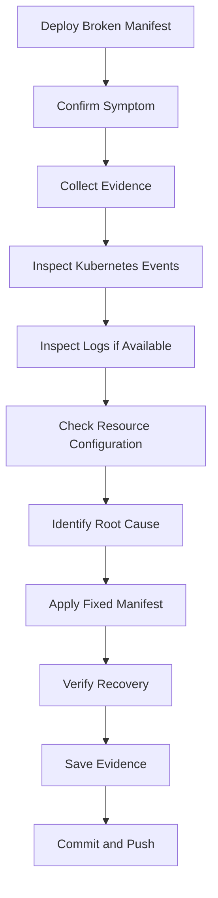
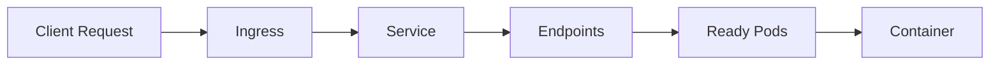
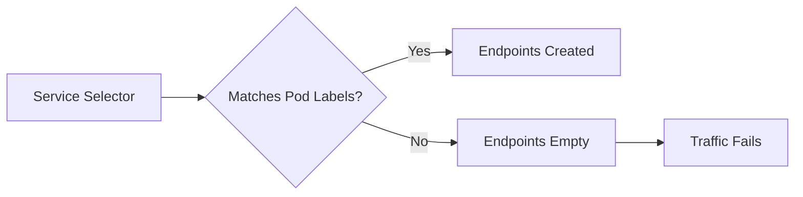
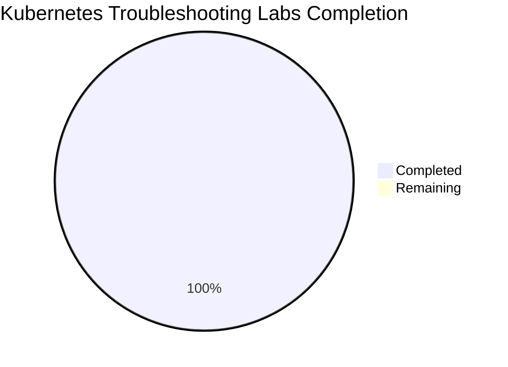

# Kubernetes Troubleshooting Labs


---

## Overview

This directory contains hands-on Kubernetes troubleshooting labs.

Each lab intentionally creates a broken Kubernetes scenario, then walks through investigation, root cause analysis, fix, verification, and evidence capture.

These labs are designed for:

```text
DevOps Engineers
DevSecOps Engineers
SREs
Platform Engineers
Kubernetes interview preparation
GitHub portfolio proof
```

> [!NOTE]
> These are not only YAML examples. These are production-style incident simulations.

---

## Why These Labs Matter

In real production environments, Kubernetes issues are rarely solved by guessing.

A good engineer must know how to inspect:

```text
Pods
Deployments
Events
Logs
Services
Endpoints
Ingress
Readiness probes
Resource requests and limits
```

This lab series builds that troubleshooting muscle using a local Kind cluster.



---

## Chosen Lab Environment

For this portfolio, the preferred Kubernetes lab environment is **Kind**.

Kind runs Kubernetes clusters using Docker containers as nodes. This keeps the setup lightweight, local-first, reproducible, and free.

For cloud learning, AWS and Azure concepts will be practiced using **Floci running in Docker**, so cloud workflows can be simulated locally before using real cloud accounts.

Real cloud accounts will be used only when explicitly required.

---

## Tooling

| Tool | Purpose |
|---|---|
| Docker | Base runtime for Kind and local labs |
| Kind | Local Kubernetes cluster |
| kubectl | Kubernetes CLI |
| Helm | Kubernetes package management |
| GitHub Actions | CI validation |
| Trivy | Image vulnerability scanning |
| Gitleaks | Secret scanning |
| Semgrep | Static security scanning |
| Prometheus | Metrics and monitoring |
| Grafana | Dashboards |



---

## Kubernetes Setup

Create the Kind cluster:

```bash
kind create cluster --name devsecops-lab
```

Verify the cluster:

```bash
kubectl cluster-info --context kind-devsecops-lab
kubectl get nodes
kubectl get pods -A
```

Expected result:

```text
The cluster should have at least one Ready node.
```

Create the lab namespace:

```bash
kubectl create namespace incident-labs
```

Verify:

```bash
kubectl get namespace incident-labs
```

---

## Lab List

| Lab | Incident | Focus Area | Status |
|---|---|---|---|
| 001 | [CrashLoopBackOff](001-crashloopbackoff/README.md) | App crash, logs, restart count | Completed |
| 002 | [ImagePullBackOff](002-imagepullbackoff/README.md) | Wrong image, registry failure | Completed |
| 003 | [OOMKilled](003-oomkilled/README.md) | Memory limits, OOM killer | Completed |
| 004 | [Pod Pending](004-pod-pending/README.md) | Scheduling, resources, taints | Completed |
| 005 | [Service Endpoints Empty](005-service-endpoints-empty/README.md) | Selectors, labels, readiness | Completed |
| 006 | [Readiness Probe Failure](006-readiness-probe-failure/README.md) | Health checks, traffic routing | Completed |
| 007 | [Ingress 404/503](007-ingress-404-503/README.md) | Ingress routing, services, endpoints | Completed |

Series summary:

```text
SERIES-01-SUMMARY.md
```

---

## Series 01 Coverage



---

## Standard Lab Structure

Each lab follows this folder pattern:

```text
labs/kubernetes/<lab-name>/
├── README.md
├── broken/
│   └── <manifest>.yaml
├── fixed/
│   └── <manifest>.yaml
└── evidence/
    └── *.txt
```

Purpose of each folder:

| Path | Purpose |
|---|---|
| `README.md` | Explanation, commands, root cause, interview answer |
| `broken/` | Manifest that intentionally creates the incident |
| `fixed/` | Corrected manifest that resolves the incident |
| `evidence/` | Captured command outputs proving investigation and fix |

---

## Standard Troubleshooting Flow

Every lab follows this SRE-style flow:



---

## Key Commands Practiced

```bash
kubectl get pods -n incident-labs
kubectl get pods -n incident-labs -o wide
kubectl get pods -n incident-labs --show-labels
kubectl describe pod <pod-name> -n incident-labs
kubectl logs <pod-name> -n incident-labs
kubectl logs <pod-name> -n incident-labs --previous
kubectl get events -n incident-labs --sort-by=.lastTimestamp
kubectl get deployment <deployment-name> -n incident-labs -o yaml
kubectl get svc -n incident-labs
kubectl describe svc <service-name> -n incident-labs
kubectl get endpoints -n incident-labs
kubectl get ingress -n incident-labs
kubectl describe ingress <ingress-name> -n incident-labs
kubectl rollout status deployment/<deployment-name> -n incident-labs
```

---

## Traffic Troubleshooting Path

For Service and Ingress issues, always troubleshoot the full path.



If traffic fails, check in this order:

```text
1. Ingress host/path
2. Ingress backend Service name and port
3. Service exists
4. Service selector
5. Endpoints exist
6. Pod labels match selector
7. Pod is Ready
8. Container logs
```

---

## Common Lessons Learned

### Running does not mean Ready

A Pod can be:

```text
STATUS: Running
READY: 0/1
```

This means the container process is alive, but Kubernetes will not route traffic to it.

---

### Logs are not always available

For `ImagePullBackOff`, the container never starts.

So this may not help:

```bash
kubectl logs <pod-name>
```

Better command:

```bash
kubectl describe pod <pod-name>
```

---

### Events often reveal the real problem

Events are critical for:

```text
ImagePullBackOff
Pod Pending
Readiness Probe Failure
Ingress backend issues
```

Useful command:

```bash
kubectl get events -n incident-labs --sort-by=.lastTimestamp
```

---

### Service depends on labels and selectors

A Service sends traffic to Pods only when its selector matches Pod labels.



---

## Interview Value

This lab series prepares for common Kubernetes troubleshooting interview questions:

```text
How do you troubleshoot CrashLoopBackOff?
How do you troubleshoot ImagePullBackOff?
What does OOMKilled mean?
Why is a Pod stuck in Pending?
Why does a Service have no endpoints?
Why is a Pod Running but not Ready?
How do you troubleshoot Ingress 404 or 503?
What is the difference between Running and Ready?
What is the role of labels and selectors?
What is the safest troubleshooting workflow during an incident?
```

---

## Recruiter-Friendly Summary

This Kubernetes lab series demonstrates hands-on ability to troubleshoot production-style incidents.

The work includes:

```text
Broken manifests
Fixed manifests
Root cause analysis
kubectl investigation
Evidence capture
GitHub documentation
Interview-ready explanations
```

It proves practical skills across:

```text
Pods
Deployments
Services
Endpoints
Ingress
Readiness probes
Resource limits
Scheduling
Events
Logs
```

---

## Completion Status



```text
Series 01 Status: Completed
Total labs: 7
Completed labs: 7
Cloud cost: ₹0
```

---

## Next Planned Series

Recommended next section:

```text
Kubernetes Troubleshooting Labs: Series 02
```

Possible topics:

```text
DNS resolution failure
ConfigMap error
Secret error
PVC pending
Node NotReady
DiskPressure
Failed rollout
Liveness probe failure
NetworkPolicy traffic blocked
Helm deployment failure
```

---

## Related Summary

Read the full completed series summary:

```text
labs/kubernetes/SERIES-01-SUMMARY.md
```