# Kubernetes Troubleshooting Labs: Series 01


---

## Overview

This series contains hands-on Kubernetes troubleshooting labs focused on real production-style incidents.

The goal is not only to read about Kubernetes issues, but to reproduce, investigate, fix, verify, and document them using a local Kind cluster.

This series is part of the `devsecops-platform` portfolio and demonstrates practical DevOps, SRE, and Platform Engineering troubleshooting skills.

> [!NOTE]
> These labs are intentionally broken first. The purpose is to practice real incident investigation, not just deploy working YAML.

---

## Series Status

```text
Status: Completed
Total labs: 7
Completed labs: 7
Environment: Local Kind cluster
Cloud cost: ₹0
```


---

## Lab Environment

These labs run locally using:

| Tool | Purpose |
|---|---|
| Docker | Runtime for Kind cluster nodes |
| Kind | Local Kubernetes cluster |
| kubectl | Kubernetes troubleshooting CLI |
| Git | Version control |
| GitHub | Portfolio proof and documentation |

No paid cloud account is required.

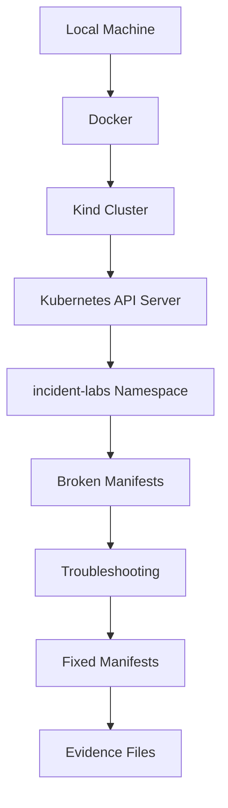

---

## Completed Labs

| Lab | Incident | Main Skill Practiced | Status |
|---|---|---|---|
| 001 | CrashLoopBackOff | Logs, restart count, container exit behavior | Completed |
| 002 | ImagePullBackOff | Image tags, registry pull failures, pod events | Completed |
| 003 | OOMKilled | Memory limits, exit code 137, resource tuning | Completed |
| 004 | Pod Pending | Scheduling, resource requests, node capacity | Completed |
| 005 | Service Endpoints Empty | Labels, selectors, Service endpoint discovery | Completed |
| 006 | Readiness Probe Failure | Health checks, readiness state, traffic routing | Completed |
| 007 | Ingress 404/503 | Ingress routing, Service backends, endpoints | Completed |

---

## Series Coverage

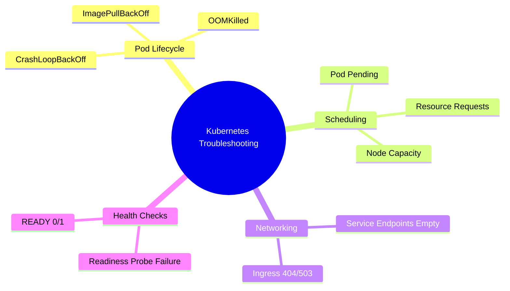

---

## Standard Incident Workflow

Each lab follows the same production-style troubleshooting workflow:

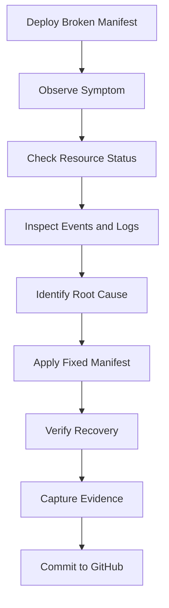

This workflow maps directly to real production incident handling.

---

## Incident Coverage

### 001: CrashLoopBackOff

A container starts but exits repeatedly.

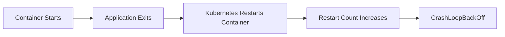

Skills practiced:

```text
kubectl get pods
kubectl logs
kubectl describe pod
Restart count analysis
Container command debugging
```

Production meaning:

```text
The application process is starting but crashing after startup.
```

> [!TIP]
> For CrashLoopBackOff, check logs first. If the container restarted, also check previous logs.

---

### 002: ImagePullBackOff

Kubernetes cannot pull the container image.


Skills practiced:

```text
Image tag troubleshooting
Pod event analysis
Registry failure identification
Deployment image inspection
```

Production meaning:

```text
The container never starts because the image cannot be downloaded.
```

> [!WARNING]
> Logs usually do not help for ImagePullBackOff because the container never started.

---

### 003: OOMKilled

The container exceeds its memory limit and gets killed.

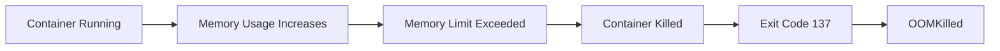

Skills practiced:

```text
Memory limit analysis
Exit code 137 investigation
Previous container logs
Resource tuning
```

Production meaning:

```text
The application consumed more memory than allowed by Kubernetes.
```

> [!NOTE]
> Exit code `137` usually means the process was killed with `SIGKILL`, often due to memory limit violation.

---

### 004: Pod Pending

The pod cannot be scheduled onto a node.

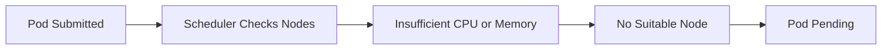

Skills practiced:

```text
Scheduler event analysis
Node capacity inspection
CPU and memory request debugging
kubectl get pods -o wide
```

Production meaning:

```text
The API server accepted the pod, but the scheduler cannot place it on any node.
```

> [!TIP]
> For Pending pods, always check the Events section using `kubectl describe pod`.

---

### 005: Service Endpoints Empty

The Service exists and the Pod is running, but the Service has no endpoints.

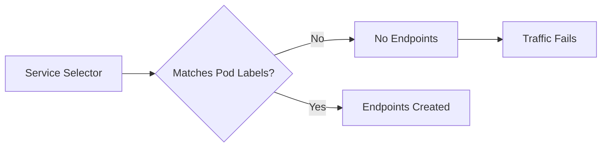

Skills practiced:

```text
Service selector debugging
Pod label inspection
Endpoint verification
Application traffic path analysis
```

Production meaning:

```text
The Service cannot find matching backend Pods.
```

> [!IMPORTANT]
> A Service does not send traffic directly to Deployments. It sends traffic to matching Pod endpoints.

---

### 006: Readiness Probe Failure

The Pod is running but not ready to receive traffic.

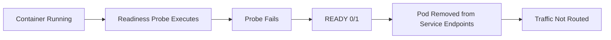

Skills practiced:

```text
Readiness probe debugging
READY 0/1 investigation
Endpoint availability checking
Health check path validation
```

Production meaning:

```text
The container process is alive, but Kubernetes does not consider it ready for traffic.
```

> [!WARNING]
> `Running` does not always mean the application is ready to serve traffic.

---

### 007: Ingress 404/503

Ingress routing fails due to incorrect backend configuration.

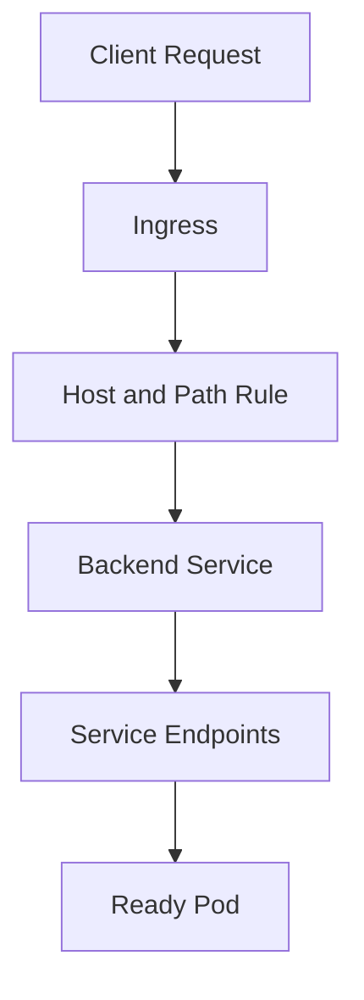

Skills practiced:

```text
Ingress backend validation
Service and endpoint tracing
Host/path routing analysis
Full request path troubleshooting
```

Production meaning:

```text
Traffic reached the cluster, but routing to the backend failed.
```

> [!TIP]
> For Ingress issues, troubleshoot the full path: Ingress → Service → Endpoints → Pod.

---

## Full Traffic Troubleshooting Map

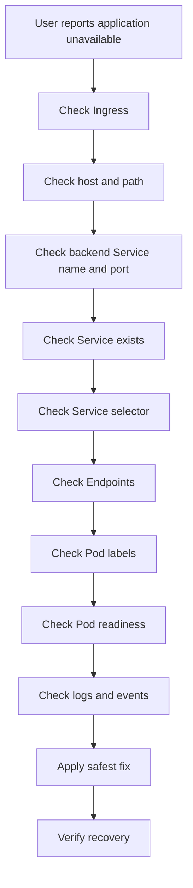

---

## Key Troubleshooting Commands

```bash
kubectl get pods -n incident-labs
kubectl get pods -n incident-labs -o wide
kubectl get pods -n incident-labs --show-labels
kubectl describe pod <pod-name> -n incident-labs
kubectl logs <pod-name> -n incident-labs
kubectl logs <pod-name> -n incident-labs --previous
kubectl get events -n incident-labs --sort-by=.lastTimestamp
kubectl get deployment <deployment-name> -n incident-labs -o yaml
kubectl get svc -n incident-labs
kubectl describe svc <service-name> -n incident-labs
kubectl get endpoints -n incident-labs
kubectl get ingress -n incident-labs
kubectl describe ingress <ingress-name> -n incident-labs
kubectl rollout status deployment/<deployment-name> -n incident-labs
```

---

## Common Production Lessons

### Running does not always mean healthy

A Pod can be:

```text
Running but not Ready
```

This usually points to readiness probe failure or dependency issues.

---

### A Service without endpoints cannot send traffic

A Service depends on matching Pod labels.

If selectors and labels do not match:

```text
Service exists
Pod exists
Endpoints empty
Traffic fails
```

---

### Events are critical

For many Kubernetes issues, logs are not enough.

Examples:

```text
ImagePullBackOff
Pod Pending
Readiness probe failure
Ingress backend issues
```

In these cases, `kubectl describe` and Events usually reveal the real cause.

---

### Always troubleshoot the full path

For application traffic issues, check:

```text
Ingress
Service
Endpoints
Pod labels
Pod readiness
Container logs
Events
```

Do not assume the issue is only at the application layer.

---

## Skills Demonstrated

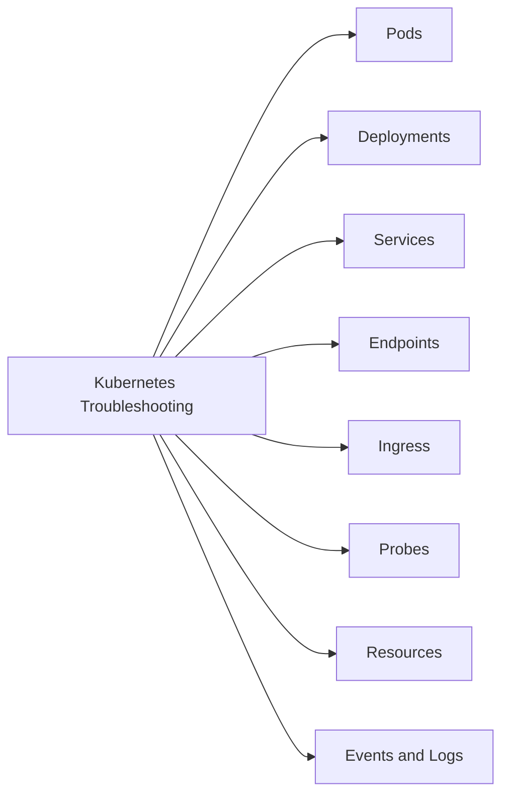

This series demonstrates practical ability in:

```text
Root cause analysis
Incident reproduction
Kubernetes debugging
YAML correction
Resource inspection
Traffic path analysis
Evidence capture
GitHub documentation
```

---

## Interview Value

This series prepares for real Kubernetes troubleshooting interview questions such as:

```text
How do you troubleshoot CrashLoopBackOff?
How do you troubleshoot ImagePullBackOff?
What does OOMKilled mean?
Why is my Pod stuck in Pending?
Why does my Service have no endpoints?
Why is my Pod Running but not Ready?
How do you troubleshoot Ingress 404 or 503?
What is the difference between Running and Ready?
What is the difference between Service selector and Pod labels?
What commands do you use during a Kubernetes incident?
```

---

## Recruiter-Friendly Summary

This project demonstrates that the engineer can troubleshoot Kubernetes incidents hands-on using a structured SRE-style workflow.

The labs cover container failures, image pull failures, memory issues, scheduling failures, Service routing problems, readiness probe issues, and Ingress backend problems.

Each incident includes:

```text
Broken manifest
Fixed manifest
Troubleshooting steps
Evidence files
Interview explanation
```

---

## Portfolio Value

This series demonstrates:

```text
Hands-on Kubernetes troubleshooting
Structured incident documentation
Root cause analysis
Evidence capture
GitHub-based learning proof
Local-first DevOps practice
SRE-style debugging workflow
```

This is useful for roles such as:

```text
DevOps Engineer
DevSecOps Engineer
Site Reliability Engineer
Platform Engineer
Cloud Engineer
Kubernetes Support Engineer
```

---

## Completion Summary

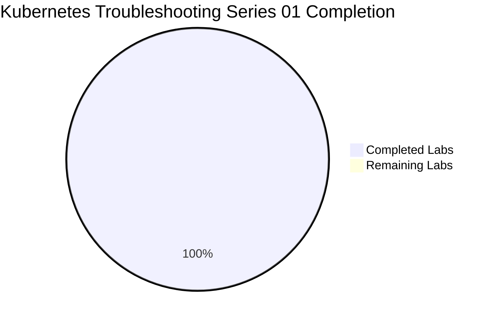

```text
Status: Completed
Total labs: 7
Completed labs: 7
Environment: Local Kind cluster
Cloud cost: ₹0
```

---

## Next Series

Recommended next Kubernetes series:

```text
Kubernetes Troubleshooting Labs: Series 02
```

Possible topics:

```text
DNS resolution failure
ConfigMap error
Secret error
PVC pending
Node NotReady
DiskPressure
Failed rollout
Liveness probe failure
NetworkPolicy traffic blocked
Helm deployment failure
```