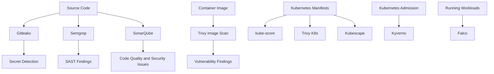

# DevSecOps Security Labs


---

## Objective

This section contains practical DevSecOps security labs focused on real-world detection, scanning, enforcement, and runtime monitoring.

The goal is to build a production-style security portfolio using free and open-source tools.

---

## Security Workflow Covered

```text
Secret scanning
Container image scanning
Static application security testing
Code quality and security analysis
Kubernetes manifest scanning
Kubernetes security posture scanning
Kubernetes admission policy enforcement
Runtime threat detection
```

---

## Completed Labs

| Area | Tool | Purpose | Status |
|---|---|---|---|
| Secret Scanning | [Gitleaks](./gitleaks/) | Detect hardcoded secrets | Completed |
| Container Security | [Trivy Image Scanning](./trivy-image-scanning/) | Scan container images for vulnerabilities | Completed |
| SAST | [Semgrep](./semgrep/) | Detect insecure code patterns | Completed |
| Code Quality / Security | [SonarQube](./sonarqube/) | Analyze code quality and security issues | Completed |
| Kubernetes Security | [Kubernetes Security Scanning](./kubernetes-scanning/) | Scan, enforce, and monitor Kubernetes workloads | Completed |

---

## DevSecOps Security Flow



---

## Tool Categories

### 1. Gitleaks

Folder:

```text
gitleaks/
```

Purpose:

```text
Detect secrets before they are committed or pushed.
```

What this lab demonstrates:

```text
Scanning working directory
Scanning Git history
Pre-commit hook
Pre-push hook
GitHub Actions workflow
Before and after remediation reports
```

Why it matters:

```text
Secrets committed to Git can lead to cloud account compromise, database compromise, and supply-chain incidents.
```

---

### 2. Trivy Image Scanning

Folder:

```text
trivy-image-scanning/
```

Purpose:

```text
Scan container images for known vulnerabilities.
```

What this lab demonstrates:

```text
Scanning vulnerable container images
Comparing vulnerable and safer images
Saving scan reports
Adding GitHub Actions image scan workflows
Adding critical vulnerability gates
```

Why it matters:

```text
Container images may contain vulnerable operating system packages, libraries, and application dependencies.
```

---

### 3. Semgrep

Folder:

```text
semgrep/
```

Purpose:

```text
Static application security testing.
```

What this lab demonstrates:

```text
Detecting command injection
Detecting SQL injection
Fixing vulnerable code
Saving before and after reports
Adding GitHub Actions SAST workflows
```

Why it matters:

```text
Security bugs should be detected early in the development workflow before they reach production.
```

---

### 4. SonarQube

Folder:

```text
sonarqube/
```

Purpose:

```text
Code quality and security analysis.
```

What this lab demonstrates:

```text
Running SonarQube locally on Kubernetes
Scanning a Python project
Detecting a hardcoded password issue
Fixing the issue
Passing the quality gate
Saving evidence reports
```

Why it matters:

```text
Production teams need visibility into code quality, maintainability, reliability, and security issues.
```

---

### 5. Kubernetes Security Scanning and Runtime Protection

Folder:

```text
kubernetes-scanning/
```

Purpose:

```text
Demonstrate Kubernetes security from pre-deployment scanning to runtime threat detection.
```

Included labs:

| Tool | Purpose |
|---|---|
| kube-score | Kubernetes production-readiness scanning |
| Trivy config | Kubernetes manifest misconfiguration scanning |
| Kubescape | Kubernetes security posture and framework scanning |
| Kyverno | Kubernetes admission policy enforcement |
| Falco | Runtime threat detection |

Security lifecycle:

```text
Scan manifests
Fix weak configuration
Check security posture
Enforce policies at admission time
Detect suspicious runtime behavior
```

Why it matters:

```text
Kubernetes security requires multiple layers. A workload can pass one check and still be risky in another stage.
```

---

## End-to-End Portfolio Story

```text
Gitleaks    -> Prevent secrets from entering Git
Trivy       -> Find vulnerable container images
Semgrep     -> Detect insecure code patterns
SonarQube   -> Improve code quality and security visibility
kube-score  -> Check Kubernetes production-readiness
Trivy K8s   -> Detect Kubernetes misconfigurations
Kubescape   -> Validate security posture controls
Kyverno     -> Enforce Kubernetes policies
Falco       -> Detect runtime threats
```

---

## Production Best Practices Demonstrated

```text
Use pre-commit and pre-push security hooks
Scan Git history for secrets
Scan container images before deployment
Fail CI/CD on critical vulnerabilities
Run SAST during pull requests
Use code quality gates
Set Kubernetes resource requests and limits
Run containers as non-root
Disable privilege escalation
Use read-only root filesystems where possible
Use NetworkPolicy
Use PodDisruptionBudget
Use admission control policies
Avoid latest image tags
Monitor runtime behavior
Store evidence reports
Document before and after remediation
```

---

## Interview Explanation

This security lab series demonstrates a practical DevSecOps workflow.

I started with secret scanning using Gitleaks to prevent credentials from entering Git history. Then I used Trivy to scan container images for vulnerabilities.

For application security, I used Semgrep to detect insecure code patterns such as command injection and SQL injection. I also used SonarQube to analyze code quality and security issues and verify that the fixed code passed the quality gate.

For Kubernetes security, I built a complete local Kind-based series. I used kube-score for production-readiness checks, Trivy config for Kubernetes misconfiguration scanning, and Kubescape for security posture scanning against framework controls.

Then I moved from detection to enforcement using Kyverno. I created a policy to block workloads using the `latest` image tag.

Finally, I used Falco to detect runtime threats. I opened a shell inside a container and read `/etc/shadow`, and Falco generated runtime security alerts.

This shows a full DevSecOps lifecycle: prevent, scan, analyze, enforce, and detect.

---

## Lab Status

```text
Gitleaks: Completed
Trivy Image Scanning: Completed
Semgrep: Completed
SonarQube: Completed
Kubernetes Security Scanning: Completed
Status: Active
```