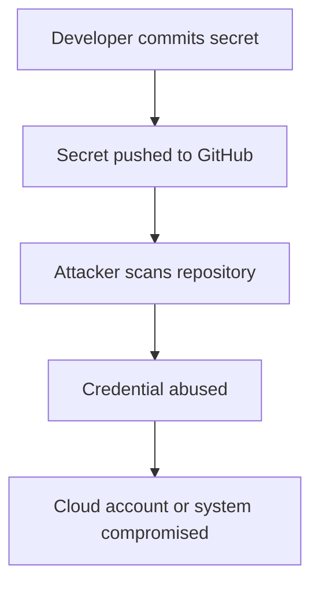
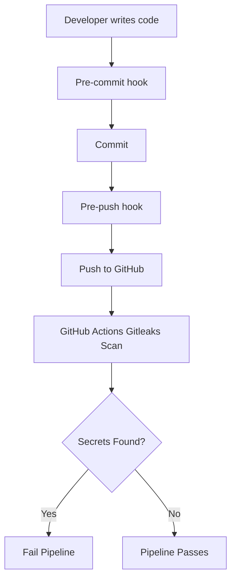

# Gitleaks Secret Scanning Lab


---

## Objective

This lab demonstrates how to detect hardcoded secrets using Gitleaks.

The goal is to understand:

```text
How secret leaks happen
How Gitleaks detects secrets
Difference between Git history scan and directory scan
How to fix hardcoded secrets
How to prevent secrets from being committed
```

---

## Why Secret Scanning Matters

Hardcoded secrets can expose:

```text
Cloud accounts
GitHub repositories
Databases
CI/CD systems
Production environments
Customer data
```

A common real-world incident looks like this:



---

## Tool Used

| Tool | Purpose |
|---|---|
| Gitleaks | Detect secrets in Git repositories and directories |
| jq | Pretty-print JSON reports |
| Git | Track source code and history |

---

## Commands Practiced

### Check Gitleaks version

```bash
gitleaks version
```

### Scan committed Git history

```bash
gitleaks detect --source .
```

This scans secrets already committed in Git history.

### Scan current working directory

```bash
gitleaks dir labs/security/gitleaks/vulnerable-app
```

This scans files in the current directory, including files not committed to Git.

### Generate JSON report

```bash
gitleaks dir labs/security/gitleaks/vulnerable-app \
  --report-format json \
  --report-path labs/security/gitleaks/gitleaks-report-after-fix.json
```

---

## Important Difference

```text
gitleaks detect = scans Git history
gitleaks dir    = scans current directory
```

In this lab, the first `gitleaks detect --source .` command found no leaks because the vulnerable files were not committed.

The directory scan found leaks because it scanned the current working directory.

---

## Findings Before Fix

Gitleaks detected secret-like values such as:

```text
Generic API key
GitHub token pattern
```

The raw before-fix report is not committed because reports can contain sensitive values.

---

## Fix Applied

Hardcoded secrets were removed from the application code.

Instead of storing secrets directly in Python code, the fixed app uses environment variables:

```python
import os

github_token = os.getenv("GITHUB_TOKEN")
```

The `.env` file was replaced with `.env.example`.

```text
.env          = local secret file, ignored by Git
.env.example  = safe template, committed to GitHub
```

---

## Verification After Fix

After fixing the vulnerable files, Gitleaks was run again:

```bash
gitleaks dir labs/security/gitleaks/vulnerable-app \
  --report-format json \
  --report-path labs/security/gitleaks/gitleaks-report-after-fix.json
```

Result:

```text
no leaks found
```

The after-fix report contains:

```json
[]
```

---

## Prevention

To prevent future secret leaks:

```text
Never hardcode secrets
Use environment variables
Commit .env.example, not .env
Add .env files to .gitignore
Run Gitleaks before committing
Add Gitleaks to CI/CD pipelines
Rotate any real exposed secret immediately
```

---

## Production Usage

In real projects, Gitleaks is commonly used in three places:

```text
1. Developer laptop before commit
2. Pull request checks in CI/CD
3. Scheduled scans of repositories
```

Example local scan before committing:

```bash
gitleaks dir . --redact
```

Example Git history scan:

```bash
gitleaks detect --source . --redact
```

Example SARIF report for GitHub Code Scanning:

```bash
gitleaks detect \
  --source . \
  --report-format sarif \
  --report-path gitleaks-report.sarif \
  --redact
```

---

## Interview Explanation

Gitleaks is a secret scanning tool used to detect hardcoded credentials in source code and Git history.

In production, I would use it locally before commits and in CI/CD pipelines for pull requests.

If a real secret is detected, I would:

```text
1. Remove the secret from code
2. Rotate the exposed credential immediately
3. Check Git history to understand exposure
4. Clean history if required
5. Add .gitignore protection
6. Move secrets to environment variables or a secret manager
7. Add Gitleaks to CI/CD to prevent recurrence
```

---

---

## CI/CD Integration

Gitleaks was also integrated with GitHub Actions.

Workflow file:

```text
.github/workflows/gitleaks.yml
```

The workflow runs on:

```text
push to main
pull requests to main
manual workflow dispatch
```

The workflow uses:

```yaml
uses: gitleaks/gitleaks-action@v2
```

Why this matters:

```text
Local hooks help developers catch secrets early.
GitHub Actions enforces scanning centrally in CI/CD.
```

This creates a stronger DevSecOps workflow:



---

## Lab Status

```text
Tool: Gitleaks
Version tested: 8.30.1
Status: Completed
Leaks after fix: 0
```