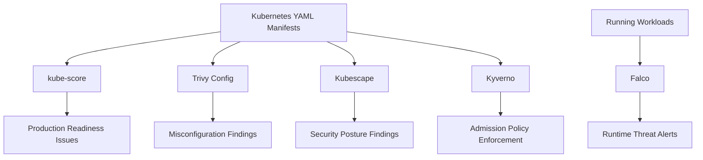

# Kubernetes Security Scanning and Runtime Protection Labs


---

## Objective

This section contains Kubernetes-focused DevSecOps labs.

The goal is to demonstrate a complete Kubernetes security workflow:

```text
Production-readiness scanning
Misconfiguration scanning
Security posture scanning
Admission policy enforcement
Runtime threat detection
```

These labs are designed to run locally using Kind and open-source tools.

---

## Why Kubernetes Security Needs Multiple Tools

Kubernetes security is not solved by one tool.

A manifest can be:

```text
Valid YAML but not production-ready
Production-ready but still misconfigured
Misconfiguration-free but not policy-enforced
Policy-compliant but still risky at runtime
```

That is why this lab series uses multiple tools together.

---

## Completed Labs

| Lab | Tool | Main Purpose | Result |
|---|---|---|---|
| [kube-score](./kube-score/) | kube-score | Kubernetes production-readiness scanning | Completed |
| [trivy-k8s](./trivy-k8s/) | Trivy config | Kubernetes manifest misconfiguration scanning | Completed |
| [kubescape](./kubescape/) | Kubescape | Kubernetes security posture and framework scanning | Completed |
| [kyverno](./kyverno/) | Kyverno | Kubernetes admission policy enforcement | Completed |
| [falco](./falco/) | Falco | Runtime threat detection | Completed |

---

## Security Flow



---

## Tool Comparison

| Tool | Stage | What It Answers |
|---|---|---|
| kube-score | Pre-deployment | Is this workload production-ready? |
| Trivy config | Pre-deployment | Does this manifest contain security misconfigurations? |
| Kubescape | Pre-deployment / posture | Does this workload comply with security framework controls? |
| Kyverno | Admission control | Should this workload be allowed into the cluster? |
| Falco | Runtime | Is suspicious activity happening inside running workloads? |

---

## 1. kube-score

Folder:

```text
kube-score/
```

Purpose:

```text
Checks Kubernetes manifests for production-readiness.
```

Examples of checks:

```text
Resource requests and limits
Security context
Image tag quality
NetworkPolicy presence
PodDisruptionBudget
Readiness and liveness probes
```

Key learning:

```text
A manifest can deploy successfully but still be weak from an operations and reliability perspective.
```

---

## 2. Trivy Kubernetes Config Scanning

Folder:

```text
trivy-k8s/
```

Purpose:

```text
Scans Kubernetes YAML files for security misconfigurations.
```

Examples of findings:

```text
Privileged containers
Missing resource limits
Containers running as root
Writable root filesystem
Missing namespace
Unsafe image tags
```

Key learning:

```text
Trivy config helps catch Kubernetes security misconfigurations before deployment.
```

---

## 3. Kubescape

Folder:

```text
kubescape/
```

Purpose:

```text
Scans Kubernetes manifests against security framework controls.
```

Framework used:

```text
NSA
```

Key result:

```text
Before fix: 12 passed, 8 failed, 60%
After fix: 20 passed, 0 failed, 100%
```

Key learning:

```text
Kubescape provides Kubernetes security posture and compliance-style control results.
```

---

## 4. Kyverno

Folder:

```text
kyverno/
```

Purpose:

```text
Enforces Kubernetes policies at admission time.
```

Policy tested:

```text
Disallow latest image tag
```

Result:

```text
nginx:latest       -> denied
nginx:1.27-alpine -> allowed
```

Key learning:

```text
Scanning tools report problems.
Kyverno blocks problems before workloads enter the cluster.
```

---

## 5. Falco

Folder:

```text
falco/
```

Purpose:

```text
Detects suspicious runtime activity inside running workloads.
```

Runtime tests:

```text
kubectl exec shell into container
cat /etc/shadow
```

Falco detected:

```text
Shell spawned inside container
Sensitive file opened for reading
```

Key learning:

```text
A workload can pass pre-deployment checks and still behave suspiciously at runtime.
Falco fills the runtime detection gap.
```

---

## End-to-End DevSecOps View

```text
kube-score  -> Is it production-ready?
Trivy K8s   -> Is it misconfigured?
Kubescape   -> Does it meet security posture controls?
Kyverno     -> Can we enforce the rule before deployment?
Falco       -> Can we detect threats after deployment?
```

---

## Production Best Practices Demonstrated

```text
Use fixed image tags instead of latest
Set CPU and memory requests
Set CPU and memory limits
Run containers as non-root
Disable privilege escalation
Drop unnecessary Linux capabilities
Use read-only root filesystem where possible
Disable service account token auto-mount when not needed
Use NetworkPolicy
Use PodDisruptionBudget
Use admission control policies
Use runtime threat detection
Store scan and runtime evidence
Use Helm for platform tools
Use plain YAML for custom policies and test workloads
```

---

## Interview Explanation

This Kubernetes security lab series demonstrates layered DevSecOps controls.

I used kube-score to check whether manifests were production-ready, Trivy config to find Kubernetes misconfigurations, and Kubescape to evaluate security posture against framework controls.

Then I moved from detection to enforcement using Kyverno. I created a ClusterPolicy that blocked Deployments using the `latest` image tag and allowed a Deployment using a fixed version tag.

Finally, I used Falco for runtime detection. I deployed an Nginx Pod, opened a shell inside the container, and read `/etc/shadow`. Falco detected both the shell activity and sensitive file access.

This shows a full Kubernetes security lifecycle: scan, improve, enforce, and monitor.

---

## Lab Status

```text
kube-score: Completed
Trivy K8s: Completed
Kubescape: Completed
Kyverno: Completed
Falco: Completed
Status: Kubernetes security scanning and runtime protection series completed
```