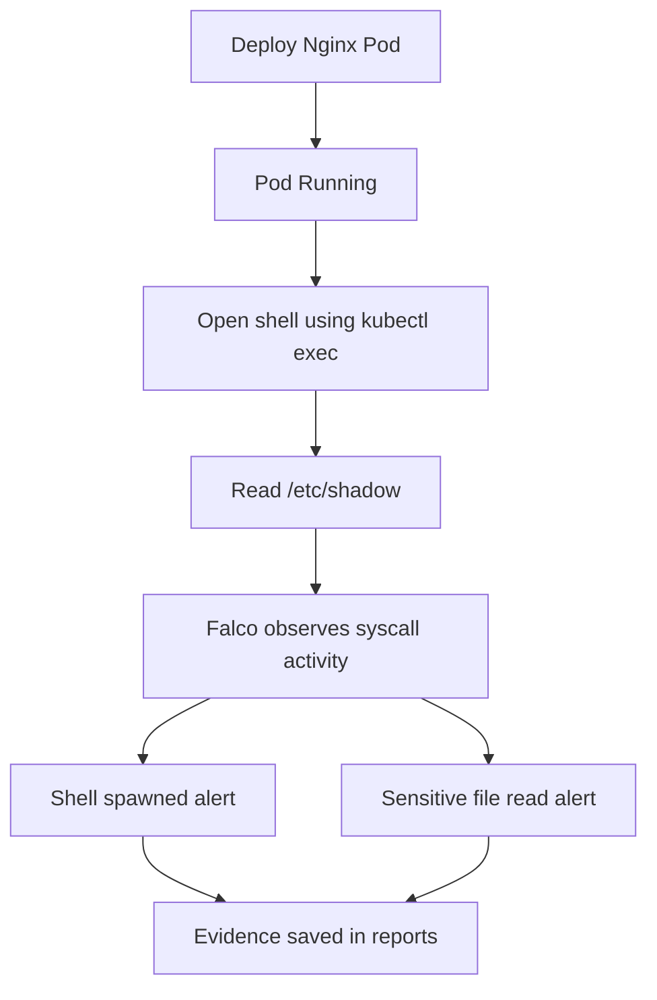

# Falco Runtime Security Detection Lab


---

## Objective

This lab demonstrates how to use Falco to detect suspicious runtime activity inside Kubernetes workloads.

The goal is to move beyond pre-deployment scanning and admission control into runtime threat detection.

---

## What is Falco?

Falco is a runtime security tool for Linux and Kubernetes.

It watches system call activity and detects suspicious behavior while containers are running.

Falco can detect events such as:

```text
Shell opened inside a container
Sensitive file access
Unexpected process execution
Package manager execution inside containers
Privilege escalation behavior
Container escape indicators
Suspicious network tool usage
Unexpected writes to sensitive paths
```

---

## Why This Matters

A workload can pass all pre-deployment checks and still become risky at runtime.

For example:

```text
Image scan passes
Kubernetes manifest scan passes
Kyverno admission policy allows the workload
Pod starts successfully
Someone opens a shell inside the container
Sensitive files are accessed
```

Falco helps detect that runtime behavior.

---

## Lab Structure

```text
labs/security/kubernetes-scanning/falco/
├── README.md
├── install/
│   ├── falco-generated.yaml
│   └── values.yaml
├── manifests/
│   └── test-nginx-pod.yaml
└── reports/
    ├── comparison-summary.md
    ├── falco-daemonset-status.txt
    ├── falco-pod-status.txt
    ├── falco-runtime-alerts.txt
    ├── test-pod-describe.txt
    └── test-pod-status.txt
```

---

## Falco Installation Approach

Falco was installed using a Helm-rendered manifest.

For platform tools like Falco, Helm is preferred because it manages Kubernetes resources such as:

```text
DaemonSet
ServiceAccount
RBAC
ConfigMaps
Driver loader init containers
Runtime configuration
```

For this lab:

```text
Falco installation -> Helm-rendered manifest
Test workload      -> Plain Kubernetes YAML
Evidence reports   -> Text and Markdown
```

---

## Falco Values File

File:

```text
install/values.yaml
```

Values used:

```yaml
driver:
  enabled: true
  kind: auto

falcosidekick:
  enabled: false

falco:
  priority: debug
  json_output: false
  stdout_output:
    enabled: true
```

---

## Generate Falco Manifest

```bash
helm repo add falcosecurity https://falcosecurity.github.io/charts
helm repo update
```

Generate the manifest:

```bash
helm template falco falcosecurity/falco \
  --namespace falco \
  --values labs/security/kubernetes-scanning/falco/install/values.yaml \
  --no-hooks \
  > labs/security/kubernetes-scanning/falco/install/falco-generated.yaml
```

---

## Install Falco

Create namespace:

```bash
kubectl create namespace falco
```

Apply manifest:

```bash
kubectl apply --server-side \
  -f labs/security/kubernetes-scanning/falco/install/falco-generated.yaml
```

---

## Verify Falco

```bash
kubectl get pods -n falco
kubectl get daemonset -n falco
```

Expected:

```text
falco   2/2 Running
falco   1 desired   1 current   1 ready
```

Falco runs as a DaemonSet because it needs to observe runtime activity on each Kubernetes node.

---

## Driver and Event Source

Falco started successfully with:

```text
Falco version: 0.44.1
Linux kernel: WSL2
Event source: syscall
Driver: modern BPF probe
```

This confirms Falco was able to observe syscall activity in the local Kind environment.

---

## Test Workload

File:

```text
manifests/test-nginx-pod.yaml
```

Workload:

```yaml
apiVersion: v1
kind: Pod
metadata:
  name: falco-test-nginx
  namespace: default
spec:
  containers:
    - name: nginx
      image: nginx:1.27-alpine
      ports:
        - containerPort: 80
```

Apply:

```bash
kubectl apply -f labs/security/kubernetes-scanning/falco/manifests/test-nginx-pod.yaml
```

Verify:

```bash
kubectl get pod falco-test-nginx
```

---

## Runtime Test

Open an interactive shell inside the container:

```bash
kubectl exec -it falco-test-nginx -- sh
```

Inside the container:

```sh
cat /etc/shadow || true
exit
```

This simulates suspicious runtime behavior.

---

## Capture Falco Alerts

```bash
kubectl logs -n falco daemonset/falco --tail=100 \
  > labs/security/kubernetes-scanning/falco/reports/falco-runtime-alerts.txt
```

View:

```bash
cat labs/security/kubernetes-scanning/falco/reports/falco-runtime-alerts.txt
```

---

## Alert 1: Shell Spawned in Container

Falco detected:

```text
Notice A shell was spawned in a container with an attached terminal
process=sh
container_name=nginx
container_image_repository=docker.io/library/nginx
container_image_tag=1.27-alpine
k8s_pod_name=falco-test-nginx
k8s_ns_name=default
```

Why this matters:

```text
Interactive shell access inside a container can indicate debugging, compromised access, or attacker activity.
```

---

## Alert 2: Sensitive File Opened

Falco detected:

```text
Warning Sensitive file opened for reading by non-trusted program
file=/etc/shadow
process=cat
command=cat /etc/shadow
container_name=nginx
k8s_pod_name=falco-test-nginx
k8s_ns_name=default
```

Why this matters:

```text
Reading sensitive files inside a container can indicate credential discovery or privilege abuse.
```

---

## Evidence Files

```text
reports/falco-pod-status.txt
reports/falco-daemonset-status.txt
reports/falco-runtime-alerts.txt
reports/test-pod-status.txt
reports/test-pod-describe.txt
reports/comparison-summary.md
```

---

## Runtime Detection Flow



---

## Falco vs Previous Tools

| Tool | Main Focus |
|---|---|
| kube-score | Kubernetes production-readiness scanning |
| Trivy config | Kubernetes misconfiguration scanning |
| Kubescape | Kubernetes security posture scanning |
| Kyverno | Kubernetes policy enforcement |
| Falco | Runtime threat detection |

Key difference:

```text
Scanning tools detect problems before deployment.
Kyverno blocks unsafe resources at admission time.
Falco detects suspicious behavior after workloads are running.
```

---

## Production Best Practices Demonstrated

```text
Run Falco as a DaemonSet
Capture runtime alerts
Treat shell access inside containers as suspicious
Monitor sensitive file access
Store security evidence
Use Falco with admission control and image scanning
Keep platform installation managed through Helm
Tune noisy rules before production alerting
```

---

## Real-World Usage

In production, Falco alerts can be forwarded to:

```text
Slack
Microsoft Teams
Grafana
Prometheus Alertmanager
SIEM platforms
OpenSearch
Loki
Incident management systems
```

Falco is commonly integrated using Falcosidekick.

Falcosidekick was intentionally disabled in this local lab to keep the setup simple.

---

## Common Mistakes

```text
Thinking secure manifests guarantee secure runtime behavior
Ignoring shell access inside containers
Not collecting runtime security logs
Running Falco but not forwarding alerts anywhere
Leaving noisy default rules untuned
Not testing alerts with realistic scenarios
Using only image scanning without runtime monitoring
```

---

## Interview Explanation

Falco is a runtime security tool for Kubernetes and Linux.

It watches Linux syscall activity and detects suspicious behavior while containers are running.

In this lab, I installed Falco on a local Kind cluster using a Helm-rendered manifest.

Falco ran as a DaemonSet and successfully used the modern BPF probe in my WSL2-based Kind environment.

I deployed an Nginx test Pod, opened an interactive shell inside it using `kubectl exec`, and attempted to read `/etc/shadow`.

Falco generated alerts for both suspicious actions: a shell spawned inside a container and a sensitive file being opened for reading.

This demonstrates runtime threat detection, which complements image scanning, Kubernetes manifest scanning, security posture scanning, and Kyverno admission policy enforcement.

---

## Lab Status

```text
Tool: Falco
Cluster: Kind
Install method: Helm-rendered manifest
Apply method: Server-side apply
Runtime driver: modern BPF probe
Event source: syscall
Test workload: nginx:1.27-alpine
Runtime test 1: Shell inside container
Runtime test 2: Sensitive file read
Status: Completed
```