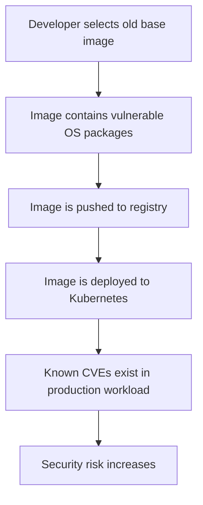

# Trivy Container Image Scanning Lab


---

## Objective

This lab demonstrates how to scan container images for vulnerabilities using Trivy.

The goal is to understand:

```text
How container image vulnerabilities are detected
Why old base images are risky
How to compare vulnerable and improved images
How to read CRITICAL and HIGH severity findings
How to generate JSON and table reports
How to document remediation steps
```

---

## Why Container Image Scanning Matters

Container images often include many operating system packages and libraries.

A small application image may still contain vulnerable packages from:

```text
Base image
Operating system packages
Language runtime
Package managers
Application dependencies
Unused tools inside the image
```

A common production problem looks like this:



---

## Tool Used

| Tool | Purpose |
|---|---|
| Trivy | Scan container images for vulnerabilities |
| Docker | Pull and inspect container images |
| jq | Parse and summarize JSON reports |

---

## Images Scanned

| Image | Purpose |
|---|---|
| `nginx:1.21` | Older image used to demonstrate many vulnerabilities |
| `nginx:stable-alpine` | Newer lightweight image used for comparison |

---

## Commands Practiced

### Check Trivy version

```bash
trivy --version
```

### Scan an image

```bash
trivy image nginx:1.21
```

### Scan only HIGH and CRITICAL vulnerabilities

```bash
trivy image \
  --severity HIGH,CRITICAL \
  nginx:1.21
```

### Generate a table report

```bash
trivy image \
  --severity HIGH,CRITICAL \
  nginx:1.21 \
  > labs/security/trivy/reports/nginx-1.21-table-report.txt
```

### Generate a JSON report

```bash
trivy image nginx:1.21 \
  --severity HIGH,CRITICAL \
  --format json \
  --output labs/security/trivy/reports/nginx-1.21-report.json
```

### Summarize vulnerabilities by severity

```bash
jq '
  [ .Results[]?.Vulnerabilities[]? ]
  | group_by(.Severity)
  | map({severity: .[0].Severity, count: length})
' labs/security/trivy/reports/nginx-1.21-report.json
```

### Show top findings

```bash
jq -r '
  .Results[]?.Vulnerabilities[]?
  | [.VulnerabilityID, .PkgName, .InstalledVersion, .FixedVersion, .Severity]
  | @tsv
' labs/security/trivy/reports/nginx-1.21-report.json | head -10
```

---

## Scan Results

### `nginx:1.21`

| Severity | Count |
|---|---:|
| CRITICAL | 28 |
| HIGH | 185 |
| Total | 213 |

### `nginx:stable-alpine`

| Severity | Count |
|---|---:|
| CRITICAL | 0 |
| HIGH | 4 |
| Total | 4 |

---

## Comparison

| Image | Base OS | CRITICAL | HIGH | Total HIGH/CRITICAL |
|---|---|---:|---:|---:|
| `nginx:1.21` | Debian 11.3 | 28 | 185 | 213 |
| `nginx:stable-alpine` | Alpine 3.23 | 0 | 4 | 4 |

---

## Key Finding

The older `nginx:1.21` image had many more vulnerabilities because it used an older Debian base image.

The newer `nginx:stable-alpine` image had far fewer HIGH and CRITICAL vulnerabilities.

This shows that many container vulnerabilities come from the base OS layer, not necessarily from application code.

---

## Lesson Learned

When Trivy reports vulnerabilities, first identify where the vulnerabilities come from:

```text
Base OS packages
Application dependencies
Language runtime packages
Package manager cache
Unused binaries or tools
```

Before changing application code, check:

```text
Base image version
OS package versions
Fixed versions
Severity level
Whether a patch is available
Whether the package is actually used
```

---

## Remediation Strategy

```text
1. Upgrade to a newer base image
2. Prefer smaller images where suitable
3. Remove unnecessary packages
4. Rebuild the image
5. Re-scan using Trivy
6. Compare before/after vulnerability counts
7. Block CRITICAL vulnerabilities in CI/CD
```

---

## Reports Generated

| Report | Purpose |
|---|---|
| `reports/nginx-1.21-table-report.txt` | Human-readable table report |
| `reports/nginx-1.21-report.json` | Machine-readable JSON report for old image |
| `reports/nginx-stable-alpine-report.json` | Machine-readable JSON report for improved image |
| `reports/comparison-summary.md` | Before/after vulnerability comparison |

---

## Production Usage

In real DevSecOps pipelines, Trivy is commonly used at multiple stages:

```text
Developer laptop
CI/CD pipeline
Container registry scanning
Kubernetes admission control
Scheduled image re-scans
```

A common CI/CD policy is:

```text
Fail pipeline for CRITICAL vulnerabilities
Warn or review HIGH vulnerabilities
Ignore unfixed vulnerabilities only with justification
Generate reports as pipeline artifacts
```

---

## Important Trivy Options

| Option | Meaning |
|---|---|
| `trivy image` | Scan a container image |
| `--severity HIGH,CRITICAL` | Show only selected severity levels |
| `--ignore-unfixed` | Hide vulnerabilities without available fixes |
| `--format json` | Generate JSON output |
| `--output <file>` | Save report to file |
| `--exit-code 1` | Fail command if matching vulnerabilities are found |

---

## Example CI/CD Gate

```bash
trivy image \
  --severity CRITICAL \
  --exit-code 1 \
  nginx:1.21
```

Meaning:

```text
If CRITICAL vulnerabilities are found, fail the pipeline.
```

---

## Interview Explanation

Trivy is a vulnerability scanning tool used to scan container images, filesystems, repositories, Kubernetes manifests, and infrastructure code.

For container images, I use Trivy to identify vulnerabilities in OS packages, runtime dependencies, and application dependencies.

In this lab, scanning `nginx:1.21` showed 213 HIGH and CRITICAL vulnerabilities. After comparing it with `nginx:stable-alpine`, the number reduced to 4.

This proves that base image selection has a major impact on container security.

In production, I would integrate Trivy into CI/CD, fail builds for CRITICAL vulnerabilities, review HIGH findings, generate reports as artifacts, and regularly re-scan images because new CVEs are discovered over time.

---

## Lab Status

```text
Tool: Trivy
Version tested: 0.72.0
Scan type: Container image vulnerability scan
Old image: nginx:1.21
Improved image: nginx:stable-alpine
Status: Completed
```