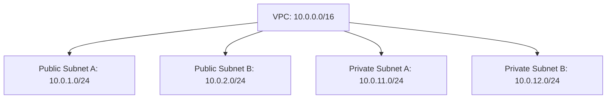

# Terraform Lab 10: AWS-Style VPC Design

## Goal

Learn AWS VPC design using Terraform patterns without creating real AWS resources.

---

## Concepts Covered

- VPC CIDR
- Public subnets
- Private subnets
- Environment-based naming
- AWS-style tags
- Terraform maps
- Outputs

---

## Architecture



---

## Public vs Private Subnets

| Subnet Type | Common Usage |
|---|---|
| Public subnet | ALB, NAT Gateway, bastion host |
| Private subnet | Application servers, databases, internal services |

---

## Commands

```bash
terraform init
terraform fmt
terraform plan -var-file="dev.tfvars"
terraform apply --auto-approve -var-file="dev.tfvars"
terraform output
```

---

## Output

Terraform creates:

```text
dev-flask-health-api-vpc-design.json
```

Example:

```json
{
  "cidr": "10.0.0.0/16",
  "name": "dev-flask-health-api-vpc",
  "public_subnets": {
    "public-a": "10.0.1.0/24",
    "public-b": "10.0.2.0/24"
  },
  "private_subnets": {
    "private-a": "10.0.11.0/24",
    "private-b": "10.0.12.0/24"
  }
}
```

---

## Interview Summary

A VPC is an isolated network in AWS. Public subnets are used for internet-facing components like load balancers, while private subnets are used for application servers and databases. In production, workloads are usually spread across multiple Availability Zones for high availability.